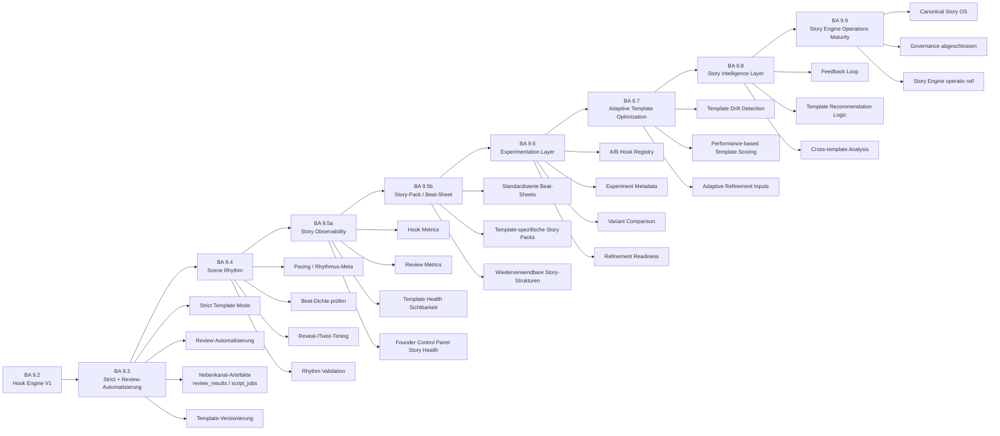

# Pipeline-Plan — News- und YouTube-to-Video

Ziel dieses Dokuments ist eine **kontrollierte Weiterentwicklung**: Phasen, Status, Akzeptanzkriterien, Tests und dokumentierter Fehler-Rücklauf (siehe [ISSUES_LOG.md](ISSUES_LOG.md)).  
Neue fachliche Bausteine werden idealerweise zuerst mit [MODULE_TEMPLATE.md](MODULE_TEMPLATE.md) skizziert.

---

## Gesamtziel

Eine **zuverlässige, modulare Pipeline** von **Quellen** (Nachrichten-URLs, YouTube) zu **strukturierten, redaktionell nutzbaren Skripten** für längere Videoformate — mit **optionaler LLM-Nutzung**, **stabilem Fallback ohne API-Key**, **festem JSON-Vertrag** für Skript-Endpoints und klarer **Warn- und Fehlerlogik**. Spätere Phasen erweitern um Prüfung, Monitoring, Persistenz, Medienproduktion und Veröffentlichungsvorbereitung — ohne die bestehenden API-Verträge ungeplant zu brechen.

---

## Aktueller Stand (Kurz)

| Bereich | Stand |
|--------|--------|
| FastAPI, Health | Lokal und Cloud Run MVP v1 nutzbar |
| Skript aus Artikel-URL | `POST /generate-script` — Extraktion, LLM optional, Fallback |
| YouTube Transkript → Skript | `POST /youtube/generate-script` — gleicher Response-Vertrag wie Generate |
| Kanal-Discovery | `POST /youtube/latest-videos` — RSS, Scoring, ohne Data API |
| Review / Originalität | `POST /review-script` — V1 heuristisch (Phase 4 **done**) |
| Persistenz Jobs / Watchlist / Voice / Bild / Render / Publish | Teilweise (Phase 5 Schritt 1–4: Watchlist **CRUD** + **`/check`** + Firestore `watch_channels` / **`processed_videos`** / **`script_jobs`** + manueller **`POST /watchlist/jobs/{job_id}/run`** → **`generated_scripts`** — **kein** Scheduler/Auto-Run bis später geplant) |

Details zu Deploy und Tests: [README.md](README.md), [DEPLOYMENT.md](DEPLOYMENT.md).  
Agenten- und Qualitätsregeln: [AGENTS.md](AGENTS.md).

### Nächste Priorität (Ausrichtung)

| Strang | Rolle | Kurzhinweis |
|--------|--------|-------------|
| **BA 9.x Story Engine Kern** (**9.7–9.9**) | **abgeschlossen** | Umsetzung: **`GET /story-engine/template-health`**, Control-Panel **`template_optimization`** / **`story_intelligence`**; Canonical **„Story OS“:** [docs/STORY_ENGINE_OS.md](docs/STORY_ENGINE_OS.md). **`GenerateScriptResponse`** weiterhin **6 Felder**. |
| **Phase 7** — Voiceover (TTS) | **primär Makro-Produkt nach Story-Kern** | Ausführungsplan **Baustein 7.1–7.8:** [docs/phases/phase7_voice_bauplan.md](docs/phases/phase7_voice_bauplan.md); erste Provider-Wahl + Secret-Setup ohne Repo-Secrets ([DEPLOYMENT.md](DEPLOYMENT.md)). |
| **Betrieb** — Cloud Scheduler (+ optional IAP/OAuth) | **alternativ Betrieb** | HTTP-Endpunkte **`POST /watchlist/automation/run-cycle`** und **`POST /production/automation/run-daily-cycle`** existieren; zeitgesteuerte oder abgesicherte Aufrufe sind **Deploymentsache**, kein eigener Pipeline-Baustein in diesem Repo ohne separates Deliverable. |

*Reihenfolge-Hinweis:* Die **Story-Engine-Maturity-Linie bis 9.9** ist dokumentarisch/im Code **geschlossen**; neue Priorität liegt typischerweise bei **Phase 7 (Voice)** oder bei **GCP-Scheduling** entscheidbar (siehe Tabelle).

---

## Phasenübersicht

| # | Phase | Status |
|---|--------|--------|
| 1 | Skriptmotor | **done** |
| 2 | YouTube Channel Discovery | **done** |
| 3 | YouTube Transcript-to-Script | **done** |
| 4 | Script Review / Originality Check | **done** |
| 5 | Watchlist / Channel Monitoring | **next** |
| 6 | Script Job Speicherung | **planned** |
| 7 | Voiceover | **in progress** |
| 8 | Bild- / Szenenplan | **planned** |
| 9 | Video Packaging | **planned** |
| 10 | Veröffentlichungsvorbereitung | **planned** |

**Hinweis zur Nummerierung:** Die **BA 9.x**-Bausteine (**Template Engine / Story Engine** in `app/story_engine/`) sind eine **eigene Produkt-Release-Linie** und **nicht** dasselbe wie **Phase 9** in dieser Tabelle (MP4/Packaging). Ausführlicher Bauplan: [PIPELINE_PLAN.md](PIPELINE_PLAN.md) (Abschnitt **„BA 9 — Template Engine / Story Engine (Produktachse)“**).

---

### Phase 1 — Skriptmotor

| | |
|--|--|
| **Status** | **done** |
| **Ziel** | Aus einer Nachrichten-URL ein strukturiertes Skript (Titel, Hook, Kapitel, `full_script`, Quellen, Warnungen) erzeugen; Dauer- und Wortlogik; LLM optional; Fallback ohne OpenAI. |
| **Endpoints** | `GET /health`, `POST /generate-script` |
| **Relevante Dateien** | `app/main.py`, `app/routes/generate.py`, `app/utils.py`, `app/models.py`, `app/config.py` |
| **Akzeptanzkriterien** | Fester JSON-Vertrag unverändert; kein HTTP 500 bei LLM-Fehler; `warnings` bei Fallback und Qualitätslücken; `python -m compileall app` grün. |
| **Bekannte Grenzen** | Qualität abhängig von Extraktion und Quelltext; kein automatischer Faktencheck. |
| **Nächster Schritt** | Phase 1 nur bei Regression oder Vertragsänderung anfassen; Änderungen mit README/AGENTS abstimmen. |

---

### Phase 2 — YouTube Channel Discovery

| | |
|--|--|
| **Status** | **done** |
| **Ziel** | Kanal identifizieren, neueste Videos per öffentlichem RSS listen, Heuristik-Score und Kurzbegründung für Auswahl langer Formate (inkl. Shorts-Abwertung). |
| **Endpoints** | `POST /youtube/latest-videos` |
| **Relevante Dateien** | `app/routes/youtube.py`, `app/youtube/service.py`, `app/youtube/rss.py`, `app/youtube/resolver.py`, `app/youtube/scoring.py`, `app/models.py` (`LatestVideos*`) |
| **Akzeptanzkriterien** | Response-Struktur stabil; sinnvolle `warnings` bei Auflösungs-/Feed-Fehlern; keine YouTube Data API Pflicht; Tests laut README/Agent-Regeln. |
| **Bekannte Grenzen** | `@handle`-Auflösung kann an Cookie-/Consent-Seiten scheitern; `/channel/UC…` bevorzugen; `summary` nur aus Metadaten, nicht aus Transkript. |
| **Nächster Schritt** | Optional Feintuning Scoring nur mit Plan-Eintrag und ISSUES_LOG bei Bugs. |

---

### Phase 3 — YouTube Transcript-to-Script

| | |
|--|--|
| **Status** | **done** |
| **Ziel** | YouTube-Video-URL → Transkript (öffentliche Untertitel) → gleiches Skript-Format wie Artikel-Pipeline; redaktionell als eigene Story, nicht Abschrift. |
| **Endpoints** | `POST /youtube/generate-script` |
| **Relevante Dateien** | `app/routes/youtube.py`, `app/utils.py` (Transkript, gemeinsame Skript-Pipeline), `app/models.py` |
| **Akzeptanzkriterien** | Gleicher Response-Vertrag wie `/generate-script`; bei fehlendem Transkript 200 mit leerem/minimalem Vertrag und klarer `warning`; keine Data API Pflicht. |
| **Bekannte Grenzen** | Nicht jedes Video hat Untertitel; Sprachen und Verfügbarkeit variieren. |
| **Nächster Schritt** | Nur bei Transkript-/Parsing-Problemen ändern; Vorgänge in ISSUES_LOG festhalten. |

---

### Phase 4 — Script Review / Originality Check

| | |
|--|--|
| **Status** | **done** (V1 heuristisch, Stand siehe README und `tests/test_review_script.py`) |
| **Ziel** | Zusätzliche Prüfstufe vor Voiceover/Bild/Video: Nähe zum Quelltext, lange gemeinsame Wortfolgen, Satz-Ähnlichkeit, grobe Einordnungs-Signale. Architektur **hybrid-fähig**; **V1 nur lokal** (kein `llm_review.py`). **`GenerateScriptResponse` unverändert**; Review eigener Vertrag. |
| **Endpoints** | `POST /review-script` — Request: `source_url`, `source_type`, `source_text`, `generated_script`, `target_language`, `prior_warnings`; Response: `risk_level`, `originality_score` (0–100, höher = eigenständiger), `similarity_flags`, `issues`, `recommendations`, `warnings`. |
| **Relevante Dateien** | `app/models.py` (`ReviewScriptRequest`, `ReviewScriptResponse`, …), `app/review/__init__.py`, `app/review/originality.py`, `app/review/service.py`, `app/routes/review.py`, `app/main.py` (Router), `README.md`, Tests: `tests/test_review_script.py`. |
| **Akzeptanzkriterien (V1)** | 200 + strukturiertes JSON; 422 wenn `source_text` und `generated_script` beide leer; kein Secret-/.env-Zugriff im Review-Modul; kein Volltext-Logging; LLM-Fehler irrelevant (kein LLM in V1); bei identischem Text `high` / niedriger Score; eigenständiges Skript `low` oder `medium` möglich; `python -m compileall app` grün; Unittests für Kernfälle grün. |
| **Bekannte Grenzen (V1)** | Rein **heuristisch**; **keine Rechtsberatung**; False Positives/Negatives möglich; **qualitatives LLM-Review** bewusst **nicht** in V1 — in `warnings` dokumentiert; für V1.1 optional `app/review/llm_review.py` nach MODULE_TEMPLATE. |
| **Nächster Schritt** | Feintuning Schwellen nur mit Plan-Eintrag; LLM-Review optional Phase 4.x / V1.1; bei Incidents [ISSUES_LOG.md](ISSUES_LOG.md). |

---

### Phase 5 — Watchlist / Channel Monitoring

| | |
|--|--|
| **Status** | **next** (Phase 5 weiterhin aktiv; Schritt 1 wie unten dokumentiert vorhanden; Gesamtphase **nicht** `done`) |
| **Umsetzungsstand** | **Schritt 1–4 umgesetzt** (CRUD, Check, Jobs, **`POST …/jobs/{job_id}/run`**, **`generated_scripts`**). **BA 5.5–5.7:** Recheck, **`run-pending`**, **`run-cycle`**, **`POST …/jobs/{job_id}/review`**. **BA 5.8–6.2:** Pending-Query, Dashboard, Errors-Summary, Governance, **`production_jobs`**-Stub. **BA 6.3–6.5:** Dashboard-Aggregationsfix + Stream-Fallback, **`review_results`** + Verknüpfungen, **`GET/POST /production/jobs`** (Liste, Detail, Skip, Retry ohne Render). **BA 6.6:** Collection **`scene_plans`** Script-to-Szenenplan ohne LLM (**`/production/jobs/{id}/scene-plan/*`**); **`generated_scripts`** unverändert. **BA 6.7:** Collection **`scene_assets`**, Prompt-Entwürfe aus **`scene_plans`** (**`/production/jobs/{id}/scene-assets/*`**), ohne externe Bild-/Video-Generatoren. **BA 6.8–7.0:** **`voice_plans`**, **`render_manifests`**, Connector-Export (**`/production/jobs/{id}/voice-plan/*`**, **`render-manifest/*`**, **`GET …/export`**) — Datenstrukturen und JSON, **ohne** echtes TTS/Video/Provider-Upload. **BA 6.6.1:** Dev-Endpoint **`/dev/fixtures/completed-script-job`** (nur wenn **`ENABLE_TEST_FIXTURES`**) zur Erzeugung abgeschlossener Test-Jobs ohne YouTube. **BA 7.1–7.4:** Collection **`production_checklists`** (Doc-ID = **`production_job_id`**); **`GET …/export/download?format=json|markdown|csv|txt`** (Manifest-Paket + `provider_templates`-Blöcke); **`POST/GET …/checklist/init|GET|update`**; **`production_jobs.status`** Workflow (**`planning_ready`** … **`published`**). **BA 7.5–7.7:** **`POST /production/automation/run-daily-cycle`** ( **`run_automation_cycle`** + Pending Jobs + Production-Artefakte bis Checkliste; **`dry_run`** ohne Schreibzugriffe); Collections **`provider_configs`** / **`production_files`** (Konfig-Status, geplante Pfade); **`GET/POST /providers/*`**, **`POST/GET …/production/jobs/{id}/files/plan|GET …/files`** — ohne echte Provider-Aufrufe und ohne Cloud Scheduler Deploy. **BA 7.8–7.9:** Collections **`execution_jobs`**, **`production_costs`**; **`execution_queue.py`-Logik**, **`cost_calculator.py`**; **`POST …/production/jobs/{id}/execution/init`**, **`GET …/execution`**, **`POST …/costs/calculate`**, **`GET …/costs`** — Queue ohne Provider-Dispatch; Budget nur Heuristik (EUR). **BA 8.0–8.2:** **`pipeline_audits`**, **`recovery_actions`**, Audit-/Recovery-/Monitoring-Endpunkte (**`/production/audit/*`**, **`…/recovery/retry`**, **`/production/monitoring/summary`**). **BA 8.3:** Collection **`pipeline_escalations`**, Modul **`status_normalizer.py`** — Status-Normalisierung (**`stuck`**, **`retryable`**, **`partial_failed`**, Gap-Erkennung), Escalation Cases, Retry-Disziplin; **`POST /production/status/normalize/run`**, **`GET /production/status/escalations`**. **BA 8.4 LIGHT:** **`GET /production/control-panel/summary`**, Modul **`control_panel.py`** — read-only Founder-Übersicht (bestehende Collections aggregiert). **BA 8.5:** **`input_quality_guard.py`** — Transkript-/Eingangsqualität (`transcript_missing` \| `transcript_blocked` \| `transcript_partial` \| `source_low_quality`), **`input_quality_status`** auf **`script_jobs`** / **`processed_videos`** / Check-Items; keine unnötige Eskalation bei erwartbarem Fehlen von Untertiteln. **BA 8.6:** **`provider_discipline.py`** — **`seed_default_provider_configs`**, **`validate_provider_runtime_health`**; **`POST /providers/configs/seed-defaults`** (optional `apply_writes`); erweiterte Provider-Namen **`voice_default`**, **`image_default`**, **`render_default`**. **BA 8.7:** **`production_costs`** um **`cost_baseline_expected`**, **`cost_variance`**, **`over_budget_flag`**, **`step_cost_breakdown`**, **`estimated_profitability_hint`** (grob). **BA 8.8:** Referenzdoku **`GOLD_PRODUCTION_STANDARD.md`**; Test-Goldpfad **`tests/test_ba88_full_production_run.py`**. **BA 8.9:** **`OPERATOR_RUNBOOK.md`** (Daily Check, Dry Run, Incidents). **BA 9.0 (Template Engine):** **`app/story_engine/`**, optional **`video_template`**, Persistenz/Connector, Downstream-Profile, Tests **`tests/test_ba90_story_engine.py`**. **BA 9.1:** Blueprints, **`[template_conformance:…]`**, **`GET /story-engine/templates`**, **`tests/test_ba91_story_engine.py`**. **BA 9.2:** Hook Engine (**`POST /story-engine/generate-hook`**, Persistenz-Meta auf **`generated_scripts`**), **`tests/test_ba92_hook_engine.py`**. **BA 9.3–9.6:** Conformance/Gate, **`story_structure`**, **`POST /story-engine/rhythm-hint`**, Story-Observability (**Control Panel**), Story-Pack im Export, Experiment-Registry (**`GET /story-engine/experiment-registry`**) — **done** (Details **BA 9** unten; Tests u. a. **`tests/test_ba9396_story_maturity.py`**). **BA 9.7–9.9:** Adaptive Optimization, Story Intelligence und Story-Engine-Ops-Reife — **done** (**`GET /story-engine/template-health`**, Control-Panel `template_optimization` / `story_intelligence`, **[docs/STORY_ENGINE_OS.md](docs/STORY_ENGINE_OS.md)**, **[OPERATOR_RUNBOOK.md](OPERATOR_RUNBOOK.md)** Abschnitt Story Engine). |
| **Ziel (Kurz)** | YouTube-Kanäle dauerhaft speichern, regelmäßig oder manuell prüfen, neue Videos erkennen, Kandidaten bewerten, Script-Jobs vorbereiten und Status führen — aufbauend auf bestehender RSS-/Discovery-Logik (`POST /youtube/latest-videos`). |
| **Relevante Dateien** | `app/youtube/*` (Resolver, RSS für Kanalnamen bei Create), **implementiert:** `app/story_engine/` (**BA 9** inkl. **`hook_engine`**, **`hook_library`**, BA 9.2), **`app/routes/story_engine.py`** (**`GET /story-engine/templates`**, **`POST /story-engine/generate-hook`**, **`POST /story-engine/rhythm-hint`**, **`POST /story-engine/scene-plan`** (Makro‑Phase 8.1 Visual Blueprint, ohne Bildprovider/Persistenz), **`GET /story-engine/experiment-registry`**, **`GET /story-engine/template-health`** (BA 9.7/9.8)), **`app/visual_plan/`**, `app/watchlist/` (inkl. `scene_plan.py` BA 6.6, `scene_asset_prompts.py` BA 6.7, `voice_plan.py` BA 6.8, `render_manifest.py`, `connector_export.py` BA 6.9–7.0, **`export_download.py`**, **`production_checklist.py`** BA 7.1–7.4, `dev_fixture_seed.py` BA 6.6.1, **`execution_queue.py`**, **`cost_calculator.py`** BA 7.8–7.9 / **8.7**, **`pipeline_audit_scan.py`** BA 8.0, **`status_normalizer.py`** BA 8.3, **`control_panel.py`** BA 8.4, **`input_quality_guard.py`** BA 8.5, **`provider_discipline.py`** BA 8.6), `app/routes/watchlist.py`, `app/routes/dev_fixtures.py`, **`app/routes/production.py`**, **`app/routes/providers.py`** (BA 7.5–8.6), `tests/test_watchlist_*.py`, `tests/test_ba66_scene_plan.py`, `tests/test_ba67_scene_assets.py`, `tests/test_ba68_6970_production_voice_render_export.py`, **`tests/test_ba714_production_os.py`**, **`tests/test_ba75_77_automation_provider_storage.py`**, **`tests/test_ba78_79_execution_budget.py`**, **`tests/test_ba80_82_hardening.py`**, **`tests/test_ba83_status_normalization.py`**, **`tests/test_ba84_control_panel.py`**, **`tests/test_ba85_input_quality_guard.py`**, **`tests/test_ba86_provider_seed.py`**, **`tests/test_ba87_cost_baseline.py`**, **`tests/test_ba88_full_production_run.py`**, **`tests/test_ba89_operator_runbook.py`**, **`tests/test_ba90_story_engine.py`**, **`tests/test_ba91_story_engine.py`**, **`tests/test_ba92_hook_engine.py`**, **`tests/test_ba9396_story_maturity.py`**, **`tests/test_ba97_template_optimization.py`**, **`tests/test_ba98_story_intelligence.py`**, `**`tests/test_phase8_81_visual_contract.py`**, `tests/test_ba661_dev_fixtures.py`; `app/models.py` (**`GenerateScriptResponse`**-Vertrag unverändert) |
| **Bekannte Grenzen** | YouTube-RSS liefert keine Echtzeit-Garantie; `@handle`-Auflösung bleibt fragiler als `/channel/UC…` (wie Phase 2). |

#### Zielbild Phase 5

- Nutzer hinterlegen YouTube-Kanäle (**Watchlist**); das System löst **`channel_id`** / Anzeigenamen wo möglich auf und persistiert Kanalparameter (Prüfintervall, `max_results`, Schwellen, Shorts-Verhalten, Zielsprache/Dauer für spätere Jobs).
- **Prüfen** nutzt dieselbe fachliche Basis wie **`POST /youtube/latest-videos`** (Resolver, RSS-Feed, Heuristik-**Score**/**reason**).
- **Neue** Videos gegenüber bereits bekannten Einträgen erkennen; **Duplicate Prevention** über gespeicherte **`video_id`**.
- Bei passenden/neuen Videos können **Script-Jobs** entstehen; Ausführung und Speicherung folgen den V1-Regeln unten.
- **Nicht Ziel von Phase 5 V1:** automatische Veröffentlichung; Voiceover; Video-Rendering/Produktion; eigenes Frontend-Dashboard; Nutzerverwaltung; YouTube Data API; Aufbewahrung großer Roh-Transkripte ohne Nutzen für die Pipeline.

#### Speicher — Empfehlung

- **Firestore (Native Mode)** als empfohlene Speicherlösung: Cloud Run bleibt zustandslos; strukturierte Entitäten, Abfragen (Kanäle, Jobs, Duplikate); IAM über GCP-Service-Account; passt zu Watchlist-, Job- und Review-Persistenz.
- JSON-Datei oder Roh-GCS ohne Index sind für Status/Queues und Konkurrenz auf Cloud Run ungeeignet.

#### Firestore — geplante Collections

| Collection | Zweck |
|------------|--------|
| **watch_channels** | Überwachte Kanäle: u. a. URL, `channel_id`, Name, Status (`active` / `paused` / `error`), `check_interval`, `max_results`, Flags `auto_generate_script`, `auto_review_script`, Zielsprache/Dauer/Schwellen, `ignore_shorts`, Zeitstempel, letzte Fehler-/Check-Infos (`last_checked_at`, `last_error`, …). |
| **processed_videos** | Bekannte Videos: `video_id`, Zuordnung zum Kanal, URL/Titel, `published_at`, Status (z. B. seen / skipped / …), Score/Grund/Short-Hinweis, Verweise auf Job/Review-IDs. |
| **script_jobs** | Jobs zur Skripterzeugung: Status (`pending`, `running`, `completed`, `failed`, …), Verknüpfung zu Video/Kanal, Parameter, Zeitstempel, Verweise auf Ergebnis-IDs/Fehler. |
| **generated_scripts** | Persistenz generierter Skripte im Sinne des festen **`GenerateScriptResponse`** (Titel, Hook, Kapitel, `full_script`, Quellen, Warnungen — Vertrag bestehender Skript-Endpoints nicht brechen). |
| **review_results** | Ergebnisse analog **`POST /review-script`** — persistiert durch **`POST /watchlist/jobs/{job_id}/review`** wenn Job **`completed`** + **`generated_script_id`**. Verknüpfung **`script_jobs.review_result_id`**, optional **`processed_videos.review_result_id`**. |
| **watchlist_meta** | Kleines Metadokument (z. B. Doc **`automation`**: `last_run_cycle_at` nach erfolgreichem **`run-cycle`-Durchlauf). |
| **production_jobs** | Vorbereitung späterer Produktion (Voice/Render): Status, Verweise auf **`generated_script_id`** / **`script_job_id`**, Platzhalterfelder — **kein** Rendern in dieser BA. |
| **scene_plans** | BA 6.6: strukturierter Szenenplan je Production Job (**Document-ID** = **`production_job_id`**), Verknüpfung zu **`generated_script_id`** / **`script_job_id`**; keine Änderung an **`generated_scripts`**. Deterministische Erzeugung, idempotent beim erneuten Aufruf. |
| **scene_assets** | BA 6.7: strukturierte Prompt-Entwürfe (Bild/Video/Thumbnail/Kamera) je Szene, **Document-ID** = **`production_job_id`**, Verknüpfung zu **`scene_plan_id`**, **`generated_script_id`**, **`script_job_id`**, **`style_profile`**, **`asset_version`**; keine Ausführung bei Leonardo/Kling o. Ä. |
| **voice_plans** | BA 6.8: Voice-Blöcke je Szene aus **`voiceover_chunk`** (kein TTS); **Document-ID** = **`production_job_id`**, Verknüpfung zu **`scene_assets_id`**, optionaler Body **`voice_profile`**, **`voice_version`**, **`blocks[]`**, **`warnings`**. |
| **render_manifests** | BA 6.9 + 7.0: gebündeltes Maschinenmanifest und Export-Basis (`production_job`, `scene_plan`, `scene_assets`, `voice_plan`, **`timeline[]`**, **`estimated_total_duration_seconds`**, **`export_version`**, Status **`ready` \| incomplete \| failed`); **Document-ID** = **`production_job_id`**. |
| **production_checklists** | BA 7.1–7.4: Freigaben/Workflow (**Document-ID** = **`production_job_id`**). |
| **provider_configs** | BA 7.6: **`provider_name`** (elevenlabs, openai, …); **`enabled`**, **`dry_run`**, Budgetfelder (**keine** API-Secrets). |
| **production_files** | BA 7.7: geplante Artefakt-Pfade pro **`production_job_id`** (**`storage_path`**, **`file_type`**, **`status`** `planned` \| …); **ohne** GCS/GCS-Upload im MVP. |
| **execution_jobs** | BA 7.8: aus **`production_files`** abgeleitete ausführbare Tasks (**Doc-ID** typ. **`exjob_*`**, deterministisch ab **`pfile_*`**); Status **`queued` \| running \| …**; keine echten Provider-Calls aus diesem Endpoint. |
| **production_costs** | BA 7.9: geschätztes Budget je **`production_job_id`** (**Document-ID** = Job-ID): Voice/Bild/Video/Thumbnail/Buffer (**EUR**); **`actual_total_cost`** Vorbereitung für spätere echte Ist-Kosten — **nicht** angebunden an API-Abbuchungen. |
| **pipeline_audits** | BA 8.0: persistierte Audit-Befunde (fehlende Artefakte, **`dead_job`**, Drift-Hinweise); deterministic **`aud_pj_*` / `aud_sj_*`** Dokument-IDs. |
| **recovery_actions** | BA 8.1: Protokolle gezielter Recovery-Schritte ( **`retry_*`**, **`full_rebuild`**). |
| **pipeline_escalations** | BA 8.3: Eskalationen (Severity, Kategorie, Retry-Zähler, Provider-Flag, Verknüpfungen); deterministische **`esc_*`** Doc-IDs. |

#### Watchlist-Endpunkte (Phase 5 — Stand Code)

| Methode | Pfad | Zweck |
|---------|------|--------|
| `POST` | `/watchlist/channels` | Kanal in Watchlist anlegen |
| `GET` | `/watchlist/channels` | Watchlist auflisten |
| `POST` | `/watchlist/channels/{channel_id}/check` | Einen Kanal manuell prüfen |
| `POST` | `/watchlist/channels/{channel_id}/recheck-video/{video_id}` | **Ops/Dev:** Ein einzelnes Video erneut gegen die gleiche Pipeline-Logik prüfen (Warnung bei Löschen genau eines `processed_videos`-Docs; keine Massenaktion). |
| `GET` | `/watchlist/jobs` | Script-Jobs auflisten |
| `POST` | `/watchlist/jobs/run-pending` | Pending Jobs nacheinander ausführen (Query **`limit`** Default 3, Max 10; Batch bricht nicht bei Einzelfehlern ab). |
| `POST` | `/watchlist/automation/run-cycle` | Aktive Kanäle prüfen (Cap **`channel_limit`**), anschließend **`run_pending`** (Cap **`job_limit`**) — **ohne** Cloud Scheduler, nur Endpoint für spätere IAP/Cron-Anbindung. |
| `POST` | `/watchlist/jobs/{job_id}/run` | Einen Script-Job manuell ausführen (**`generated_scripts`**). |
| `POST` | `/watchlist/jobs/{job_id}/review` | Heuristik wie **`POST /review-script`** aus gespeichertem Skript; Persistenz **`review_results`** bei **`completed`** + **`generated_script_id`**; **keine** Änderung des ScriptJob-Status bei Review-/Speicherfehlern. |
| `GET` | `/watchlist/dashboard` | Snapshot: Zähler Kanäle/Videos/Jobs/Skripte, Health (`last_successful_job_at`, `last_run_cycle_at`, Warnungen). |
| `GET` | `/watchlist/errors/summary` | Stichprobe: Aggregation **`error_code`** / **`skip_reason`** mit Beispiel-IDs (`max_docs`). |
| `POST` | `/watchlist/jobs/{job_id}/retry` | **`failed`**/**`skipped`** → **`pending`**, Fehlerfelder leeren. |
| `POST` | `/watchlist/jobs/{job_id}/skip` | **`pending`**/**`failed`** → **`skipped`**, **`manual_skip`**. |
| `POST` | `/watchlist/channels/{channel_id}/pause` | Kanal **`paused`**. |
| `POST` | `/watchlist/channels/{channel_id}/resume` | Kanal **`active`** (nur aus **`paused`**). |
| `POST` | `/watchlist/jobs/{job_id}/create-production-job` | **`production_jobs`** anlegen (idempotent), nur **`completed`** + **`generated_script_id`**. |
| `GET` | `/production/jobs` | Produktions-Stubs auflisten (**`limit`**, Default 50, Max 200). |
| `GET` | `/production/jobs/{production_job_id}` | Ein Produktions-Job lesen (**404**, wenn nicht vorhanden). |
| `POST` | `/production/jobs/{production_job_id}/skip` | **`queued`**/**`failed`** → **`skipped`** (**keine** Videoproduktion). |
| `POST` | `/production/jobs/{production_job_id}/retry` | **`failed`**/**`skipped`** → **`queued`**. |
| `POST` | `/production/jobs/{production_job_id}/scene-plan/generate` | Deterministischen Szenenplan erzeugen / vorhandenen zurückgeben (idempotent); persistiert **`scene_plans`**. |
| `GET` | `/production/jobs/{production_job_id}/scene-plan` | Szenenplan lesen (**404**, wenn nicht vorhanden). |
| `POST` | `/production/jobs/{production_job_id}/scene-assets/generate` | Prompt-Entwürfe je Szene erzeugen / vorhandenes **`scene_assets`**-Dokument zurückgeben (idempotent); optionaler Body `style_profile` (`documentary` Default). Persistenz **`scene_assets`**. |
| `GET` | `/production/jobs/{production_job_id}/scene-assets` | Scene-Assets lesen (**404**, wenn nicht vorhanden). |
| `POST` | `/production/jobs/{production_job_id}/voice-plan/generate` | Voice-Plan aus **`scene_assets`** erzeugen (**idempotent** wenn vorhanden); optionaler Body **`voice_profile`** (`documentary` \| `news` \| `dramatic` \| `soft`); persistiert **`voice_plans`**. |
| `GET` | `/production/jobs/{production_job_id}/voice-plan` | Voice-Plan lesen (**404**, wenn nicht vorhanden). |
| `POST` | `/production/jobs/{production_job_id}/voice/synthesize-preview` | Phase 7.2: TTS‑Preview (**OpenAI Speech**) aus bestehendem **`voice_plan`**, keine Audio‑Persistenz; Body **`dry_run`**, **`max_blocks`** (1–5), optional **`voice`**; Default **Metadata only** (optional **`audio_base64`** nur mit **`ENABLE_VOICE_SYNTH_PREVIEW_BODY`** und Byte‑Limit); ohne API‑Key weiterhin HTTP **200** mit **`warnings`**, kein blindes HTTP 500. |
| `POST` | `/production/jobs/{production_job_id}/voice/synthesize` | Phase 7.3: Voice‑Commit (**OpenAI Speech**) aus **`voice_plan`** → **`production_files`** (`file_type=voice`): Metadaten u. a. **`status`**, **`synthesis_byte_length`**; **keine** Audioblobs in Firestore; Body **`dry_run`**, **`max_blocks`** (1–50), **`overwrite`**, optional **`voice`**; Idempotenz: **`skipped_ready`** bei bestehendem **`ready`** + Bytes ohne **`overwrite`**; Firestore‑Fehler **503** wie andere Produktions‑Routen. |
| `POST` | `/production/jobs/{production_job_id}/render-manifest/generate` | Render-Manifest (**`render_manifests`**) aus Bausteinen zusammenstellen (**404** ohne **`scene_assets`**); enthält **`voice_production_file_refs`** aus **`production_files`**. |
| `GET` | `/production/jobs/{production_job_id}/render-manifest` | Render-Manifest lesen (**404**, wenn nicht vorhanden). |
| `GET` | `/production/jobs/{production_job_id}/export` | BA 7.0 / Phase 7.7: connector-ready JSON (**`generic_manifest`**, Provider-Stubs, **`metadata`**, **`voice_artefakte`** aus **`production_files`**, Typ **`voice`**) — **ohne** echte Provider-Aufrufe. |
| `GET` | `/production/jobs/{production_job_id}/export/download` | BA 7.1 / Phase 7.7: Manifest + Templates als Download (`format=json|markdown|csv|txt`); JSON‑Paket kann **`voice_artefakte`** in **`provider_templates`** spiegeln. |
| `POST` | `/production/jobs/{production_job_id}/checklist/init` | BA 7.3: Checkliste anlegen/idempotent zurückgeben. |
| `GET` | `/production/jobs/{production_job_id}/checklist` | Checkliste lesen (**404**, wenn keine). |
| `POST` | `/production/jobs/{production_job_id}/checklist/update` | Manuelle Booleans (**`thumbnail_ready`**, …). |
| `POST` | `/production/automation/run-daily-cycle` | BA 7.5: Watchlist **`run-cycle`** + Pending Jobs + Produktions-Schritte; Body **`channel_limit`**, **`job_limit`**, **`production_limit`**, **`dry_run`** (read-only ohne Firestore-Schreibvorgänge). |
| `GET` | `/providers/configs` | BA 7.6: Liste **`provider_configs`**. |
| `POST` | `/providers/configs/seed-defaults` | BA 8.6: Standard-Slots **`openai`**, **`voice_default`**, **`image_default`**, **`render_default`** (Query **`apply_writes`**, Default false — Vorschau ohne Schreibzugriff). |
| `GET` | `/providers/status` | BA 7.6: Aktiv-/Dry-run-Übersicht (alle registrierten Provider). |
| `POST` | `/production/jobs/{production_job_id}/files/plan` | BA 7.7: Geplante Storage-Pfade in **`production_files`** (**404** ohne Job). |
| `GET` | `/production/jobs/{production_job_id}/files` | BA 7.7: Artefakte pro Job (**404** ohne Job). |
| `POST` | `/production/jobs/{production_job_id}/execution/init` | BA 7.8: Aus **`production_files`** ausführbare **`execution_jobs`** erzeugen (idempotent bei bestehenden IDs). Ohne echte Provider-Calls — **Warnung**, wenn bereits Jobs existieren oder keine **`production_files`** geplant wurden. |
| `GET` | `/production/jobs/{production_job_id}/execution` | BA 7.8: Liste **`execution_jobs`** (**404** ohne **`production_jobs`**). |
| `POST` | `/production/jobs/{production_job_id}/costs/calculate` | BA 7.9: Heuristische Kostenschätzung (EUR) berechnen und **`production_costs`** speichern (**404** ohne Job). |
| `GET` | `/production/jobs/{production_job_id}/costs` | BA 7.9: **`production_costs`** lesen (leer ohne vorheriges **`calculate`**, dann Hinweis in **`warnings`**). |
| `POST` | `/production/audit/run` | BA 8.0: Pipeline-Scan gegen Production-/Script-Artefakte (`pipeline_audits` upsert, optional Resolver offene Befunde). |
| `GET` | `/production/audit` | BA 8.0: Liste **pipeline_audits** (Filter **`status`**, **`severity`**). |
| `POST` | `/production/jobs/{production_job_id}/recovery/retry` | BA 8.1: Body **`step`** (`scene_plan`, `scene_assets`, `voice_plan`, `render_manifest`, `execution`, `costs`, `files`, `full_rebuild`) — **nicht** der Legacy- **`POST …/retry`** zur Status-Anhebung. |
| `GET` | `/production/monitoring/summary` | BA 8.2: Aggregation offener Schweregrade + kleine Probe **`resolved`** & **`recovery_actions`**. |
| `POST` | `/production/status/normalize/run` | BA 8.3: Status-Normalisierung/Eskalationen (Body u. a. Schwellen, **`dry_run`**, **`retry_reason`**). |
| `GET` | `/production/status/escalations` | BA 8.3: letzte **`pipeline_escalations`** (Query **`limit`**). |
| `GET` | `/production/control-panel/summary` | BA 8.4 LIGHT: Founder Control Panel — Aggregation (**`pipeline_audits`**, **`pipeline_escalations`**, **`recovery_actions`**, **`production_jobs`** Stichprobe, **`script_jobs`** Zähler, **`provider_configs`**, **`production_costs`**, Problemfälle). Read-only. |
| `POST` | `/dev/fixtures/completed-script-job` | **Nur wenn `ENABLE_TEST_FIXTURES=true`:** Completed **`script_jobs`** + **`generated_scripts`** (+ optional **`production_jobs`**) ohne Transkript; Präfix **`dev_fixture_`** (**403** ohne Flag; **409** bei Kollision). |

(Response-Verträge der Watchlist-/Production-Endpunkte ergänzend; Kern-Endpoints **`/generate-script`**, **`/youtube/*`**, **`/review-script`** bleiben unverändert.)

#### V1-Entscheidungen (Pflichtlage Plan)

| Thema | Entscheid |
|-------|-----------|
| Neue Videos → Ausführung | Nach Check entstehen **nur `pending` Script-Jobs** — **keine** automatische Ausführung aller Jobs in V1. |
| Job-Ausführung | **Manuell** über **`POST /watchlist/jobs/{job_id}/run`** (Kosten-/Kontrollgründe, weniger Blind-LLM-Last). |
| Veröffentlichung | **Kein Auto-Publish** |
| Produktion | **Keine Voiceover-/Video-Produktion** in Phase 5 |

#### Scheduler und Auth (nach V1)

- **Cloud Scheduler:** erst **ab V1.1** vorgesehen (z. B. wiederkehrender Aufruf von **`POST /watchlist/automation/run-cycle`** mit Auth-Header/Secret). Der **Endpoint** existiert bereits (Phase 5.6); **Deploy/Trigger** in GCP ist noch **nicht** Teil des Repos.
- In V1 wird `check_interval` nur gespeichert/ausgewertet, wo die Implementierung es vorsieht; kein Produktzwang Scheduler in V1.
- **Absicherung:** Öffentlicher Cloud-Run-Service erfordert für Scheduler später **klare Auth** (z. B. gemeinsamer Request-Header mit Secret nur in Secret Manager, oder geschützte Invoker-Only-Variante mit Dienstkonto/IAM — Details bei Implementierung, **keine** Secret-Werte in Repo-Doku).

#### Firestore Setup (Plan, keine Secrets)

| Thema | Vorgabe |
|-------|---------|
| Modus | **Native Mode** |
| Client-Bibliothek | **`google-cloud-firestore`** (Python) |
| Cloud Run | Dienst-Service-Account mit Rolle **`roles/datastore.user`** (bzw. vergleichbar für Firestore-Zugriff) |
| Lokal | **Application Default Credentials** (z. B. über `gcloud auth application-default login`) oder **Firestore Emulator** für Tests |

#### Kosten- und Sicherheitsregeln (Plan)

- Obergrenzen für `max_results` und **pro Run** maximal erzeugbare Jobs (`max_jobs_per_run` / ähnliche Caps in der Implementierung).
- Short optional ignorieren; RSS-Score unter `min_score` → keine Job-Erstellung bzw. explizit skipped.
- Duplikate über **`video_id`** verhindern.
- Kein unkontrolliertes LLM-Generating: **Queue** statt sofortiger Massen-Generierung.
- Keine Volltexte sensibler Inhalte in Logs; **AGENTS.md** zu Secrets und Logging beachten.
- Review bleibt redaktionelle Hilfsstufe — **keine** automatische Freigabe zur Veröffentlichung.

#### Akzeptanzkriterien (Phase 5 V1, wenn implementiert)

- Kanal kann gespeichert und gelistet werden.
- Kanal kann manuell geprüft werden; neue Videos werden erkannt, bekannte `video_id` nicht erneut als „neu“ für die gleiche Pipeline-Logik.
- Shorts können per Konfiguration ignoriert werden.
- Bei aktiviertem Auto-Generate: **Jobs** werden angelegt (**pending**); Ausführung nur über **`/watchlist/jobs/{job_id}/run`** (V1-Entscheid).
- Gespeichertes Skript und optionales Review-Resultat wie geplant persistiert.
- Kein Auto-Publish; keine Voiceover-/Video-Produktion in dieser Phase.
- `python -m compileall app` grün; Tests für Kernflows; Deploy Cloud Run weiter nutzbar; Firestore Zugriff lokal/GCP lauffähig nach Doku-Schritt.

#### Testplan (V1 — wenn implementiert)

- Kanal mit `/channel/UC…` hinzufügen; Kanal mit `@handle` mit erwarteten `warnings`.
- Erster Check: neue Videos erkannt.
- Zweiter Check: keine Duplikat-Doppel-Verarbeitung als „neu“.
- `ignore_shorts`: Shorts übersprungen.
- `auto_generate_script` aus: keine neuen Jobs, nur Tracking wie spezifiziert.
- `auto_generate_script` an: **pending** Jobs erstellt, nicht ohne `run`-Call vollständig durch die Pipeline geschleust (V1).
- Job manuell: `generated_scripts` konsistent zum Skript-Vertrag.
- Review-Pfad: `review_results` gespeichert wenn aktiviert.
- Fehler: Transkript fehlt — erwartbare Degradation, keine unsauberen Produkt-Leaks von Secrets.
- Firestore unreachable: definierbare Fehlerantwort/`warnings`/HTTP-Verhalten nach Implementierung wählen — **keine** blinden HTTP-500 durch erwartbare Ausfälle (analog AGENTS-Leitlinie).

#### Schrittweise Umsetzung (Empfehlung)

1. ~~Firestore aktivieren — Repository — **Watchlist CRUD**~~ **(Schritt 1 erledigt, siehe Umsetzungsstand)**.
2. ~~**Manueller Channel Check** — **`processed_videos`** füllen / Duplikatlogik~~ **(Schritt 2 erledigt: `POST …/check`, siehe README / Umsetzungsstand).**
3. ~~**Script-Jobs anlegen** bei neuen Videos (Konfigurationsabhängig)~~ **(Schritt 3 erledigt: Firestore `script_jobs`, `pending`; Ausführung erst Schritt 4).**
4. ~~**Job manuell ausführen** — **`generated_scripts`** persistieren (intern Logik wie `/youtube/generate-script`).~~ **(Schritt 4 umgesetzt: `POST /watchlist/jobs/{job_id}/run`, siehe README.)**
5. ~~Optional **Review** aus Job heraus (**`POST /watchlist/jobs/{job_id}/review`**) ruft **`review_script`** wie **`/review-script`** auf; Persistenz **`review_results`**~~ **done** (Firestore **`review_results`**, **`script_jobs.review_result_id`**).
6. **Scheduler / Cron in GCP** — **`run-cycle`** kann extern getriggert werden; Produkt-Timing & Auth später (V1.1+) mit Absicherung.

#### Stabilisierung zwischen Schritt 4 und Schritt 5 (Quality Gate: Transcript-Preflight, Job-Fehlercodes)

| | |
|--|--|
| **Status** | **done** (Qualitätssicherung; **keine** neue Hauptphase; Gesamt-Phase 5 weiterhin **nicht** `done`) |
| **Ziel** | Vor **`pending`**-Job-Anlage beim Kanal-Check prüfen, ob ein **öffentliches Transkript** für das Video abrufbar ist (gleicher Abrufpfad wie **`POST /youtube/generate-script`**); transcriptlose oder technisch nicht prüfbare Videos **ohne** **`pending`**-Job erfassen (**`processed_videos`** **`skipped`** mit **`skip_reason`**). Job-Run-Fehler **`failed`** mit standardisierten **`error`** / **`error_code`** statt nur Freitext. |
| **Nicht-Ziel** | Scheduler, Review-Persistenz (bleibt Schritt **5** geplant), neue große Features. |
| **Akzeptanz** | Keine Roh-Transkript-Persistenz durch Preflight; **`/generate-script`**-Verträge unverändert; Watchlist-Tests mit Mocks grün; Dokumentation/README ergänzt. |

---

### Phase 6 — Script Job Speicherung

| | |
|--|--|
| **Status** | **planned** |
| **Hinweis zur Abgrenzung** | Persistenz von Script-Jobs, generierten Skripten und Review-Ergebnissen wird in **Phase 5** (Firestore-Collections `script_jobs`, `generated_scripts`, `review_results` u. a.) bereits **mitgeplant und umgesetzt**. **Phase 6** bleibt für **Erweiterungen** reserviert: z. B. **`production_jobs`**-Weiterführung (echte Render-/Voice-Pipeline), explizite **Job-Versionierung**, erweiterte **Re-Runs**/Historie, alternative Backends — ohne Phase-5-V1 doppelt zu definieren. |
| **Ziel** | Über Phase 5 hinaus: erweiterte Job-Lifecycle-/Versionierungskonzepte (Details bei Bedarf MODULE_TEMPLATE). |
| **Endpoints** | *abhängig von Erweiterung* |
| **Relevante Dateien** | Anknüpfung an Phase-5-Watchlist/Job-Speicher; ggf. `app/config.py` |
| **Akzeptanzkriterien** | Keine Secrets im Repo; Migration/Schema dokumentiert; idempotente Job-Erstellung wo sinnvoll. |
| **Bekannte Grenzen** | Cloud Run bleibt zustandslos; persistente Arbeit liegt in Phase 5/externem Store. |
| **Nächster Schritt** | Nach Abschluss der Phase-5-Grundfunktion entscheiden, ob Phase 6 nur dokumentarisch zusammengeführt wird oder eigenes Increment. |

---

### Phase 7 — Voiceover

**Strukturierte Abarbeitung:** Bauplan mit **Baustein 7.1–7.8**, Qualitäts-Gates (`compileall`, `pytest`, keine blinden HTTP-500), Testnamenskonvention und Abgrenzung zu **BA 9.x** / **Phase 10** siehe **[docs/phases/phase7_voice_bauplan.md](docs/phases/phase7_voice_bauplan.md)**.  
*(**Baustein 7.x** = Ausführungsinkremente **unter** dieser Makrophase — **nicht** verwechseln mit **BA 9.x Story Engine** oder **Phase 10 Publishing**.)*

| | |
|--|--|
| **Status** | **done** (V1 ohne optionalen zweiten Provider **7.6**; umgesetzt: **7.2** Preview, **7.3** Persistenz‑Metadaten, **7.4** konsolidierte Voice‑Warnungen + dünn Audit, **7.5** Kostentransparenz Voice, **7.7** Manifest/Export‑Refs, **7.8** Ops‑Doku) |
| **Ziel** | Aus **`voice_plans`** **wahres TTS** ausführen; **Metadaten** in **`production_files`** ohne Blobs im Doc; später optional zweiter Provider (**7.6**). **`GenerateScriptResponse`** unberührt — Voice nur über Produktionsrouten. |
| **Voraussetzungen im Repo** | Strukturen für Voice‑Pipeline: **`voice_plans`**, **`POST …/voice-plan/*`**, **`provider_configs`**, **`production_files`**, **`render_manifests`**, Export — siehe Phase‑5‑Tabelle und **[docs/phases/phase7_voice_bauplan.md](docs/phases/phase7_voice_bauplan.md)**. |
| **Endpoints** | **`POST …/voice/synthesize-preview`**, **`POST …/voice/synthesize`** ([Phase‑5‑Tabelle](#watchlist-endpunkte-phase-5--stand-code)); MODULE **7.3** [docs/modules/phase7_73_voice_synthesize_commit.md](docs/modules/phase7_73_voice_synthesize_commit.md); Connector‑Payload **`voice_artefakte`**; Manifest **`voice_production_file_refs`** (`export_version` **7.1.0**). |
| **Relevante Dateien** | Neu: Voice/TTS-Modul (Pfad im ersten PR festlegen); bestehend: `app/watchlist/voice_plan.py`, `app/routes/production.py`, `app/routes/providers.py`, `cost_calculator.py`, `connector_export.py` / Render-Manifest. |
| **Akzeptanzkriterien (global Phase 7 V1)** | Gates laut Bauplan (**`compileall`**, **`pytest`**, `GET /health` + geänderte Routen); Secrets nur Secret Manager / `.env`; **`GenerateScriptResponse`** unverändert, sofern nicht separat beschlossen. |
| **Bekannte Grenzen** | Stimmenlizenzen Drittanbieter; keine Rechts-/Marken-Garantie durch die Pipeline; Binärdaten nicht dauerhaft in Firestore-Feldern vorhalten. |
| **Nächster Schritt** | Optional **Baustein 7.6** (zweiter TTS‑Provider). **Makro‑Phase 8** „Bild/Szenenplan“ **planen und bauen** nur in einem **gesonderten Schnitt**: **[docs/phases/phase8_image_sceneplan_bauplan.md](docs/phases/phase8_image_sceneplan_bauplan.md)** — **nicht** mit BA 8.0 (Audit) verwechseln. |

**Baustein-Übersicht (Ausführung Phase 7)**

| Baustein | Inhalt |
|----------|--------|
| **7.1** | Scope, Secrets-/Config-Namen (`voice_default`, ENV) |
| **7.2** | TTS-Adapter + erster Provider + **Preview-Vertical-Slice** — Steckbrief [docs/modules/phase7_72_voice_provider_minimal_slice.md](docs/modules/phase7_72_voice_provider_minimal_slice.md) |
| **7.3** | `voice_plan` → Synthese + Persistenz-Metadaten |
| **7.4** | Fehlerpfade / `warnings` / kein unkontrolliertes HTTP 500 |
| **7.5** | Kostenschätzung Voice-Anteil (`production_costs`) |
| **7.6** | *(optional)* zweiter Provider |
| **7.7** | Render-Manifest / Export-Anbindung |
| **7.8** | Runbook, Deploy-Hinweise, Smoke |

---

### Phase 8 — Bild- / Szenenplan

| | |
|--|--|
| **Status** | **in progress** (8.1: **`POST /story-engine/scene-plan`** unter `app/visual_plan/builder.py` — Visual Blueprint ohne Persistenz/Bild‑API; weitere Bausteine 8.3+ planned) |
| **Ziel** | Szenen aus Kapiteln ableiten (Bildprompts, Stock, generierte Bilder — policyabhängig). |
| **Endpoints** | **Live:** `POST /story-engine/scene-plan` (deterministischer Scene‑Blueprint‑Contract, **[docs/modules/phase8_81_visual_contract_minimal_slice.md](docs/modules/phase8_81_visual_contract_minimal_slice.md)**); Production‑`/visual-plan`/Firestore folgen (**8.3**). |
| **Relevante Dateien** | `app/visual_plan/`, `app/routes/story_engine.py`, `app/models.py` (Request/Response); später `production.py` / Repo bei Persistenz. |
| **Akzeptanzkriterien** | Lizenz und Quellenangaben pro Asset nachvollziehbar; keine ungeprüften Rechtsclaims in der Pipeline. |
| **Bekannte Grenzen** | Stock-APIs und Generatoren haben Nutzungsbedingungen. |
| **Nächster Schritt** | Nach Voiceover oder parallel nur mit klarem Schnitt. |

---

### Phase 9 — Video Packaging

| | |
|--|--|
| **Hinweis** | **BA 9.x „Template Engine“** (Story-/Video-Format in `app/story_engine/`) ist eine **eigene Produktachse** und **nicht** identisch mit dieser klassischen **Phase 9** (MP4/Packaging). |
| **Status** | **planned** |
| **Ziel** | Schnitt, Untertitel, Branding, Export (z. B. MP4) — lokal oder Cloud-Job. |
| **Endpoints** | *geplant* |
| **Relevante Dateien** | *neu*; ggf. FFmpeg in Container |
| **Akzeptanzkriterien** | Reproduzierbarer Build; Ressourcenlimits Cloud Run beachten. |
| **Bekannte Grenzen** | Schwere Videoverarbeitung oft nicht auf kleinen Cloud-Run-Instanzen. |
| **Nächster Schritt** | Architektur: Batch-Worker vs. dedizierter Render-Service. |

---

### Phase 10 — Veröffentlichungsvorbereitung

| | |
|--|--|
| **Status** | **planned** |
| **Ziel** | Metadaten (Titel, Beschreibung, Tags), Thumbnails, optionale Upload-Helfer — **ohne** unkontrollierte Auto-Publizierung ohne redaktionellen Freigabekanal. |
| **Endpoints** | *geplant* |
| **Relevante Dateien** | *neu* |
| **Akzeptanzkriterien** | OAuth/Plattform-Keys nur als Secrets; Upload-Workflow dokumentiert. |
| **Bekannte Grenzen** | Plattform-APIs (YouTube u. a.) haben Quoten und Richtlinien. |
| **Nächster Schritt** | Ob Upload im MVP gewünscht oder nur Export für manuelles Publishing. |

---

## BA 9 — Template Engine / Story Engine (Produktachse)

Diese Achse liefert **wiedererkennbare Video-/Erzählformate** (Hooks, Kapitellogik, Tonfall-Hinweise) über ein optionales Feld **`video_template`**, **ohne** den festen Sechs-Felder-JSON-Vertrag von **`POST /generate-script`** und **`POST /youtube/generate-script`** zu brechen (`title`, `hook`, `chapters`, `full_script`, `sources`, `warnings`).  
**Abgrenzung:** „**Phase 9**“ im Phasenplan oben meint **technisches Video-Packaging** (Schnitt, Export, MP4); „**Phase 10**“ meint **Veröffentlichungsvorbereitung**. **BA 9.x** meint ausschließlich **Story Engine / Template / Hook / Review / Optimierung** — **BA** = modulare Bauphase im Modul; **Phase** = Makro-Roadmap (**BA 9.x** ist **nicht** Phase 9 oder 10). **BA 9.9** schließt das Story-Kernmodul **innerhalb der BA-9.x-Linie** ab; es gibt **kein „BA 10“** für Story Engine, solange diese Achse nicht bewusst neu nummeriert wird.

### Übersicht Release-Stufen

| Stufe | Status | Kurzbeschreibung |
|-------|--------|------------------|
| **BA 9.0** | **done** | Modul `app/story_engine/`: Template-IDs, Normalisierung, Prompt-Zusätze (LLM + Fallback), `style_profile`/`voice_profile`-Hilfen, leichte Heuristiken → **`warnings`**; **`video_template`** durchgängig bis Watchlist/Production/Connector wo sinnvoll; Tests `tests/test_ba90_story_engine.py`. |
| **BA 9.1** | **done** | **Operable Templates:** Kapitel-Bands + Hook-Schwellen pro Template/Dauer; **Struktur-Blueprint** im LLM-Prompt; Kapitelanzahl-Clamping im `ScriptGenerator`; einheitliche **`[template_conformance:…]`**-Präfixe; **`GET /story-engine/templates`** (read-only Katalog); Tests **`tests/test_ba91_story_engine.py`**. |
| **BA 9.2** | **done** | **Hook Engine V1 (Opening-Line):** regelbasierte **`hook_type`** / **`hook_text`** / **`hook_score`** / **`rationale`** — **`POST /story-engine/generate-hook`** (Nebenkanal, `GenerateScriptResponse` unverändert); optionale Meta-Felder auf **`generated_scripts`**; Review-Heuristik Hook↔Template; Tests **`tests/test_ba92_hook_engine.py`**. |
| **BA 9.3** | **done** | **Conformance-Level** (`off`/`warn`/`strict`), **Gate** auf `generated_scripts`, **`template_definition_version`**, automatischer **Review nach Job** (Kanal `auto_review_script`), **`story_structure`**-Nebenkanal (`build_story_structure_v1`); Doku **`docs/modules/story_structure_sidechannel.md`**; Tests **`tests/test_ba9396_story_maturity.py`**. |
| **BA 9.4** | **done** | **`app/story_engine/rhythm_engine.py`** + **`POST /story-engine/rhythm-hint`**; Persistenz `generated_scripts.rhythm_hints`; keine Generate-Pflichtfelder. |
| **BA 9.5a** | **done** | **`ControlPanelSummaryResponse.story_engine`** (Hook-/Template-/Gate-/Experiment-Aggregate aus `generated_scripts`-Stichprobe). |
| **BA 9.5b** | **done** | **`ConnectorExportPayload.story_pack`** und **`provider_templates[\"story_pack\"]`** im Download-Export. |
| **BA 9.6** | **done** | **`GET /story-engine/experiment-registry`**, **`experiment_id`/`hook_variant_id`** auf `generated_scripts` (Zuordnung `experiment_registry`), Control-Panel-Zähler. |
| **BA 9.7** | **done** | **Adaptive Template Optimization:** Drift je `video_template` (`distinct_nonempty_template_definition_versions`, Dispersion), interne Health-/Performance-Scores, Refinement-Hinweise (`[template_refinement:…]`); **`GET /story-engine/template-health`** und Einbettung in **`GET /production/control-panel/summary`** → `story_engine.template_optimization`. Module: `template_drift.py`, `template_health_score.py`, `refinement_signals.py`, `template_optimization_aggregate.py`; Tests **`tests/test_ba97_template_optimization.py`**. Steckbrief: [docs/modules/ba97_adaptive_template_optimization.md](docs/modules/ba97_adaptive_template_optimization.md). |
| **BA 9.8** | **done** | **Story Intelligence Layer:** Read-only Narrative-/Cross-Template-Hinweise, Self-Learning-Readiness-Checkliste ohne Closed-Loop; gleicher Health-Endpoint + Control-Panel **`story_engine.story_intelligence`**. **`story_intelligence_layer.py`**; **[docs/modules/ba98_story_intelligence_layer.md](docs/modules/ba98_story_intelligence_layer.md)**; Tests **`tests/test_ba98_story_intelligence.py`**. |
| **BA 9.9** | **done** | **Story Engine Operations Maturity:** Canonical **Story OS** [docs/STORY_ENGINE_OS.md](docs/STORY_ENGINE_OS.md); Runbook-Reife [OPERATOR_RUNBOOK.md](OPERATOR_RUNBOOK.md) „Story Engine (Daily)“; Deploy-Verweis [docs/runbooks/cloud_run_deploy_runbook.md](docs/runbooks/cloud_run_deploy_runbook.md); Abschlusskriterien dokumentiert (**kein BA 10** für Story-, **Phase 9/10** unverändert Packaging/Publishing). Modulüberblick: [docs/modules/ba99_story_engine_operations_maturity.md](docs/modules/ba99_story_engine_operations_maturity.md). |

---

### BA 9.3–9.9 Story Engine Maturity Track (Reihenfolge)

Nach abgeschlossener **Hook Engine (9.2)** folgt die Story-Achse in dieser Reihenfolge — jeweils **ohne** Bruch des Sechs-Felder-Vertrags von **`POST /generate-script`** / **`POST /youtube/generate-script`**. Die Stufen **9.6–9.9** setzen auf **9.5b** (und den Vorläufern **9.5a Observability**, **9.4 Rhythm**, **9.3 Workflow**) auf und vertiefen Reifegrad und Optimierung **innerhalb derselben BA-9.x-Linie**.

```mermaid
flowchart LR
  done92[BA_9_2_HookEngine]
  b93[BA_9_3_WorkflowStrict]
  b94[BA_9_4_SceneRhythm]
  b95c[BA_9_5a_Observability]
  b95b[BA_9_5b_StoryPack]
  b96[BA_9_6_Experimentation]
  b97[BA_9_7_AdaptiveTemplate]
  b98[BA_9_8_StoryIntelligence]
  b99[BA_9_9_OpsMaturity]
  done92 --> b93 --> b94 --> b95c --> b95b --> b96 --> b97 --> b98 --> b99
```

| Stufe | Schwerpunkt |
|-------|-------------|
| **9.3** | Betrieb und Qualitätsschienen: Strict optional, Review-**Automatisierung**, Nebenkanal, Versionierung. |
| **9.4** | Inhaltlicher Rhythmus / Pacing auf Basis Blueprints und optional Hook-Meta. |
| **9.5a** | Observability: Metriken, Kurzüberblick, Audit-Anbindung — **nur Aggregation**, keine Secrets. |
| **9.5b** | Story-Pack: ein exportierbares Bündel für Downstream — **nach** 9.5a und idealerweise mit 9.4-Kontext. |
| **9.6** | Experimentation: A/B und Registry, Metadaten, Vorbereitung Refinement, Performance-Vergleich. |
| **9.7** | Adaptive Templates: Drift, Refinement-Inputs, Health, Scoring. |
| **9.8** | Intelligence: Feedback, Empfehlung, Cross-Template-Analyse unter Governance. |
| **9.9** | Operations Maturity: Governance, Story-OS-Zielbild, Control-Panel-Reife, Kernmodul „fertig“ in BA 9.x. |

Detailspezifikation **9.3** siehe unten; **9.4**, **9.5a**, **9.5b**, **9.6–9.9** jeweils eigene Unterabschnitte vor „Abhängigkeiten und Risiken“.

#### Erweiterte kanonische Übersicht (Unterstufen)

Die folgende Grafik verdichtet dieselbe **Reihenfolge** wie die Tabelle und das kompakte Diagramm oben (inkl. **9.5a vor 9.5b**). **Nebenkanal-Artefakte** umfassen **u. a.** die im Diagramm genannten Collections **`review_results`** / **`script_jobs`** sowie weitere Export- und Produktionspfade (siehe **BA 9.3.3**).

---

### BA 9.0 — Basismotor (Referenz: umgesetzt)

**Ziel:** Einheitliche Schnittstelle **`video_template`** für Artikel- und YouTube-Skripte, mit nachvollziehbaren Auswirkungen auf Prompts und Downstream-Defaults — **ohne** neue Pflichtfelder in der Skript-Response.

**Bereits geliefert (Ist-Zustand, nicht erneut planen):**

- Definition der Template-IDs und Normalisierung; deutscher Prompt-Baukasten; abgeleitete Profile für Szene/Stimme wo vorgesehen.
- Conformance als **reine Hinweise** in `warnings` (kein harter Abbruch der Pipeline).
- Persistenz und Metadaten entlang Watchlist/Job/Production-Pfad; Dev-Fixtures angepasst.

**Akzeptanz (Referenz):** `GenerateScriptResponse` unverändert; `compileall` + bestehende Tests grün; kein zirkulärer Import zwischen Conformance und Skript-Utils.

---

### BA 9.1 — Template-Reife, Blueprints, Operabilität (**done**)

**Ziel:** Aus „technisch vorhandenen Templates“ wird ein **redaktionell und operativ nutzbarer Katalog**: Redakteur:innen und Automatisierung wissen pro Template, **was** in Hook, Kapitelzahl und Tonalität **erwartet** wird — und das Backend liefert **Transparenz** (Endpunkt oder eingebettete Meta), ohne Geheimnisse oder `.env` preiszugeben.

#### Inhalt und Fachlogik (BA 9.1)

1. **Kapitel- und Hook-Blueprints (pro `video_template`)**  
   - Ableitung aus Dauer (`duration_minutes`) und Template: **Zielband** für Kapitelanzahl, Mindestlänge Hook (Wörter/Sätze als Heuristik), empfohlene **Kapitel-Titel-Muster** (z. B. Frageform vs. Aussage bei `mystery_explainer`).  
   - Umsetzung primär in `app/story_engine/` (Daten + Funktionen), konsumiert von Prompt-Zusätzen und von `conformance_warnings_for_template` (erweitert).

2. **Prompt-Baukasten 9.1**  
   - Strukturierte Zusammensetzung: *Rollenzeile* + *Formatvorgabe* + *Blueprint* + *Quellenregeln* (bestehende AGENTS-Regeln unverändert einbetten).  
   - Ziel: weniger Drift zwischen LLM- und Fallback-Pfad; Änderungen an einem Template zentral editierbar.

3. **Warning-Konvention (lesbar für Menschen und Logs)**  
   - Einheitliches Präfix oder Tag im Freitext, z. B. `[template_conformance:chapter_count] …` / `[template_conformance:hook_length] …` — weiterhin **nur** `List[str]` in `warnings`, kein JSON-Subvertrag in der Response.  
   - Optional: kurze interne Hilfsfunktion, die Präfixe setzt (ein Ort für konsistente Formulierung).

4. **Review-Integration (optional, rückwärtskompatibel)**  
   - Optional `video_template` auf **`ReviewScriptRequest`**, falls sinnvoll: template-spezifische **Empfehlungen** oder **Zusatz-Warnungen** (z. B. Sensibilisierung bei `true_crime`), ohne Pflichtfelder in **`ReviewScriptResponse`** zu erfinden — nur optional neue Felder nach MODULE_TEMPLATE und README, oder nur angereicherte `warnings`/`recommendations`.

5. **Watchlist / Kanal-Defaults**  
   - Dokumentieren und ggf. verifizieren: Override-Reihenfolge (Job vs. Kanal vs. Request); ein Testfall „Kanal mit Template X erzeugt persistiertes Skript mit Metadatum X“.

#### Technik und API (BA 9.1)

| Thema | Vorschlag | Vertrag |
|--------|-----------|---------|
| **Template-Katalog lesbar** | `GET /story-engine/templates` (**umgesetzt**) | 200 + `templates[]` mit `id`, `label`, `description`, `duration_examples`, … — **keine** vollständigen Prompt-Rohlinge |
| **Generate** | optional `video_template` im Body | Response-Felder unverändert |
| **Review** | optional `video_template` auf **`ReviewScriptRequest`** (**umgesetzt**) | **`ReviewScriptResponse`** unverändert; template-spezifische **`recommendations`** / Normalisierungs-**`warnings`** |
| **Firestore** | nur bei Bedarf Zusatzfelder (z. B. `story_engine_version` auf Dokumenten) — erst nach Bedarf MODULE_TEMPLATE | Migration/Defaults dokumentieren |

#### Tests und Akzeptanz (BA 9.1)

- Neue oder erweiterte Tests (z. B. `tests/test_ba91_story_engine.py`): Blueprint-Matrix (pro Template × zwei Dauern), Konformität der Warning-Präfixe, Katalog-Endpoint (Schema, Status). Watchlist: `tests/test_watchlist_run_job.py` prüft **`video_template`** bis **`generated_scripts`**. Review: `tests/test_review_script.py` (**`video_template`**).  
- Regression: `tests/test_ba90_story_engine.py` grün; vollständige Suite laut AGENTS.  
- **Nicht-Ziele 9.1:** Pflicht-JSON neben dem Sechs-Felder-Skript; automatische Eskalation zu HTTP-Fehlern nur wegen Template; LLM-Review-Pflicht.

---

### BA 9.2 — Hook Engine V1 / Opening-Line (**done**)

**Ziel:** Systematische **erste ~15–30 Sekunden** je **`video_template`**: starker Einstieg für Retention — **ohne** den Sechs-Felder-**`GenerateScriptResponse`** zu erweitern.

**Umsetzung:**

- Module [`app/story_engine/hook_library.py`](app/story_engine/hook_library.py) (Hook-Typen, Muster), [`app/story_engine/hook_engine.py`](app/story_engine/hook_engine.py) (regelbasierte Auswahl, Score 1–10, **kein LLM** in V1).
- **`POST /story-engine/generate-hook`** — Request: `video_template`, `topic`, `title`, `source_summary`; Response: `hook_text`, `hook_type`, `hook_score`, `rationale`, `template_match`, `warnings`.
- **`generated_scripts`:** optionale Felder `hook_type`, `hook_score`, `opening_style` (Meta aus Hook-Engine-Lauf beim Watchlist-Job-Run, zusätzlich zum bestehenden `hook`-Feld).
- **Review:** Heuristik „Hook passt zu Template?“ in [`app/review/originality.py`](app/review/originality.py); optional `hook_text` / `hook_type` auf **`ReviewScriptRequest`**.

**Nicht-Ziel V1:** LLM-Hook-Refinement; A/B-Varianten (später).

---

### BA 9.3 — Strenge Conformance, Nebenkanal, Review-Automatisierung, Versionierung (**done**)

**Ziel:** Template-Engine wird **workflowfähig**: Teams können „mit Template X nur veröffentlichen, wenn …“ abbilden — **ohne** den öffentlichen Generate-Vertrag zu sprengen. Schwere oder strukturierte Daten landen in **Nebenkanälen** (Production, Export, Connector, optionale Collections).

#### 9.3.1 Strikter Modus (Policy festlegen)

- **Request-Flag** (Vorschlag): z. B. `template_strict: bool` oder `template_conformance_level: "off" | "warn" | "strict"` auf Generate-Requests (und ggf. Kanal-Default).  
- **Strict** bedeutet **konzeptionell**: schwere Verstöße gegen Template-Blueprint erzeugen **explizite, auffindbare** `warnings` und optional einen **numerischen oder enumartigen „Gate“-Status** nur in **persistierten** Objekten oder Export — nicht als neues Pflichtfeld in `GenerateScriptResponse`.  
- **HTTP:** Weiterhin kein 500 durch LLM; gemäß AGENTS Fehler abfangen. Ob Strict bei „hartem“ Fehlschlag 422 verlangt — **Produktentscheid** im MODULE_TEMPLATE; Default eher „200 + warnings + ggf. `template_strict_failed` in Export“.

#### 9.3.2 Review-Automatisierung (Workflow)

- Konfigurierbar (Kanal oder global): nach erfolgreichem **`generated_scripts`**-Write **optional** `review-script` intern aufrufen oder Job-Substatus setzen „review_pending“.  
- Ergebnis an **`script_jobs`** / **`review_results`** anbinden gemäß bestehendem Phase-4-/Watchlist-Muster — **kein** automatisches Veröffentlichen.

#### 9.3.3 Nebenkanal-Artefakte („zweites Format“)

- Strukturierte Zusatzdaten: z. B. `story_structure` (Kapitel-Rollen, Timestamps-Idee, CTA-Platzierung) nur in **`production_jobs`**, **`render_manifests`**, Connector-JSON oder neuer Collection — **nicht** in den sechs Pflichtfeldern der Live-Generate-Response.  
- Export-Version im Connector erhöhen oder `metadata.story_engine` Block dokumentieren.

#### 9.3.4 Template-Versionierung

- **`video_template`** bleibt ID; zusätzlich **`template_definition_version`** (int oder semver-String) in Persistenz und Export, damit alte Jobs reproduzierbar bleiben, wenn sich Blueprints ändern.

#### 9.3.5 Tests & Akzeptanz BA 9.3

- Tests für Strict-Warnpfade, Hook-Sequenz (mock), Nebenkanal-JSON Schema (snapshot oder Feldpräsenz).  
- Expliziter Regressionstest: Roh-Generate-Response-Keys unverändert.

---

### BA 9.4 — Scene Rhythm Engine (**done**)

**Ziel:** Aus **`duration_minutes`**, **`video_template`** und dem **Kapitel-/Skriptinhalt** empfohlene **Taktführung** ableiten (Beat-Längen-Hinweise, Übergänge, CTA-Platzierung als **Text/Meta**) — **nicht** als Pflichtfeld in der Live-**`GenerateScriptResponse`**.

#### Inhalt und Technik (Skizze)

- Neues Modul z. B. [`app/story_engine/rhythm_engine.py`](app/story_engine/rhythm_engine.py) (deterministisch in V1).
- Optionaler öffentlicher Nebenkanal z. B. **`POST /story-engine/rhythm-hint`** oder ausschließlich intern über Production/Export — siehe [MODULE_TEMPLATE.md](MODULE_TEMPLATE.md) vor größerem Scope.
- **Persistenz:** bevorzugt **`production_jobs`**, **`render_manifests`**, Connector-JSON — nicht die sechs Generate-Felder.

#### Nicht-Ziele (9.4 V1)

- Keine Pflicht-JSON-Erweiterung von `/generate-script`.
- Kein Ersatz für [`scene_plans`](app/watchlist/scene_plan.py); Rhythmus-Hinweise **ergänzen** die bestehende Produktionskette.

#### Tests und Akzeptanz (9.4)

- Matrix: Template × Dauer × minimaler Kapitel-Input; stabile Strings oder strukturierte Meta-Blöcke.
- Regenerate-/Export-Snapshots nur bei vereinbartem Schema.

---

### BA 9.5a — Observability für Story-Modul (**done**, Control Panel Slice)

**Ziel:** **Story-Relevantes** (Templates, Hook-Meta, später Rhythm-Hinweise, Strict-/Gate-Signale) im **Founder-Betrieb** auf einen Blick — **read-only**, ohne neue Secrets.

- Erweiterung z. B. [`app/watchlist/control_panel.py`](app/watchlist/control_panel.py) und/oder schlanker Endpoint unter **`/production/control-panel`** oder **`/story-engine`** (nur Aggregation).
- Anknüpfung an bestehende **Audits** [`pipeline_audit_scan.py`](app/watchlist/pipeline_audit_scan.py), soweit Story-Meta ohne Overengineering abbildbar.

#### Tests (9.5a)

- Smoke mit Mocks / leeren Collections; keine Live-Firestore-Pflicht in CI.

---

### BA 9.5b — Story-Pack / Beat-Sheet (**done**, Connector + Download-Paket)

**Ziel:** Ein **gebündeltes Nebenkanal-Artefakt** für Downstream: u. a. **`video_template`**, Hook-Engine-Meta (wo vorhanden), **Rhythm-Metadaten** (nach 9.4), Verweise auf **`scene_plans`**/Kapitel — **ein** Block im Connector bzw. Export-Download.

- **Vertrag:** `GenerateScriptResponse` unverändert; Pack nur in Export / Manifest / `production_jobs`.
- Optional: Anbindung an Gold-Pfad [`tests/test_ba88_full_production_run.py`](tests/test_ba88_full_production_run.py), wenn Schema stabil ist.

#### Tests (9.5b)

- Feldpräsenz / JSON-Schema-Snapshot; Regression Generate-Keys.

---

### BA 9.6 — Experimentation Layer (**done**, Registry + Persistenzfelder)

**Ziel:** Systematisches **Ausprobieren und Vergleichen** von Hook-Varianten und Experimenten — ohne den Live-**`/generate-script`**-Vertrag zu erweitern.

- **A/B Hook Testing** (Zuordnung zu Jobs/Kontext; Auswertung über Metriken, nicht über Pflichtfelder in Generate).
- **Hook Variant Registry** (Versionierte/namhafte Varianten, referenzierbar aus Persistenz/Export).
- **Experiment Metadata** (Experiment-ID, Hypothese, Zeitraum — nur dort, wo MODULE_TEMPLATE/Schema es festlegt).
- **Optional: LLM Refinement Preparation** (Schnittstellen/Flags/Pipeline-Hooks für spätere LLM-Nachbearbeitung von Hooks — **ohne** Pflicht-LLM in V1).
- **Hook Performance Comparison** (Aggregation aus Observability 9.5a + eigenen Experiment-Telemetrien).

#### Nicht-Ziele (9.6)

- Kein neues Pflichtfeld in **`GenerateScriptResponse`**; kein automatisches Überschreiben produktiver Hooks ohne redaktionellen/policy Rahmen.
- Keine Vermischung mit **Phase 9/10** (Packaging/Publishing bleiben getrennt).

#### Tests (9.6)

- Deterministische Zuordnung von Varianten/Experiment-IDs; Smoke auf leeren Fixtures; Schema-/Snapshot-Tests für Nebenkanal-JSON.

---

### BA 9.7 — Adaptive Template Optimization (**done**)

**Modulsteckbrief:** [docs/modules/ba97_adaptive_template_optimization.md](docs/modules/ba97_adaptive_template_optimization.md). § [Nächste Priorität](#nächste-priorität-ausrichtung) bleibt als historische Produktfokussierung; Umsetzung abgeschlossen.

**Umsetzung:** Drift-/Score-/Refinement-Logik **`app/story_engine/template_drift.py`**, **`template_health_score.py`**, **`refinement_signals.py`**, **`template_optimization_aggregate.py`**. Aggregation im Control Panel und **`StoryEngineTemplateHealthHttpResponse`** via **`GET /story-engine/template-health`** (Service **`get_story_engine_template_health_service`**). Persistenz nur lesend aus **`generated_scripts`** (Stichprobe).

**Ziel:** Templates **gesund und aktuell** halten: Drift sichtbar machen und Inputs für gezielte Nachschärfung liefern.

- **Template Drift Detection** (Abweichung Istvorlagen vs. Blueprint/Conformance-Historie).
- **Auto-Refinement Inputs** (Vorschläge/Signale für Redaktion oder spätere Automatisierung — **kein** stilles Rewrite produktiver Blueprints ohne Freigabe).
- **Template Health Evolution** (Zeitreihen oder Status je Template-ID).
- **Performance-based Template Scoring** (Kopplung an Metriken aus 9.5a/9.6/9.8-Kontext).

#### Nicht-Ziele (9.7)

- Kein Bruch des Sechs-Felder-Skript-Vertrags; keine Umbenennung bestehender **Phase**-Nummern.

#### Tests (9.7)

- **`tests/test_ba97_template_optimization.py`**; Regression Control Panel **`tests/test_ba84_control_panel.py`**; Generate-Keys unverändert (`tests/test_ba9396_story_maturity.py`).

---

### BA 9.8 — Story Intelligence Layer (**done**)

**Modulüberblick:** [docs/modules/ba98_story_intelligence_layer.md](docs/modules/ba98_story_intelligence_layer.md). Technisch **`story_intelligence_layer.py`**; Ausgaben nur Hinweislisten ohne Schreibzugriff auf Produktions-Skripte.

**Ziel:** **Auswertung und Empfehlung** über Hook-, Review- und Story-Metriken hinweg — unter klarer **Governance** („Self-Learning Readiness“, nicht blindes Selbstlernen).

- **Feedback Loop** aus Hook / Review / Story Metrics (read-only Aggregation + dokumentierte Empfehlungsregeln).
- **Self-Learning Readiness** (Voraussetzungen, Audits, Feature-Flags — before any closed-loop automation).
- **Template Recommendation Logic** (z. B. „für Kontext X eher Template Y“ als Hinweis/Nebenkanal).
- **Cross-template Performance Analysis** (Vergleiche nur mit Datenschutz-/Quota-Grenzen wie heute).

#### Nicht-Ziele (9.8)

- Keine stillen Produktionsänderungen ohne Logging/Audit; kein **BA 10** als Ersatznummer — alles bleibt **BA 9.x** bis 9.9.

#### Tests (9.8)

- **`tests/test_ba98_story_intelligence.py`**; gemeinsamer READ-Pfad **`GET /story-engine/template-health`**.

---

### BA 9.9 — Story Engine Operations Maturity (**done**)

**Abschlussdoku:** [docs/STORY_ENGINE_OS.md](docs/STORY_ENGINE_OS.md); Operativer Kurzblick **[OPERATOR_RUNBOOK.md](OPERATOR_RUNBOOK.md)**; Kontext Deploy **[docs/runbooks/cloud_run_deploy_runbook.md](docs/runbooks/cloud_run_deploy_runbook.md)**. Detail-Steckbrief [docs/modules/ba99_story_engine_operations_maturity.md](docs/modules/ba99_story_engine_operations_maturity.md).

**Ziel:** Das Story-Modul ist **betrieblich und dokumentarisch** als **Kernfähigkeit abgeschlossen** — weiterhin innerhalb **BA 9.x**, ohne **Phase 9** (Packaging) oder **Phase 10** (Publishing) zu ersetzen oder zu verschmelzen.

- **Vollständige Story Governance** (Rollen, Freigaben, documented runbooks im Sinne von AGENTS/PIPELINE).
- **Canonical Story OS** als **Zielbild** / Begriff für das integrierte Zusammenspiel: Templates, Hooks, Rhythm, Packs, Experimentation, Intelligence.
- **Story Control Panel Reifegrad** (Ausbau von Observability 9.5a zu operativ nutzbarer „Einzelanlaufstelle“ für Story-relevante KPIs).
- **Story System als abgeschlossenes Kernmodul** in der **BA-9.x**-Roadmap — nächste große Produktlinien **nicht** durch Hochzählen zu „BA 10 Story“ ohne separates Planungs-Deliverable.

#### Nicht-Ziele (9.9)

- Kein Ersatz für Video-Schnitt (**Phase 9**) oder Upload-Workflow (**Phase 10**); kein neues Pflichtfeld in **`GenerateScriptResponse`**.

#### Tests (9.9)

- Smoke auf Control-Panel-/Aggregations-Verträgen; Dokumentations-Regression (Verweise BA vs. Phase konsistent).

---

### Abhängigkeiten und Risiken (gesamt BA 9.x)

| Risiko | Mitigation |
|--------|------------|
| Verwechslung BA 9.x vs. Phase 9 / Phase 10 | Plan, README, AGENTS und ISSUES_LOG: **BA** = modulare Bauphase; **Phase** = Makro-Roadmap; **BA 9.x ≠ Phase 9/10**. |
| Zu viele Felder in Generate-Body | Neue Ideen zuerst Export/Production; MODULE_TEMPLATE vor neuen Collections. |
| LLM ignoriert Blueprints | Striktere Prompts + Fallback + Conformance; kein „erfundenes“ Kapitel zum Auffüllen. |
| Review-**Automatisierung** erhöhen Latenz/Kosten | Triggern nur async/Job-Flag; Dry-Run in Runbook dokumentieren. |

---

## Workflow: Plan ↔ Umsetzung ↔ Fehler

1. **Vor größeren Änderungen** dieses Dokument und die betroffene Phase prüfen.  
2. **Neues Modul**: [MODULE_TEMPLATE.md](MODULE_TEMPLATE.md) ausfüllen und in der Phase verlinken.  
3. **Nach Incidents oder wiederkehrenden Bugs**: [ISSUES_LOG.md](ISSUES_LOG.md) aktualisieren (Datum, Ursache, Fix, Commit-Referenz).  
4. **Commits**: nur mit Tests/Checks laut [AGENTS.md](AGENTS.md) und Statusabgleich hier.

Letzte inhaltliche Überarbeitung dieser Plan-Datei: **2026-04-30** — **Phase 7 V1** (Bausteine **7.2–7.5**, **7.7–7.8**, ohne optionales **7.6**) in Endpunktliste und Phasenblock verankert: u. a. **`POST …/voice/synthesize`** → **`production_files`** (Metadaten), **`voice_production_file_refs`** / **`voice_artefakte`**, Audit‑ und **`production_costs`‑Warnpfade**, Ops‑Docs; Regression **`tests/test_phase7_73_voice_synthesize_commit.py`**; Stub **Makro‑Phase 8** in **`docs/phases/phase8_image_sceneplan_bauplan.md`**. Zuvor u. a. **2026-05-04**: Phase‑7.2‑Preview‑Slice (`tests/test_phase7_72_voice_provider_contract.py`).
