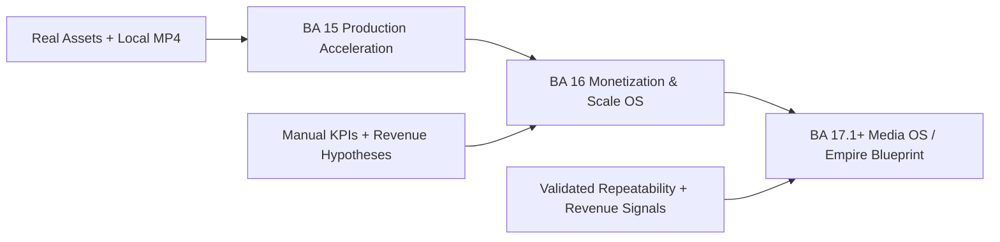
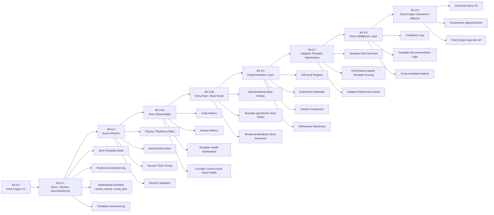

# Pipeline-Plan — News- und YouTube-to-Video

Ziel dieses Dokuments ist eine **kontrollierte Weiterentwicklung**: Phasen, Status, Akzeptanzkriterien, Tests und dokumentierter Fehler-Rücklauf (siehe [ISSUES_LOG.md](ISSUES_LOG.md)).  
Neue fachliche Bausteine werden idealerweise zuerst mit [MODULE_TEMPLATE.md](MODULE_TEMPLATE.md) skizziert.

---

## Gesamtziel

Eine **zuverlässige, modulare Pipeline** von **Quellen** (Nachrichten-URLs, YouTube) zu **strukturierten, redaktionell nutzbaren Skripten** für längere Videoformate — mit **optionaler LLM-Nutzung**, **stabilem Fallback ohne API-Key**, **festem JSON-Vertrag** für Skript-Endpoints und klarer **Warn- und Fehlerlogik**. Spätere Phasen erweitern um Prüfung, Monitoring, Persistenz, Medienproduktion und Veröffentlichungsvorbereitung — ohne die bestehenden API-Verträge ungeplant zu brechen.

---

## Aktueller Stand (Kurz)

### BA 0.0 — Prompt Operating System (PPOS) V1 (**done / meta**)

**Zweck:** Meta-Governance-Layer für zukünftige BA-Prompts: **Global Prompt Ruleset**, Pattern Library, Token-Compression-Makros und Standard-BA-/Suite-Contracts. **Nicht Teil der Produktionsausführung**; keine Runtime-, API-, Firestore-, Frontend- oder `GenerateScriptResponse`-Änderung. Kanonische Dokumente: [docs/PROMPT_OPERATING_SYSTEM.md](docs/PROMPT_OPERATING_SYSTEM.md), [docs/PROMPT_PATTERNS.md](docs/PROMPT_PATTERNS.md), optionaler Effizienzleitfaden [docs/TOKEN_EFFICIENCY_GUIDE.md](docs/TOKEN_EFFICIENCY_GUIDE.md).

| Bereich | Stand |
|--------|--------|
| FastAPI, Health | Lokal und Cloud Run MVP v1 nutzbar |
| Skript aus Artikel-URL | `POST /generate-script` — Extraktion, LLM optional, Fallback |
| YouTube Transkript → Skript | `POST /youtube/generate-script` — gleicher Response-Vertrag wie Generate |
| Kanal-Discovery | `POST /youtube/latest-videos` — RSS, Scoring, ohne Data API |
| Review / Originalität | `POST /review-script` — V1 heuristisch (Phase 4 **done**) |
| Persistenz Jobs / Watchlist / Voice / Bild / Render / Publish | Teilweise (Phase 5 Schritt 1–4: Watchlist **CRUD** + **`/check`** + Firestore `watch_channels` / **`processed_videos`** / **`script_jobs`** + manueller **`POST /watchlist/jobs/{job_id}/run`** → **`generated_scripts`** — **kein** Scheduler/Auto-Run bis später geplant) |

Details zu Deploy und Tests: [README.md](README.md), [DEPLOYMENT.md](DEPLOYMENT.md).  
Agenten- und Qualitätsregeln: [AGENTS.md](AGENTS.md).

### Nächste Priorität (Ausrichtung)

| Strang | Rolle | Kurzhinweis |
|--------|--------|-------------|
| **BA 9.x Story Engine Kern** (**9.7–9.9**) | **abgeschlossen** | Umsetzung: **`GET /story-engine/template-health`**, Control-Panel **`template_optimization`** / **`story_intelligence`**; Canonical **„Story OS“:** [docs/STORY_ENGINE_OS.md](docs/STORY_ENGINE_OS.md). **`GenerateScriptResponse`** weiterhin **6 Felder**. |
| **Phase 7** — Voiceover (TTS) | **primär Makro-Produkt nach Story-Kern** | Ausführungsplan **Baustein 7.1–7.8:** [docs/phases/phase7_voice_bauplan.md](docs/phases/phase7_voice_bauplan.md); erste Provider-Wahl + Secret-Setup ohne Repo-Secrets ([DEPLOYMENT.md](DEPLOYMENT.md)). |
| **Betrieb** — Cloud Scheduler (+ optional IAP/OAuth) | **alternativ Betrieb** | HTTP-Endpunkte **`POST /watchlist/automation/run-cycle`** und **`POST /production/automation/run-daily-cycle`** existieren; zeitgesteuerte oder abgesicherte Aufrufe sind **Deploymentsache**, kein eigener Pipeline-Baustein in diesem Repo ohne separates Deliverable. |

*Reihenfolge-Hinweis:* Die **Story-Engine-Maturity-Linie bis 9.9** ist dokumentarisch/im Code **geschlossen**; neue Priorität liegt typischerweise bei **Phase 7 (Voice)** oder bei **GCP-Scheduling** entscheidbar (siehe Tabelle).

---

## Phasenübersicht

| # | Phase | Status |
|---|--------|--------|
| 1 | Skriptmotor | **done** |
| 2 | YouTube Channel Discovery | **done** |
| 3 | YouTube Transcript-to-Script | **done** |
| 4 | Script Review / Originality Check | **done** |
| 5 | Watchlist / Channel Monitoring | **next** |
| 6 | Script Job Speicherung | **planned** |
| 7 | Voiceover | **in progress** |
| 8 | Bild- / Szenenplan | **in progress** |
| 9 | Video Packaging | **planned** |
| 10 | Veröffentlichungsvorbereitung | **planned** |

**Hinweis zur Nummerierung:** Die **BA 9.x**-Bausteine (**Template Engine / Story Engine** in `app/story_engine/`) sind eine **eigene Produkt-Release-Linie** und **nicht** dasselbe wie **Phase 9** in dieser Tabelle (MP4/Packaging). Ausführlicher Bauplan: [PIPELINE_PLAN.md](PIPELINE_PLAN.md) (Abschnitt **„BA 9 — Template Engine / Story Engine (Produktachse)“**).

---

### Phase 1 — Skriptmotor

| | |
|--|--|
| **Status** | **done** |
| **Ziel** | Aus einer Nachrichten-URL ein strukturiertes Skript (Titel, Hook, Kapitel, `full_script`, Quellen, Warnungen) erzeugen; Dauer- und Wortlogik; LLM optional; Fallback ohne OpenAI. |
| **Endpoints** | `GET /health`, `POST /generate-script` |
| **Relevante Dateien** | `app/main.py`, `app/routes/generate.py`, `app/utils.py`, `app/models.py`, `app/config.py` |
| **Akzeptanzkriterien** | Fester JSON-Vertrag unverändert; kein HTTP 500 bei LLM-Fehler; `warnings` bei Fallback und Qualitätslücken; `python -m compileall app` grün. |
| **Bekannte Grenzen** | Qualität abhängig von Extraktion und Quelltext; kein automatischer Faktencheck. |
| **Nächster Schritt** | Phase 1 nur bei Regression oder Vertragsänderung anfassen; Änderungen mit README/AGENTS abstimmen. |

---

### Phase 2 — YouTube Channel Discovery

| | |
|--|--|
| **Status** | **done** |
| **Ziel** | Kanal identifizieren, neueste Videos per öffentlichem RSS listen, Heuristik-Score und Kurzbegründung für Auswahl langer Formate (inkl. Shorts-Abwertung). |
| **Endpoints** | `POST /youtube/latest-videos` |
| **Relevante Dateien** | `app/routes/youtube.py`, `app/youtube/service.py`, `app/youtube/rss.py`, `app/youtube/resolver.py`, `app/youtube/scoring.py`, `app/models.py` (`LatestVideos*`) |
| **Akzeptanzkriterien** | Response-Struktur stabil; sinnvolle `warnings` bei Auflösungs-/Feed-Fehlern; keine YouTube Data API Pflicht; Tests laut README/Agent-Regeln. |
| **Bekannte Grenzen** | `@handle`-Auflösung kann an Cookie-/Consent-Seiten scheitern; `/channel/UC…` bevorzugen; `summary` nur aus Metadaten, nicht aus Transkript. |
| **Nächster Schritt** | Optional Feintuning Scoring nur mit Plan-Eintrag und ISSUES_LOG bei Bugs. |

---

### Phase 3 — YouTube Transcript-to-Script

| | |
|--|--|
| **Status** | **done** |
| **Ziel** | YouTube-Video-URL → Transkript (öffentliche Untertitel) → gleiches Skript-Format wie Artikel-Pipeline; redaktionell als eigene Story, nicht Abschrift. |
| **Endpoints** | `POST /youtube/generate-script` |
| **Relevante Dateien** | `app/routes/youtube.py`, `app/utils.py` (Transkript, gemeinsame Skript-Pipeline), `app/models.py` |
| **Akzeptanzkriterien** | Gleicher Response-Vertrag wie `/generate-script`; bei fehlendem Transkript 200 mit leerem/minimalem Vertrag und klarer `warning`; keine Data API Pflicht. |
| **Bekannte Grenzen** | Nicht jedes Video hat Untertitel; Sprachen und Verfügbarkeit variieren. |
| **Nächster Schritt** | Nur bei Transkript-/Parsing-Problemen ändern; Vorgänge in ISSUES_LOG festhalten. |

---

### Phase 4 — Script Review / Originality Check

| | |
|--|--|
| **Status** | **done** (V1 heuristisch, Stand siehe README und `tests/test_review_script.py`) |
| **Ziel** | Zusätzliche Prüfstufe vor Voiceover/Bild/Video: Nähe zum Quelltext, lange gemeinsame Wortfolgen, Satz-Ähnlichkeit, grobe Einordnungs-Signale. Architektur **hybrid-fähig**; **V1 nur lokal** (kein `llm_review.py`). **`GenerateScriptResponse` unverändert**; Review eigener Vertrag. |
| **Endpoints** | `POST /review-script` — Request: `source_url`, `source_type`, `source_text`, `generated_script`, `target_language`, `prior_warnings`; Response: `risk_level`, `originality_score` (0–100, höher = eigenständiger), `similarity_flags`, `issues`, `recommendations`, `warnings`. |
| **Relevante Dateien** | `app/models.py` (`ReviewScriptRequest`, `ReviewScriptResponse`, …), `app/review/__init__.py`, `app/review/originality.py`, `app/review/service.py`, `app/routes/review.py`, `app/main.py` (Router), `README.md`, Tests: `tests/test_review_script.py`. |
| **Akzeptanzkriterien (V1)** | 200 + strukturiertes JSON; 422 wenn `source_text` und `generated_script` beide leer; kein Secret-/.env-Zugriff im Review-Modul; kein Volltext-Logging; LLM-Fehler irrelevant (kein LLM in V1); bei identischem Text `high` / niedriger Score; eigenständiges Skript `low` oder `medium` möglich; `python -m compileall app` grün; Unittests für Kernfälle grün. |
| **Bekannte Grenzen (V1)** | Rein **heuristisch**; **keine Rechtsberatung**; False Positives/Negatives möglich; **qualitatives LLM-Review** bewusst **nicht** in V1 — in `warnings` dokumentiert; für V1.1 optional `app/review/llm_review.py` nach MODULE_TEMPLATE. |
| **Nächster Schritt** | Feintuning Schwellen nur mit Plan-Eintrag; LLM-Review optional Phase 4.x / V1.1; bei Incidents [ISSUES_LOG.md](ISSUES_LOG.md). |

---

### Phase 5 — Watchlist / Channel Monitoring

| | |
|--|--|
| **Status** | **next** (Phase 5 weiterhin aktiv; Schritt 1 wie unten dokumentiert vorhanden; Gesamtphase **nicht** `done`) |
| **Umsetzungsstand** | **Schritt 1–4 umgesetzt** (CRUD, Check, Jobs, **`POST …/jobs/{job_id}/run`**, **`generated_scripts`**). **BA 5.5–5.7:** Recheck, **`run-pending`**, **`run-cycle`**, **`POST …/jobs/{job_id}/review`**. **BA 5.8–6.2:** Pending-Query, Dashboard, Errors-Summary, Governance, **`production_jobs`**-Stub. **BA 6.3–6.5:** Dashboard-Aggregationsfix + Stream-Fallback, **`review_results`** + Verknüpfungen, **`GET/POST /production/jobs`** (Liste, Detail, Skip, Retry ohne Render). **BA 6.6:** Collection **`scene_plans`** Script-to-Szenenplan ohne LLM (**`/production/jobs/{id}/scene-plan/*`**); **`generated_scripts`** unverändert. **BA 6.7:** Collection **`scene_assets`**, Prompt-Entwürfe aus **`scene_plans`** (**`/production/jobs/{id}/scene-assets/*`**), ohne externe Bild-/Video-Generatoren. **BA 6.8–7.0:** **`voice_plans`**, **`render_manifests`**, Connector-Export (**`/production/jobs/{id}/voice-plan/*`**, **`render-manifest/*`**, **`GET …/export`**) — Datenstrukturen und JSON, **ohne** echtes TTS/Video/Provider-Upload. **BA 6.6.1:** Dev-Endpoint **`/dev/fixtures/completed-script-job`** (nur wenn **`ENABLE_TEST_FIXTURES`**) zur Erzeugung abgeschlossener Test-Jobs ohne YouTube. **BA 7.1–7.4:** Collection **`production_checklists`** (Doc-ID = **`production_job_id`**); **`GET …/export/download?format=json|markdown|csv|txt`** (Manifest-Paket + `provider_templates`-Blöcke); **`POST/GET …/checklist/init|GET|update`**; **`production_jobs.status`** Workflow (**`planning_ready`** … **`published`**). **BA 7.5–7.7:** **`POST /production/automation/run-daily-cycle`** ( **`run_automation_cycle`** + Pending Jobs + Production-Artefakte bis Checkliste; **`dry_run`** ohne Schreibzugriffe); Collections **`provider_configs`** / **`production_files`** (Konfig-Status, geplante Pfade); **`GET/POST /providers/*`**, **`POST/GET …/production/jobs/{id}/files/plan|GET …/files`** — ohne echte Provider-Aufrufe und ohne Cloud Scheduler Deploy. **BA 7.8–7.9:** Collections **`execution_jobs`**, **`production_costs`**; **`execution_queue.py`-Logik**, **`cost_calculator.py`**; **`POST …/production/jobs/{id}/execution/init`**, **`GET …/execution`**, **`POST …/costs/calculate`**, **`GET …/costs`** — Queue ohne Provider-Dispatch; Budget nur Heuristik (EUR). **BA 8.0–8.2:** **`pipeline_audits`**, **`recovery_actions`**, Audit-/Recovery-/Monitoring-Endpunkte (**`/production/audit/*`**, **`…/recovery/retry`**, **`/production/monitoring/summary`**). **BA 8.3:** Collection **`pipeline_escalations`**, Modul **`status_normalizer.py`** — Status-Normalisierung (**`stuck`**, **`retryable`**, **`partial_failed`**, Gap-Erkennung), Escalation Cases, Retry-Disziplin; **`POST /production/status/normalize/run`**, **`GET /production/status/escalations`**. **BA 8.4 LIGHT:** **`GET /production/control-panel/summary`**, Modul **`control_panel.py`** — read-only Founder-Übersicht (bestehende Collections aggregiert). **BA 8.5:** **`input_quality_guard.py`** — Transkript-/Eingangsqualität (`transcript_missing` \| `transcript_blocked` \| `transcript_partial` \| `source_low_quality`), **`input_quality_status`** auf **`script_jobs`** / **`processed_videos`** / Check-Items; keine unnötige Eskalation bei erwartbarem Fehlen von Untertiteln. **BA 8.6:** **`provider_discipline.py`** — **`seed_default_provider_configs`**, **`validate_provider_runtime_health`**; **`POST /providers/configs/seed-defaults`** (optional `apply_writes`); erweiterte Provider-Namen **`voice_default`**, **`image_default`**, **`render_default`**. **BA 8.7:** **`production_costs`** um **`cost_baseline_expected`**, **`cost_variance`**, **`over_budget_flag`**, **`step_cost_breakdown`**, **`estimated_profitability_hint`** (grob). **BA 8.8:** Referenzdoku **`GOLD_PRODUCTION_STANDARD.md`**; Test-Goldpfad **`tests/test_ba88_full_production_run.py`**. **BA 8.9:** **`OPERATOR_RUNBOOK.md`** (Daily Check, Dry Run, Incidents). **BA 9.0 (Template Engine):** **`app/story_engine/`**, optional **`video_template`**, Persistenz/Connector, Downstream-Profile, Tests **`tests/test_ba90_story_engine.py`**. **BA 9.1:** Blueprints, **`[template_conformance:…]`**, **`GET /story-engine/templates`**, **`tests/test_ba91_story_engine.py`**. **BA 9.2:** Hook Engine (**`POST /story-engine/generate-hook`**, Persistenz-Meta auf **`generated_scripts`**), **`tests/test_ba92_hook_engine.py`**. **BA 9.3–9.6:** Conformance/Gate, **`story_structure`**, **`POST /story-engine/rhythm-hint`**, Story-Observability (**Control Panel**), Story-Pack im Export, Experiment-Registry (**`GET /story-engine/experiment-registry`**) — **done** (Details **BA 9** unten; Tests u. a. **`tests/test_ba9396_story_maturity.py`**). **BA 9.7–9.9:** Adaptive Optimization, Story Intelligence und Story-Engine-Ops-Reife — **done** (**`GET /story-engine/template-health`**, Control-Panel `template_optimization` / `story_intelligence`, **[docs/STORY_ENGINE_OS.md](docs/STORY_ENGINE_OS.md)**, **[OPERATOR_RUNBOOK.md](OPERATOR_RUNBOOK.md)** Abschnitt Story Engine). |
| **Ziel (Kurz)** | YouTube-Kanäle dauerhaft speichern, regelmäßig oder manuell prüfen, neue Videos erkennen, Kandidaten bewerten, Script-Jobs vorbereiten und Status führen — aufbauend auf bestehender RSS-/Discovery-Logik (`POST /youtube/latest-videos`). |
| **Relevante Dateien** | `app/youtube/*` (Resolver, RSS für Kanalnamen bei Create), **implementiert:** `app/story_engine/` (**BA 9** inkl. **`hook_engine`**, **`hook_library`**, BA 9.2), **`app/routes/story_engine.py`** (**`GET /story-engine/templates`**, **`POST /story-engine/generate-hook`**, **`POST /story-engine/rhythm-hint`**, **`POST /story-engine/scene-plan`** (Makro‑Phase 8.1 Visual Blueprint, ohne Bildprovider/Persistenz), **`POST /story-engine/scene-prompts`** (Makro‑Phase 8.2 Prompt Engine V1, **[docs/modules/phase8_82_prompt_engine_v1.md](docs/modules/phase8_82_prompt_engine_v1.md)**), **`GET /story-engine/experiment-registry`**, **`GET /story-engine/template-health`** (BA 9.7/9.8)), **`app/visual_plan/`**, `app/watchlist/` (inkl. `scene_plan.py` BA 6.6, `scene_asset_prompts.py` BA 6.7, `voice_plan.py` BA 6.8, `render_manifest.py`, `connector_export.py` BA 6.9–7.0, **`export_download.py`**, **`production_checklist.py`** BA 7.1–7.4, `dev_fixture_seed.py` BA 6.6.1, **`execution_queue.py`**, **`cost_calculator.py`** BA 7.8–7.9 / **8.7**, **`pipeline_audit_scan.py`** BA 8.0, **`status_normalizer.py`** BA 8.3, **`control_panel.py`** BA 8.4, **`input_quality_guard.py`** BA 8.5, **`provider_discipline.py`** BA 8.6), `app/routes/watchlist.py`, `app/routes/dev_fixtures.py`, **`app/routes/production.py`**, **`app/routes/providers.py`** (BA 7.5–8.6), `tests/test_watchlist_*.py`, `tests/test_ba66_scene_plan.py`, `tests/test_ba67_scene_assets.py`, `tests/test_ba68_6970_production_voice_render_export.py`, **`tests/test_ba714_production_os.py`**, **`tests/test_ba75_77_automation_provider_storage.py`**, **`tests/test_ba78_79_execution_budget.py`**, **`tests/test_ba80_82_hardening.py`**, **`tests/test_ba83_status_normalization.py`**, **`tests/test_ba84_control_panel.py`**, **`tests/test_ba85_input_quality_guard.py`**, **`tests/test_ba86_provider_seed.py`**, **`tests/test_ba87_cost_baseline.py`**, **`tests/test_ba88_full_production_run.py`**, **`tests/test_ba89_operator_runbook.py`**, **`tests/test_ba90_story_engine.py`**, **`tests/test_ba91_story_engine.py`**, **`tests/test_ba92_hook_engine.py`**, **`tests/test_ba9396_story_maturity.py`**, **`tests/test_ba97_template_optimization.py`**, **`tests/test_ba98_story_intelligence.py`**, **`tests/test_phase8_81_visual_contract.py`**, **`tests/test_phase8_82_prompt_engine.py`**, `tests/test_ba661_dev_fixtures.py`; `app/models.py` (**`GenerateScriptResponse`**-Vertrag unverändert) |
| **Bekannte Grenzen** | YouTube-RSS liefert keine Echtzeit-Garantie; `@handle`-Auflösung bleibt fragiler als `/channel/UC…` (wie Phase 2). |

#### Zielbild Phase 5

- Nutzer hinterlegen YouTube-Kanäle (**Watchlist**); das System löst **`channel_id`** / Anzeigenamen wo möglich auf und persistiert Kanalparameter (Prüfintervall, `max_results`, Schwellen, Shorts-Verhalten, Zielsprache/Dauer für spätere Jobs).
- **Prüfen** nutzt dieselbe fachliche Basis wie **`POST /youtube/latest-videos`** (Resolver, RSS-Feed, Heuristik-**Score**/**reason**).
- **Neue** Videos gegenüber bereits bekannten Einträgen erkennen; **Duplicate Prevention** über gespeicherte **`video_id`**.
- Bei passenden/neuen Videos können **Script-Jobs** entstehen; Ausführung und Speicherung folgen den V1-Regeln unten.
- **Nicht Ziel von Phase 5 V1:** automatische Veröffentlichung; Voiceover; Video-Rendering/Produktion; eigenes Frontend-Dashboard; Nutzerverwaltung; YouTube Data API; Aufbewahrung großer Roh-Transkripte ohne Nutzen für die Pipeline.

#### Speicher — Empfehlung

- **Firestore (Native Mode)** als empfohlene Speicherlösung: Cloud Run bleibt zustandslos; strukturierte Entitäten, Abfragen (Kanäle, Jobs, Duplikate); IAM über GCP-Service-Account; passt zu Watchlist-, Job- und Review-Persistenz.
- JSON-Datei oder Roh-GCS ohne Index sind für Status/Queues und Konkurrenz auf Cloud Run ungeeignet.

#### Firestore — geplante Collections

| Collection | Zweck |
|------------|--------|
| **watch_channels** | Überwachte Kanäle: u. a. URL, `channel_id`, Name, Status (`active` / `paused` / `error`), `check_interval`, `max_results`, Flags `auto_generate_script`, `auto_review_script`, Zielsprache/Dauer/Schwellen, `ignore_shorts`, Zeitstempel, letzte Fehler-/Check-Infos (`last_checked_at`, `last_error`, …). |
| **processed_videos** | Bekannte Videos: `video_id`, Zuordnung zum Kanal, URL/Titel, `published_at`, Status (z. B. seen / skipped / …), Score/Grund/Short-Hinweis, Verweise auf Job/Review-IDs. |
| **script_jobs** | Jobs zur Skripterzeugung: Status (`pending`, `running`, `completed`, `failed`, …), Verknüpfung zu Video/Kanal, Parameter, Zeitstempel, Verweise auf Ergebnis-IDs/Fehler. |
| **generated_scripts** | Persistenz generierter Skripte im Sinne des festen **`GenerateScriptResponse`** (Titel, Hook, Kapitel, `full_script`, Quellen, Warnungen — Vertrag bestehender Skript-Endpoints nicht brechen). |
| **review_results** | Ergebnisse analog **`POST /review-script`** — persistiert durch **`POST /watchlist/jobs/{job_id}/review`** wenn Job **`completed`** + **`generated_script_id`**. Verknüpfung **`script_jobs.review_result_id`**, optional **`processed_videos.review_result_id`**. |
| **watchlist_meta** | Kleines Metadokument (z. B. Doc **`automation`**: `last_run_cycle_at` nach erfolgreichem **`run-cycle`-Durchlauf). |
| **production_jobs** | Vorbereitung späterer Produktion (Voice/Render): Status, Verweise auf **`generated_script_id`** / **`script_job_id`**, Platzhalterfelder — **kein** Rendern in dieser BA. |
| **scene_plans** | BA 6.6: strukturierter Szenenplan je Production Job (**Document-ID** = **`production_job_id`**), Verknüpfung zu **`generated_script_id`** / **`script_job_id`**; keine Änderung an **`generated_scripts`**. Deterministische Erzeugung, idempotent beim erneuten Aufruf. |
| **scene_assets** | BA 6.7: strukturierte Prompt-Entwürfe (Bild/Video/Thumbnail/Kamera) je Szene, **Document-ID** = **`production_job_id`**, Verknüpfung zu **`scene_plan_id`**, **`generated_script_id`**, **`script_job_id`**, **`style_profile`**, **`asset_version`**; keine Ausführung bei Leonardo/Kling o. Ä. |
| **voice_plans** | BA 6.8: Voice-Blöcke je Szene aus **`voiceover_chunk`** (kein TTS); **Document-ID** = **`production_job_id`**, Verknüpfung zu **`scene_assets_id`**, optionaler Body **`voice_profile`**, **`voice_version`**, **`blocks[]`**, **`warnings`**. |
| **render_manifests** | BA 6.9 + 7.0: gebündeltes Maschinenmanifest und Export-Basis (`production_job`, `scene_plan`, `scene_assets`, `voice_plan`, **`timeline[]`**, **`estimated_total_duration_seconds`**, **`export_version`**, Status **`ready` \| incomplete \| failed`); **Document-ID** = **`production_job_id`**. |
| **production_checklists** | BA 7.1–7.4: Freigaben/Workflow (**Document-ID** = **`production_job_id`**). |
| **provider_configs** | BA 7.6: **`provider_name`** (elevenlabs, openai, …); **`enabled`**, **`dry_run`**, Budgetfelder (**keine** API-Secrets). |
| **production_files** | BA 7.7: geplante Artefakt-Pfade pro **`production_job_id`** (**`storage_path`**, **`file_type`**, **`status`** `planned` \| …); **ohne** GCS/GCS-Upload im MVP. |
| **execution_jobs** | BA 7.8: aus **`production_files`** abgeleitete ausführbare Tasks (**Doc-ID** typ. **`exjob_*`**, deterministisch ab **`pfile_*`**); Status **`queued` \| running \| …**; keine echten Provider-Calls aus diesem Endpoint. |
| **production_costs** | BA 7.9: geschätztes Budget je **`production_job_id`** (**Document-ID** = Job-ID): Voice/Bild/Video/Thumbnail/Buffer (**EUR**); **`actual_total_cost`** Vorbereitung für spätere echte Ist-Kosten — **nicht** angebunden an API-Abbuchungen. |
| **pipeline_audits** | BA 8.0: persistierte Audit-Befunde (fehlende Artefakte, **`dead_job`**, Drift-Hinweise); deterministic **`aud_pj_*` / `aud_sj_*`** Dokument-IDs. |
| **recovery_actions** | BA 8.1: Protokolle gezielter Recovery-Schritte ( **`retry_*`**, **`full_rebuild`**). |
| **pipeline_escalations** | BA 8.3: Eskalationen (Severity, Kategorie, Retry-Zähler, Provider-Flag, Verknüpfungen); deterministische **`esc_*`** Doc-IDs. |

#### Watchlist-Endpunkte (Phase 5 — Stand Code)

| Methode | Pfad | Zweck |
|---------|------|--------|
| `POST` | `/watchlist/channels` | Kanal in Watchlist anlegen |
| `GET` | `/watchlist/channels` | Watchlist auflisten |
| `POST` | `/watchlist/channels/{channel_id}/check` | Einen Kanal manuell prüfen |
| `POST` | `/watchlist/channels/{channel_id}/recheck-video/{video_id}` | **Ops/Dev:** Ein einzelnes Video erneut gegen die gleiche Pipeline-Logik prüfen (Warnung bei Löschen genau eines `processed_videos`-Docs; keine Massenaktion). |
| `GET` | `/watchlist/jobs` | Script-Jobs auflisten |
| `POST` | `/watchlist/jobs/run-pending` | Pending Jobs nacheinander ausführen (Query **`limit`** Default 3, Max 10; Batch bricht nicht bei Einzelfehlern ab). |
| `POST` | `/watchlist/automation/run-cycle` | Aktive Kanäle prüfen (Cap **`channel_limit`**), anschließend **`run_pending`** (Cap **`job_limit`**) — **ohne** Cloud Scheduler, nur Endpoint für spätere IAP/Cron-Anbindung. |
| `POST` | `/watchlist/jobs/{job_id}/run` | Einen Script-Job manuell ausführen (**`generated_scripts`**). |
| `POST` | `/watchlist/jobs/{job_id}/review` | Heuristik wie **`POST /review-script`** aus gespeichertem Skript; Persistenz **`review_results`** bei **`completed`** + **`generated_script_id`**; **keine** Änderung des ScriptJob-Status bei Review-/Speicherfehlern. |
| `GET` | `/watchlist/dashboard` | Snapshot: Zähler Kanäle/Videos/Jobs/Skripte, Health (`last_successful_job_at`, `last_run_cycle_at`, Warnungen). |
| `GET` | `/watchlist/errors/summary` | Stichprobe: Aggregation **`error_code`** / **`skip_reason`** mit Beispiel-IDs (`max_docs`). |
| `POST` | `/watchlist/jobs/{job_id}/retry` | **`failed`**/**`skipped`** → **`pending`**, Fehlerfelder leeren. |
| `POST` | `/watchlist/jobs/{job_id}/skip` | **`pending`**/**`failed`** → **`skipped`**, **`manual_skip`**. |
| `POST` | `/watchlist/channels/{channel_id}/pause` | Kanal **`paused`**. |
| `POST` | `/watchlist/channels/{channel_id}/resume` | Kanal **`active`** (nur aus **`paused`**). |
| `POST` | `/watchlist/jobs/{job_id}/create-production-job` | **`production_jobs`** anlegen (idempotent), nur **`completed`** + **`generated_script_id`**. |
| `GET` | `/production/jobs` | Produktions-Stubs auflisten (**`limit`**, Default 50, Max 200). |
| `GET` | `/production/jobs/{production_job_id}` | Ein Produktions-Job lesen (**404**, wenn nicht vorhanden). |
| `POST` | `/production/jobs/{production_job_id}/skip` | **`queued`**/**`failed`** → **`skipped`** (**keine** Videoproduktion). |
| `POST` | `/production/jobs/{production_job_id}/retry` | **`failed`**/**`skipped`** → **`queued`**. |
| `POST` | `/production/jobs/{production_job_id}/scene-plan/generate` | Deterministischen Szenenplan erzeugen / vorhandenen zurückgeben (idempotent); persistiert **`scene_plans`**. |
| `GET` | `/production/jobs/{production_job_id}/scene-plan` | Szenenplan lesen (**404**, wenn nicht vorhanden). |
| `POST` | `/production/jobs/{production_job_id}/scene-assets/generate` | Prompt-Entwürfe je Szene erzeugen / vorhandenes **`scene_assets`**-Dokument zurückgeben (idempotent); optionaler Body `style_profile` (`documentary` Default). Persistenz **`scene_assets`**. |
| `GET` | `/production/jobs/{production_job_id}/scene-assets` | Scene-Assets lesen (**404**, wenn nicht vorhanden). |
| `POST` | `/production/jobs/{production_job_id}/voice-plan/generate` | Voice-Plan aus **`scene_assets`** erzeugen (**idempotent** wenn vorhanden); optionaler Body **`voice_profile`** (`documentary` \| `news` \| `dramatic` \| `soft`); persistiert **`voice_plans`**. |
| `GET` | `/production/jobs/{production_job_id}/voice-plan` | Voice-Plan lesen (**404**, wenn nicht vorhanden). |
| `POST` | `/production/jobs/{production_job_id}/voice/synthesize-preview` | Phase 7.2: TTS‑Preview (**OpenAI Speech**) aus bestehendem **`voice_plan`**, keine Audio‑Persistenz; Body **`dry_run`**, **`max_blocks`** (1–5), optional **`voice`**; Default **Metadata only** (optional **`audio_base64`** nur mit **`ENABLE_VOICE_SYNTH_PREVIEW_BODY`** und Byte‑Limit); ohne API‑Key weiterhin HTTP **200** mit **`warnings`**, kein blindes HTTP 500. |
| `POST` | `/production/jobs/{production_job_id}/voice/synthesize` | Phase 7.3: Voice‑Commit (**OpenAI Speech**) aus **`voice_plan`** → **`production_files`** (`file_type=voice`): Metadaten u. a. **`status`**, **`synthesis_byte_length`**; **keine** Audioblobs in Firestore; Body **`dry_run`**, **`max_blocks`** (1–50), **`overwrite`**, optional **`voice`**; Idempotenz: **`skipped_ready`** bei bestehendem **`ready`** + Bytes ohne **`overwrite`**; Firestore‑Fehler **503** wie andere Produktions‑Routen. |
| `POST` | `/production/jobs/{production_job_id}/render-manifest/generate` | Render-Manifest (**`render_manifests`**) aus Bausteinen zusammenstellen (**404** ohne **`scene_assets`**); enthält **`voice_production_file_refs`** aus **`production_files`**. |
| `GET` | `/production/jobs/{production_job_id}/render-manifest` | Render-Manifest lesen (**404**, wenn nicht vorhanden). |
| `GET` | `/production/jobs/{production_job_id}/export` | BA 7.0 / Phase 7.7: connector-ready JSON (**`generic_manifest`**, Provider-Stubs, **`metadata`**, **`voice_artefakte`** aus **`production_files`**, Typ **`voice`**) — **ohne** echte Provider-Aufrufe. |
| `GET` | `/production/jobs/{production_job_id}/export/download` | BA 7.1 / Phase 7.7: Manifest + Templates als Download (`format=json|markdown|csv|txt`); JSON‑Paket kann **`voice_artefakte`** in **`provider_templates`** spiegeln. |
| `POST` | `/production/jobs/{production_job_id}/checklist/init` | BA 7.3: Checkliste anlegen/idempotent zurückgeben. |
| `GET` | `/production/jobs/{production_job_id}/checklist` | Checkliste lesen (**404**, wenn keine). |
| `POST` | `/production/jobs/{production_job_id}/checklist/update` | Manuelle Booleans (**`thumbnail_ready`**, …). |
| `POST` | `/production/automation/run-daily-cycle` | BA 7.5: Watchlist **`run-cycle`** + Pending Jobs + Produktions-Schritte; Body **`channel_limit`**, **`job_limit`**, **`production_limit`**, **`dry_run`** (read-only ohne Firestore-Schreibvorgänge). |
| `GET` | `/providers/configs` | BA 7.6: Liste **`provider_configs`**. |
| `POST` | `/providers/configs/seed-defaults` | BA 8.6: Standard-Slots **`openai`**, **`voice_default`**, **`image_default`**, **`render_default`** (Query **`apply_writes`**, Default false — Vorschau ohne Schreibzugriff). |
| `GET` | `/providers/status` | BA 7.6: Aktiv-/Dry-run-Übersicht (alle registrierten Provider). |
| `POST` | `/production/jobs/{production_job_id}/files/plan` | BA 7.7: Geplante Storage-Pfade in **`production_files`** (**404** ohne Job). |
| `GET` | `/production/jobs/{production_job_id}/files` | BA 7.7: Artefakte pro Job (**404** ohne Job). |
| `POST` | `/production/jobs/{production_job_id}/execution/init` | BA 7.8: Aus **`production_files`** ausführbare **`execution_jobs`** erzeugen (idempotent bei bestehenden IDs). Ohne echte Provider-Calls — **Warnung**, wenn bereits Jobs existieren oder keine **`production_files`** geplant wurden. |
| `GET` | `/production/jobs/{production_job_id}/execution` | BA 7.8: Liste **`execution_jobs`** (**404** ohne **`production_jobs`**). |
| `POST` | `/production/jobs/{production_job_id}/costs/calculate` | BA 7.9: Heuristische Kostenschätzung (EUR) berechnen und **`production_costs`** speichern (**404** ohne Job). |
| `GET` | `/production/jobs/{production_job_id}/costs` | BA 7.9: **`production_costs`** lesen (leer ohne vorheriges **`calculate`**, dann Hinweis in **`warnings`**). |
| `POST` | `/production/audit/run` | BA 8.0: Pipeline-Scan gegen Production-/Script-Artefakte (`pipeline_audits` upsert, optional Resolver offene Befunde). |
| `GET` | `/production/audit` | BA 8.0: Liste **pipeline_audits** (Filter **`status`**, **`severity`**). |
| `POST` | `/production/jobs/{production_job_id}/recovery/retry` | BA 8.1: Body **`step`** (`scene_plan`, `scene_assets`, `voice_plan`, `render_manifest`, `execution`, `costs`, `files`, `full_rebuild`) — **nicht** der Legacy- **`POST …/retry`** zur Status-Anhebung. |
| `GET` | `/production/monitoring/summary` | BA 8.2: Aggregation offener Schweregrade + kleine Probe **`resolved`** & **`recovery_actions`**. |
| `POST` | `/production/status/normalize/run` | BA 8.3: Status-Normalisierung/Eskalationen (Body u. a. Schwellen, **`dry_run`**, **`retry_reason`**). |
| `GET` | `/production/status/escalations` | BA 8.3: letzte **`pipeline_escalations`** (Query **`limit`**). |
| `GET` | `/production/control-panel/summary` | BA 8.4 LIGHT: Founder Control Panel — Aggregation (**`pipeline_audits`**, **`pipeline_escalations`**, **`recovery_actions`**, **`production_jobs`** Stichprobe, **`script_jobs`** Zähler, **`provider_configs`**, **`production_costs`**, Problemfälle). Read-only. |
| `POST` | `/dev/fixtures/completed-script-job` | **Nur wenn `ENABLE_TEST_FIXTURES=true`:** Completed **`script_jobs`** + **`generated_scripts`** (+ optional **`production_jobs`**) ohne Transkript; Präfix **`dev_fixture_`** (**403** ohne Flag; **409** bei Kollision). |

(Response-Verträge der Watchlist-/Production-Endpunkte ergänzend; Kern-Endpoints **`/generate-script`**, **`/youtube/*`**, **`/review-script`** bleiben unverändert.)

#### V1-Entscheidungen (Pflichtlage Plan)

| Thema | Entscheid |
|-------|-----------|
| Neue Videos → Ausführung | Nach Check entstehen **nur `pending` Script-Jobs** — **keine** automatische Ausführung aller Jobs in V1. |
| Job-Ausführung | **Manuell** über **`POST /watchlist/jobs/{job_id}/run`** (Kosten-/Kontrollgründe, weniger Blind-LLM-Last). |
| Veröffentlichung | **Kein Auto-Publish** |
| Produktion | **Keine Voiceover-/Video-Produktion** in Phase 5 |

#### Scheduler und Auth (nach V1)

- **Cloud Scheduler:** erst **ab V1.1** vorgesehen (z. B. wiederkehrender Aufruf von **`POST /watchlist/automation/run-cycle`** mit Auth-Header/Secret). Der **Endpoint** existiert bereits (Phase 5.6); **Deploy/Trigger** in GCP ist noch **nicht** Teil des Repos.
- In V1 wird `check_interval` nur gespeichert/ausgewertet, wo die Implementierung es vorsieht; kein Produktzwang Scheduler in V1.
- **Absicherung:** Öffentlicher Cloud-Run-Service erfordert für Scheduler später **klare Auth** (z. B. gemeinsamer Request-Header mit Secret nur in Secret Manager, oder geschützte Invoker-Only-Variante mit Dienstkonto/IAM — Details bei Implementierung, **keine** Secret-Werte in Repo-Doku).

#### Firestore Setup (Plan, keine Secrets)

| Thema | Vorgabe |
|-------|---------|
| Modus | **Native Mode** |
| Client-Bibliothek | **`google-cloud-firestore`** (Python) |
| Cloud Run | Dienst-Service-Account mit Rolle **`roles/datastore.user`** (bzw. vergleichbar für Firestore-Zugriff) |
| Lokal | **Application Default Credentials** (z. B. über `gcloud auth application-default login`) oder **Firestore Emulator** für Tests |

#### Kosten- und Sicherheitsregeln (Plan)

- Obergrenzen für `max_results` und **pro Run** maximal erzeugbare Jobs (`max_jobs_per_run` / ähnliche Caps in der Implementierung).
- Short optional ignorieren; RSS-Score unter `min_score` → keine Job-Erstellung bzw. explizit skipped.
- Duplikate über **`video_id`** verhindern.
- Kein unkontrolliertes LLM-Generating: **Queue** statt sofortiger Massen-Generierung.
- Keine Volltexte sensibler Inhalte in Logs; **AGENTS.md** zu Secrets und Logging beachten.
- Review bleibt redaktionelle Hilfsstufe — **keine** automatische Freigabe zur Veröffentlichung.

#### Akzeptanzkriterien (Phase 5 V1, wenn implementiert)

- Kanal kann gespeichert und gelistet werden.
- Kanal kann manuell geprüft werden; neue Videos werden erkannt, bekannte `video_id` nicht erneut als „neu“ für die gleiche Pipeline-Logik.
- Shorts können per Konfiguration ignoriert werden.
- Bei aktiviertem Auto-Generate: **Jobs** werden angelegt (**pending**); Ausführung nur über **`/watchlist/jobs/{job_id}/run`** (V1-Entscheid).
- Gespeichertes Skript und optionales Review-Resultat wie geplant persistiert.
- Kein Auto-Publish; keine Voiceover-/Video-Produktion in dieser Phase.
- `python -m compileall app` grün; Tests für Kernflows; Deploy Cloud Run weiter nutzbar; Firestore Zugriff lokal/GCP lauffähig nach Doku-Schritt.

#### Testplan (V1 — wenn implementiert)

- Kanal mit `/channel/UC…` hinzufügen; Kanal mit `@handle` mit erwarteten `warnings`.
- Erster Check: neue Videos erkannt.
- Zweiter Check: keine Duplikat-Doppel-Verarbeitung als „neu“.
- `ignore_shorts`: Shorts übersprungen.
- `auto_generate_script` aus: keine neuen Jobs, nur Tracking wie spezifiziert.
- `auto_generate_script` an: **pending** Jobs erstellt, nicht ohne `run`-Call vollständig durch die Pipeline geschleust (V1).
- Job manuell: `generated_scripts` konsistent zum Skript-Vertrag.
- Review-Pfad: `review_results` gespeichert wenn aktiviert.
- Fehler: Transkript fehlt — erwartbare Degradation, keine unsauberen Produkt-Leaks von Secrets.
- Firestore unreachable: definierbare Fehlerantwort/`warnings`/HTTP-Verhalten nach Implementierung wählen — **keine** blinden HTTP-500 durch erwartbare Ausfälle (analog AGENTS-Leitlinie).

#### Schrittweise Umsetzung (Empfehlung)

1. ~~Firestore aktivieren — Repository — **Watchlist CRUD**~~ **(Schritt 1 erledigt, siehe Umsetzungsstand)**.
2. ~~**Manueller Channel Check** — **`processed_videos`** füllen / Duplikatlogik~~ **(Schritt 2 erledigt: `POST …/check`, siehe README / Umsetzungsstand).**
3. ~~**Script-Jobs anlegen** bei neuen Videos (Konfigurationsabhängig)~~ **(Schritt 3 erledigt: Firestore `script_jobs`, `pending`; Ausführung erst Schritt 4).**
4. ~~**Job manuell ausführen** — **`generated_scripts`** persistieren (intern Logik wie `/youtube/generate-script`).~~ **(Schritt 4 umgesetzt: `POST /watchlist/jobs/{job_id}/run`, siehe README.)**
5. ~~Optional **Review** aus Job heraus (**`POST /watchlist/jobs/{job_id}/review`**) ruft **`review_script`** wie **`/review-script`** auf; Persistenz **`review_results`**~~ **done** (Firestore **`review_results`**, **`script_jobs.review_result_id`**).
6. **Scheduler / Cron in GCP** — **`run-cycle`** kann extern getriggert werden; Produkt-Timing & Auth später (V1.1+) mit Absicherung.

#### Stabilisierung zwischen Schritt 4 und Schritt 5 (Quality Gate: Transcript-Preflight, Job-Fehlercodes)

| | |
|--|--|
| **Status** | **done** (Qualitätssicherung; **keine** neue Hauptphase; Gesamt-Phase 5 weiterhin **nicht** `done`) |
| **Ziel** | Vor **`pending`**-Job-Anlage beim Kanal-Check prüfen, ob ein **öffentliches Transkript** für das Video abrufbar ist (gleicher Abrufpfad wie **`POST /youtube/generate-script`**); transcriptlose oder technisch nicht prüfbare Videos **ohne** **`pending`**-Job erfassen (**`processed_videos`** **`skipped`** mit **`skip_reason`**). Job-Run-Fehler **`failed`** mit standardisierten **`error`** / **`error_code`** statt nur Freitext. |
| **Nicht-Ziel** | Scheduler, Review-Persistenz (bleibt Schritt **5** geplant), neue große Features. |
| **Akzeptanz** | Keine Roh-Transkript-Persistenz durch Preflight; **`/generate-script`**-Verträge unverändert; Watchlist-Tests mit Mocks grün; Dokumentation/README ergänzt. |

---

### Phase 6 — Script Job Speicherung

| | |
|--|--|
| **Status** | **planned** |
| **Hinweis zur Abgrenzung** | Persistenz von Script-Jobs, generierten Skripten und Review-Ergebnissen wird in **Phase 5** (Firestore-Collections `script_jobs`, `generated_scripts`, `review_results` u. a.) bereits **mitgeplant und umgesetzt**. **Phase 6** bleibt für **Erweiterungen** reserviert: z. B. **`production_jobs`**-Weiterführung (echte Render-/Voice-Pipeline), explizite **Job-Versionierung**, erweiterte **Re-Runs**/Historie, alternative Backends — ohne Phase-5-V1 doppelt zu definieren. |
| **Ziel** | Über Phase 5 hinaus: erweiterte Job-Lifecycle-/Versionierungskonzepte (Details bei Bedarf MODULE_TEMPLATE). |
| **Endpoints** | *abhängig von Erweiterung* |
| **Relevante Dateien** | Anknüpfung an Phase-5-Watchlist/Job-Speicher; ggf. `app/config.py` |
| **Akzeptanzkriterien** | Keine Secrets im Repo; Migration/Schema dokumentiert; idempotente Job-Erstellung wo sinnvoll. |
| **Bekannte Grenzen** | Cloud Run bleibt zustandslos; persistente Arbeit liegt in Phase 5/externem Store. |
| **Nächster Schritt** | Nach Abschluss der Phase-5-Grundfunktion entscheiden, ob Phase 6 nur dokumentarisch zusammengeführt wird oder eigenes Increment. |

---

### Phase 7 — Voiceover

**Strukturierte Abarbeitung:** Bauplan mit **Baustein 7.1–7.8**, Qualitäts-Gates (`compileall`, `pytest`, keine blinden HTTP-500), Testnamenskonvention und Abgrenzung zu **BA 9.x** / **Phase 10** siehe **[docs/phases/phase7_voice_bauplan.md](docs/phases/phase7_voice_bauplan.md)**.  
*(**Baustein 7.x** = Ausführungsinkremente **unter** dieser Makrophase — **nicht** verwechseln mit **BA 9.x Story Engine** oder **Phase 10 Publishing**.)*

| | |
|--|--|
| **Status** | **done** (V1 ohne optionalen zweiten Provider **7.6**; umgesetzt: **7.2** Preview, **7.3** Persistenz‑Metadaten, **7.4** konsolidierte Voice‑Warnungen + dünn Audit, **7.5** Kostentransparenz Voice, **7.7** Manifest/Export‑Refs, **7.8** Ops‑Doku) |
| **Ziel** | Aus **`voice_plans`** **wahres TTS** ausführen; **Metadaten** in **`production_files`** ohne Blobs im Doc; später optional zweiter Provider (**7.6**). **`GenerateScriptResponse`** unberührt — Voice nur über Produktionsrouten. |
| **Voraussetzungen im Repo** | Strukturen für Voice‑Pipeline: **`voice_plans`**, **`POST …/voice-plan/*`**, **`provider_configs`**, **`production_files`**, **`render_manifests`**, Export — siehe Phase‑5‑Tabelle und **[docs/phases/phase7_voice_bauplan.md](docs/phases/phase7_voice_bauplan.md)**. |
| **Endpoints** | **`POST …/voice/synthesize-preview`**, **`POST …/voice/synthesize`** ([Phase‑5‑Tabelle](#watchlist-endpunkte-phase-5--stand-code)); MODULE **7.3** [docs/modules/phase7_73_voice_synthesize_commit.md](docs/modules/phase7_73_voice_synthesize_commit.md); Connector‑Payload **`voice_artefakte`**; Manifest **`voice_production_file_refs`** (`export_version` **7.1.0**). |
| **Relevante Dateien** | Neu: Voice/TTS-Modul (Pfad im ersten PR festlegen); bestehend: `app/watchlist/voice_plan.py`, `app/routes/production.py`, `app/routes/providers.py`, `cost_calculator.py`, `connector_export.py` / Render-Manifest. |
| **Akzeptanzkriterien (global Phase 7 V1)** | Gates laut Bauplan (**`compileall`**, **`pytest`**, `GET /health` + geänderte Routen); Secrets nur Secret Manager / `.env`; **`GenerateScriptResponse`** unverändert, sofern nicht separat beschlossen. |
| **Bekannte Grenzen** | Stimmenlizenzen Drittanbieter; keine Rechts-/Marken-Garantie durch die Pipeline; Binärdaten nicht dauerhaft in Firestore-Feldern vorhalten. |
| **Nächster Schritt** | Optional **Baustein 7.6** (zweiter TTS‑Provider). **Makro‑Phase 8** „Bild/Szenenplan“ **planen und bauen** nur in einem **gesonderten Schnitt**: **[docs/phases/phase8_image_sceneplan_bauplan.md](docs/phases/phase8_image_sceneplan_bauplan.md)** — **nicht** mit BA 8.0 (Audit) verwechseln. |

**Baustein-Übersicht (Ausführung Phase 7)**

| Baustein | Inhalt |
|----------|--------|
| **7.1** | Scope, Secrets-/Config-Namen (`voice_default`, ENV) |
| **7.2** | TTS-Adapter + erster Provider + **Preview-Vertical-Slice** — Steckbrief [docs/modules/phase7_72_voice_provider_minimal_slice.md](docs/modules/phase7_72_voice_provider_minimal_slice.md) |
| **7.3** | `voice_plan` → Synthese + Persistenz-Metadaten |
| **7.4** | Fehlerpfade / `warnings` / kein unkontrolliertes HTTP 500 |
| **7.5** | Kostenschätzung Voice-Anteil (`production_costs`) |
| **7.6** | *(optional)* zweiter Provider |
| **7.7** | Render-Manifest / Export-Anbindung |
| **7.8** | Runbook, Deploy-Hinweise, Smoke |

---

### Phase 8 — Bild- / Szenenplan

| | |
|--|--|
| **Status** | **in progress** (8.1 **`POST /story-engine/scene-plan`** — `app/visual_plan/builder.py`; 8.2 **`POST /story-engine/scene-prompts`** — `app/visual_plan/prompt_engine.py`; kein Bild-API/Persistenz; Makro‑Bausteine **8.3+** / Production‑`/visual-plan` geplant) |
| **Ziel** | Szenen aus Kapiteln ableiten (Bildprompts, Stock, generierte Bilder — policyabhängig). |
| **Endpoints** | **Live:** `POST /story-engine/scene-plan` (Scene‑Blueprint, **[docs/modules/phase8_81_visual_contract_minimal_slice.md](docs/modules/phase8_81_visual_contract_minimal_slice.md)**); **`POST /story-engine/scene-prompts`** (Prompt Engine V1 inkl. Provider‑Stubs, Continuity Lock, Safety‑Negative, **[docs/modules/phase8_82_prompt_engine_v1.md](docs/modules/phase8_82_prompt_engine_v1.md)**); Production‑Persistenz/Firestore folgt (**8.3**). |
| **Relevante Dateien** | `app/visual_plan/` (`builder.py`, `prompt_engine.py`, `policy.py`), `app/routes/story_engine.py`, `app/models.py`; Tests `tests/test_phase8_81_visual_contract.py`, `tests/test_phase8_82_prompt_engine.py`; später `production.py` / Repo bei Persistenz. |
| **Akzeptanzkriterien** | Lizenz und Quellenangaben pro Asset nachvollziehbar; keine ungeprüften Rechtsclaims in der Pipeline. |
| **Bekannte Grenzen** | Stock-APIs und Generatoren haben Nutzungsbedingungen. |
| **Nächster Schritt** | Nach Voiceover oder parallel nur mit klarem Schnitt. |

---

### Phase 9 — Video Packaging

| | |
|--|--|
| **Hinweis** | **BA 9.x „Template Engine“** (Story-/Video-Format in `app/story_engine/`) ist eine **eigene Produktachse** und **nicht** identisch mit dieser klassischen **Phase 9** (MP4/Packaging). |
| **Status** | **planned** |
| **Ziel** | Schnitt, Untertitel, Branding, Export (z. B. MP4) — lokal oder Cloud-Job. |
| **Endpoints** | *geplant* |
| **Relevante Dateien** | *neu*; ggf. FFmpeg in Container |
| **Akzeptanzkriterien** | Reproduzierbarer Build; Ressourcenlimits Cloud Run beachten. |
| **Bekannte Grenzen** | Schwere Videoverarbeitung oft nicht auf kleinen Cloud-Run-Instanzen. |
| **Nächster Schritt** | Architektur: Batch-Worker vs. dedizierter Render-Service. |

---

### Phase 10 — Veröffentlichungsvorbereitung

| | |
|--|--|
| **Status** | **planned** |
| **Ziel** | Metadaten (Titel, Beschreibung, Tags), Thumbnails, optionale Upload-Helfer — **ohne** unkontrollierte Auto-Publizierung ohne redaktionellen Freigabekanal. |
| **Endpoints** | *geplant* |
| **Relevante Dateien** | *neu* |
| **Akzeptanzkriterien** | OAuth/Plattform-Keys nur als Secrets; Upload-Workflow dokumentiert. |
| **Bekannte Grenzen** | Plattform-APIs (YouTube u. a.) haben Quoten und Richtlinien. |
| **Nächster Schritt** | Ob Upload im MVP gewünscht oder nur Export für manuelles Publishing. |

---

## BA 9 — Template Engine / Story Engine (Produktachse)

Diese Achse liefert **wiedererkennbare Video-/Erzählformate** (Hooks, Kapitellogik, Tonfall-Hinweise) über ein optionales Feld **`video_template`**, **ohne** den festen Sechs-Felder-JSON-Vertrag von **`POST /generate-script`** und **`POST /youtube/generate-script`** zu brechen (`title`, `hook`, `chapters`, `full_script`, `sources`, `warnings`).  
**Abgrenzung:** „**Phase 9**“ im Phasenplan oben meint **technisches Video-Packaging** (Schnitt, Export, MP4); „**Phase 10**“ meint **Veröffentlichungsvorbereitung**. **BA 9.x** meint ausschließlich **Story Engine / Template / Hook / Review / Optimierung** — **BA** = modulare Bauphase im Modul; **Phase** = Makro-Roadmap (**BA 9.x** ist **nicht** Phase 9 oder 10). **BA 9.9** schließt das Story-Kernmodul **innerhalb der BA-9.x-Linie** ab; es gibt **kein „BA 10“** für Story Engine, solange diese Achse nicht bewusst neu nummeriert wird.  
**Hinweis (Namensgebung):** Ein **Prompt-Planning-System V1** wird produktseitig mitunter als „**BA 9.1**“ beschriftet; **im Kanon dieses Repos** ist es **BA 9.10** (siehe unten), damit **BA 9.1** unverändert die historische Stufe **Operable Templates** bezeichnet.

### Übersicht Release-Stufen

| Stufe | Status | Kurzbeschreibung |
|-------|--------|------------------|
| **BA 9.0** | **done** | Modul `app/story_engine/`: Template-IDs, Normalisierung, Prompt-Zusätze (LLM + Fallback), `style_profile`/`voice_profile`-Hilfen, leichte Heuristiken → **`warnings`**; **`video_template`** durchgängig bis Watchlist/Production/Connector wo sinnvoll; Tests `tests/test_ba90_story_engine.py`. |
| **BA 9.1** | **done** | **Operable Templates:** Kapitel-Bands + Hook-Schwellen pro Template/Dauer; **Struktur-Blueprint** im LLM-Prompt; Kapitelanzahl-Clamping im `ScriptGenerator`; einheitliche **`[template_conformance:…]`**-Präfixe; **`GET /story-engine/templates`** (read-only Katalog); Tests **`tests/test_ba91_story_engine.py`**. |
| **BA 9.2** | **done** | **Hook Engine V1 (Opening-Line):** regelbasierte **`hook_type`** / **`hook_text`** / **`hook_score`** / **`rationale`** — **`POST /story-engine/generate-hook`** (Nebenkanal, `GenerateScriptResponse` unverändert); optionale Meta-Felder auf **`generated_scripts`**; Review-Heuristik Hook↔Template; Tests **`tests/test_ba92_hook_engine.py`**. |
| **BA 9.3** | **done** | **Conformance-Level** (`off`/`warn`/`strict`), **Gate** auf `generated_scripts`, **`template_definition_version`**, automatischer **Review nach Job** (Kanal `auto_review_script`), **`story_structure`**-Nebenkanal (`build_story_structure_v1`); Doku **`docs/modules/story_structure_sidechannel.md`**; Tests **`tests/test_ba9396_story_maturity.py`**. |
| **BA 9.4** | **done** | **`app/story_engine/rhythm_engine.py`** + **`POST /story-engine/rhythm-hint`**; Persistenz `generated_scripts.rhythm_hints`; keine Generate-Pflichtfelder. |
| **BA 9.5a** | **done** | **`ControlPanelSummaryResponse.story_engine`** (Hook-/Template-/Gate-/Experiment-Aggregate aus `generated_scripts`-Stichprobe). |
| **BA 9.5b** | **done** | **`ConnectorExportPayload.story_pack`** und **`provider_templates[\"story_pack\"]`** im Download-Export. |
| **BA 9.6** | **done** | **`GET /story-engine/experiment-registry`**, **`experiment_id`/`hook_variant_id`** auf `generated_scripts` (Zuordnung `experiment_registry`), Control-Panel-Zähler. |
| **BA 9.7** | **done** | **Adaptive Template Optimization:** Drift je `video_template` (`distinct_nonempty_template_definition_versions`, Dispersion), interne Health-/Performance-Scores, Refinement-Hinweise (`[template_refinement:…]`); **`GET /story-engine/template-health`** und Einbettung in **`GET /production/control-panel/summary`** → `story_engine.template_optimization`. Module: `template_drift.py`, `template_health_score.py`, `refinement_signals.py`, `template_optimization_aggregate.py`; Tests **`tests/test_ba97_template_optimization.py`**. Steckbrief: [docs/modules/ba97_adaptive_template_optimization.md](docs/modules/ba97_adaptive_template_optimization.md). |
| **BA 9.8** | **done** | **Story Intelligence Layer:** Read-only Narrative-/Cross-Template-Hinweise, Self-Learning-Readiness-Checkliste ohne Closed-Loop; gleicher Health-Endpoint + Control-Panel **`story_engine.story_intelligence`**. **`story_intelligence_layer.py`**; **[docs/modules/ba98_story_intelligence_layer.md](docs/modules/ba98_story_intelligence_layer.md)**; Tests **`tests/test_ba98_story_intelligence.py`**. |
| **BA 9.9** | **done** | **Story Engine Operations Maturity:** Canonical **Story OS** [docs/STORY_ENGINE_OS.md](docs/STORY_ENGINE_OS.md); Runbook-Reife [OPERATOR_RUNBOOK.md](OPERATOR_RUNBOOK.md) „Story Engine (Daily)“; Deploy-Verweis [docs/runbooks/cloud_run_deploy_runbook.md](docs/runbooks/cloud_run_deploy_runbook.md); Abschlusskriterien dokumentiert (**kein BA 10** für Story-, **Phase 9/10** unverändert Packaging/Publishing). Modulüberblick: [docs/modules/ba99_story_engine_operations_maturity.md](docs/modules/ba99_story_engine_operations_maturity.md). |
| **BA 9.10** | **done** | **Prompt Planning System V1:** Topic-getriebenes, **deterministisches** Produktions-Blueprint (`template_type`, `tone`, `hook`, `chapter_outline`, `scene_prompts`, `voice_style`, `thumbnail_angle`); Module **`app/prompt_engine/`**, JSON-Templates **`app/templates/prompt_planning/`** (V1: `true_crime`, `mystery_history`); Hook-Schritt delegiert an **BA 9.2** `generate_hook_v1`; **`POST /story-engine/prompt-plan`**; Tests **`tests/test_ba910_prompt_planning.py`**. **`GenerateScriptResponse`** unverändert. |
| **BA 9.11** | **done** | **Prompt Plan Quality Check V1:** Heuristische **Produktionsreife** (`PromptPlanQualityResult`: `score`, `status` pass/warning/fail, `warnings`, `blocking_issues`, `checked_fields`); Modul **`app/prompt_engine/quality_check.py`**, Funktion **`evaluate_prompt_plan_quality`**; in **`POST /story-engine/prompt-plan`** als Feld **`quality_result`** im **`ProductionPromptPlan`**; Tests **`tests/test_ba911_prompt_plan_quality.py`**. **`GenerateScriptResponse`** unverändert. |
| **BA 9.12** | **done** | **Narrative Scoring V1:** Erzählerische **Zugkraft** (`NarrativeScoreResult`: Aggregat + Teilscores Hook/Curiosity, Emotion, Eskalation, Kapitel-Progression, Thumbnail-Potenzial); **`app/prompt_engine/narrative_scoring.py`**, **`evaluate_narrative_score`**; Feld **`narrative_score_result`** in **`ProductionPromptPlan`** / **`POST /story-engine/prompt-plan`**; Tests **`tests/test_ba912_narrative_scoring.py`**. **`GenerateScriptResponse`** unverändert. |
| **BA 9.13** | **done** | **Performance Learning Loop V1:** Logisches **`performance_records`**-Modell (`PerformanceRecord`, KPI-Optionalfelder), Builder **`build_performance_record_from_prompt_plan`**, **`evaluate_performance_snapshot`**, **`summarize_template_performance`** in **`app/prompt_engine/performance_learning.py`**; optional **`include_performance_record`** auf **`PromptPlanRequest`** → Feld **`performance_record`** im Plan (ohne Firestore/Migration V1); Tests **`tests/test_ba913_performance_learning.py`**. **Keine YouTube-API**. **`GenerateScriptResponse`** unverändert. |
| **BA 9.14** | **done** | **Prompt Plan Review Gate V1:** Operative Ampel **`go` / `revise` / `stop`** aus Quality (9.11), Narrative (9.12), optional Performance-Hinweis (9.13); **`PromptPlanReviewGateResult`** (`decision`, `confidence`, `reasons`, `required_actions`, `checked_signals`); **`app/prompt_engine/review_gate.py`**, Feld **`review_gate_result`** auf **`ProductionPromptPlan`** / **`POST /story-engine/prompt-plan`**; Tests **`tests/test_ba914_prompt_plan_review_gate.py`**. **`GenerateScriptResponse`** unverändert. |
| **BA 9.15** | **done** | **Prompt Repair Suggestions V1:** Konkrete, priorisierte Reparatur-To-dos aus Gate **`revise`/`stop`**, Quality (`blocking_issues`, Warnungsbudget), Narrativ (Schwächen, Teilscores), Struktur (Hook/Kapitel/Szenen/Voice/Thumbnail) und optionalem Performance-**`pending_data`**-Hinweis; **`PromptRepairSuggestion`** / **`PromptRepairSuggestionsResult`**, **`app/prompt_engine/repair_suggestions.py`** (`build_prompt_repair_suggestions`), Feld **`repair_suggestions_result`**; Tests **`tests/test_ba915_prompt_repair_suggestions.py`**. Kein LLM, keine Firestore-Writes. **`GenerateScriptResponse`** unverändert. |
| **BA 9.16** | **done** | **Repair Preview / Auto-Revision V1:** Deterministische **Vorschau** eines reparierten Plans (**`PromptRepairPreviewResult`**: `preview_available` / `not_needed` / `not_possible`, **`preview_plan`**, **`applied_repairs`**, **`remaining_issues`**, **`warnings`**); Modul **`app/prompt_engine/repair_preview.py`** (`build_repair_preview`); Hook-/Kapitel-/Szenen-/Voice-/Thumbnail-Heuristiken, Narrativ-**weak** nur als Hinweis; Re-Evaluation von Quality/Narrative/Gate/Suggestions auf der Preview mit **`preview_plan.repair_preview_result = None`** (keine Rekursion); **`POST /story-engine/prompt-plan`** additiv **`repair_preview_result`**; Tests **`tests/test_ba916_repair_preview.py`**. Kein Auto-Overwrite, kein LLM/Firestore. **`GenerateScriptResponse`** unverändert. |
| **BA 9.17** | **done** | **Human Approval Layer V1:** Freigabe-Vorbereitung (**`HumanApprovalState`**: `pending_review` / `approved` / `rejected` / `needs_revision`, **`recommended_action`**, **`approval_required`**, **`reasons`**, **`checklist`**, optional **`approved_by`**/**`approved_at`**/**`rejected_reason`**); **`app/prompt_engine/human_approval.py`** (`build_human_approval_state`); Mapping aus Review Gate (9.14) + Repair-Summary (9.15); **`human_approval_state`** auf **`ProductionPromptPlan`** / **`POST /story-engine/prompt-plan`**; Tests **`tests/test_ba917_human_approval_layer.py`**. Keine Persistenz, kein Auth, keine User-Aktion in V1. **`GenerateScriptResponse`** unverändert. |
| **BA 9.18** | **done** | **Production Handoff V1:** Übergabepaket (**`ProductionHandoffResult`**: `handoff_status` ready/blocked/needs_review/needs_revision, **`production_ready`**, **`summary`**, **`package`** mit Plan-/Quality-/Narrative-/Gate-/Approval-Metadaten, **`warnings`**, **`blocking_reasons`**, **`checked_sources`**); **`app/prompt_engine/production_handoff.py`** (`build_production_handoff`); konservativ: **`pending_review`** → nicht **`production_ready`**; **`approved`** → **`ready`**; **`POST /story-engine/prompt-plan`** additiv **`production_handoff_result`**; Tests **`tests/test_ba918_production_handoff.py`**. Kein Produktionsstart, kein Firestore. **`GenerateScriptResponse`** unverändert. |
| **BA 9.19** | **done** | **Production Handoff Export Contract V1:** Versionierter JSON-Vertrag (**`ProductionExportContractResult`**, **`export_contract_version`** `9.19-v1`, **`handoff_package_id`**, **`export_ready`**/**`export_status`**, **`export_payload`** mit vollem Plan-/Quality-/Narrative-/Gate-/Approval-/Handoff-Inhalt, ohne Secrets); **`app/prompt_engine/production_export_contract.py`** (`build_production_export_contract`); abbildet **`production_handoff_result`**; fehlendes Handoff → **`blocked`**; **`POST /story-engine/prompt-plan`** additiv **`production_export_contract_result`**; Tests **`tests/test_ba919_production_export_contract.py`**. Kein Provider/Firestore/Produktionsstart. **`GenerateScriptResponse`** unverändert. |
| **BA 9.20** | **done** | **Connector Packaging / Provider Mapping V1:** Rolle **`ProviderPackage`** (image/video/voice/thumbnail/render), **`ProviderPackagingResult`** (`packaging_status` ready/partial/blocked); Mapping Leonardo/Kling/Voice-Stubs/Thumbnail/Render-Timeline aus Plan + Export-Contract-Gate; **`app/prompt_engine/provider_packaging.py`**; Feld **`provider_packaging_result`**; Tests **`tests/test_ba920_provider_packaging.py`**. Keine echten Provider-Calls. |
| **BA 9.21** | **done** | **Multi-Provider Export Bundle V1:** **`ProviderExportBundleResult`** (`bundle_version` **`9.21-v1`**, **`bundle_id`**, **`providers`** mit fünf Slots); **`app/prompt_engine/provider_export_bundle.py`**; Feld **`provider_export_bundle_result`**; Tests **`tests/test_ba921_provider_export_bundle.py`**. |
| **BA 9.22** | **done** | **Production Package Validation V1:** **`PackageValidationResult`** (`validation_status`, **`production_safety`**, **`missing_components`**, **`recommendations`**); **`app/prompt_engine/package_validation.py`**; Feld **`package_validation_result`**; Tests **`tests/test_ba922_package_validation.py`**. |
| **BA 9.23** | **done** | **Production Timeline Builder V1:** **`TimelineScene`** / **`ProductionTimelineResult`** (Rollen Hook→Outro, geschätzte Sekunden, **`target_video_length_category`** short/medium/long); **`app/prompt_engine/timeline_builder.py`** (`build_production_timeline`); Feld **`production_timeline_result`**; Tests **`tests/test_ba923_timeline_builder.py`**. Kein Render-Start. |
| **BA 9.24** | **done** | **Cost Projection V2:** **`ProviderCostEstimate`** / **`CostProjectionResult`** (EUR-Heuristik Leonardo/Kling/Voice/Thumbnail/Render); **`app/prompt_engine/cost_projection.py`**; Feld **`cost_projection_result`**; Tests **`tests/test_ba924_cost_projection.py`**. Keine API-Preise. |
| **BA 9.25** | **done** | **Final Production Readiness Gate V1:** **`FinalProductionReadinessResult`** (`readiness_decision`, Score, Blocker, Review-Flags, Strengths); **`app/prompt_engine/final_readiness_gate.py`**; Feld **`final_readiness_gate_result`**; Tests **`tests/test_ba925_final_readiness_gate.py`**. Operative Freigabe ohne Produktionsstart. |
| **BA 9.26** | **done** | **Template Performance Comparison V1:** **`TemplatePerformanceEntry`** / **`TemplatePerformanceComparisonResult`**; **`app/prompt_engine/template_performance_comparison.py`** (`compare_template_performance`); Feld **`template_performance_comparison_result`** (optional leer); Tests **`tests/test_ba926_template_performance_comparison.py`**. |
| **BA 9.27** | **done** | **Auto Template Recommendation V1:** **`TemplateRecommendationResult`** (Basis topic_match / historical_performance / narrative_fit); **`app/prompt_engine/template_recommendation.py`**; Feld **`template_recommendation_result`**; Tests **`tests/test_ba927_template_recommendation.py`**. |
| **BA 9.28** | **done** | **Provider Strategy Optimizer V1:** **`ProviderStrategyOptimizerResult`** (Kosten-Priorität, Stub-Provider, Reasoning); **`app/prompt_engine/provider_strategy_optimizer.py`**; Feld **`provider_strategy_optimizer_result`**; Tests **`tests/test_ba928_provider_strategy_optimizer.py`**. |
| **BA 9.29** | **done** | **Production OS Dashboard Summary V1:** **`ProductionOSDashboardResult`** (Gesundheit, Readiness, Kosten, Risiken, Executive Summary); **`app/prompt_engine/production_os_dashboard.py`**; Feld **`production_os_dashboard_result`**; Tests **`tests/test_ba929_production_os_dashboard.py`**. |
| **BA 9.30** | **done** | **Story-to-Production Master Orchestrator V1:** **`MasterOrchestrationResult`** (Launch-Empfehlung proceed/revise/hold); **`app/prompt_engine/master_orchestrator.py`**; Feld **`master_orchestration_result`**; Tests **`tests/test_ba930_master_orchestrator.py`**. |
| **BA 10.0** | **done** | **Production Connector Layer V1:** **`app/production_connectors/`** (Base, Registry, **`dry_run_provider_bundle`**, Provider-Stubs Leonardo/Kling/Voice/Thumbnail/Render); Schema **`ConnectorExecutionRequest`**/**`ConnectorExecutionResult`**/**`ProductionConnectorSuiteResult`**; Feld **`production_connector_suite_result`** auf **`POST /story-engine/prompt-plan`**; Tests **`tests/test_ba100_*.py`**. Nur Dry-Run — keine Live-APIs. |
| **BA 10.1** | **done** | **Live Connector Auth Contract V1:** **`ConnectorAuthContractResult`** / **`ConnectorAuthContractsResult`**; **`app/production_connectors/auth_contract.py`** (`build_connector_auth_contract`, `build_connector_auth_contracts_result`); Felder **`connector_auth_contracts_result`** + optional **`auth_contracts`** in **`ProductionConnectorSuiteResult`**; Tests **`tests/test_ba101_auth_contract.py`**. Keine ENV-Lesung, kein Secret-Logging. |
| **BA 10.2** | **done** | **Provider Execution Queue V1:** **`ExecutionQueueJob`** / **`ProviderExecutionQueueResult`**; **`app/production_connectors/execution_queue.py`** (`build_provider_execution_queue`); Feld **`provider_execution_queue_result`** + optional **`execution_queue_result`** in Suite; Tests **`tests/test_ba102_execution_queue.py`**. Deterministische Reihenfolge, kein Queue-Backend. |
| **BA 10.3** | **done** | **Asset Return Normalization V1:** **`NormalizedAssetResult`**; **`app/production_connectors/asset_normalization.py`** (`normalize_provider_asset_result`); Utility + Tests **`tests/test_ba103_asset_normalization.py`**. Keine Downloads/Uploads. |
| **BA 15.0–15.9** | **done** | **First Production Acceleration Suite V1:** **`app/production_acceleration/`** macht aus Live-/Smoke-Assets eine reproduzierbare lokale Demo-Produktion: Demo-Video-Automation, Asset-Downloader-Plan, Voice Registry, Scene Stitcher, Subtitle Draft, Thumbnail Extract, Founder Local Dashboard, Batch Topic Runner, Cost Snapshot, Viral Prototype Presets; Felder **`*_result`** additiv auf **`POST /story-engine/prompt-plan`**; Tests **`tests/test_ba150_production_acceleration.py`**. Kein Firestore-/YouTube-/Frontend-Zwang. |
| **BA 16.0–16.9** | **done** | **Monetization & Scale Operating System V1:** **`app/monetization_scale/`** bereitet Revenue, Channel Portfolio, Multi-Platform, Opportunity Scanning, Founder KPI, Scale Blueprint, Sponsorship Readiness, Content Investment, Scale Risks und Founder Summary strategisch vor; Felder **`*_result`** additiv auf **`POST /story-engine/prompt-plan`**; Tests **`tests/test_ba160_monetization_scale.py`**. Kein Upload, keine Pflicht-Analytics, keine Business-Automation. |
| **BA 17.0** | **done** | **Viral Upgrade Layer V1 (Founder-only, Lean):** **`app/viral_upgrade/`** — advisory Verpackung (3 Titelvarianten, Hook-Intensität 0–100, 3 Thumbnail-Winkel, emotionaler Treiber, Audience-Mode, Caution-Flags) aus Rewrite-Preview + Prompt-Plan; Feld **`viral_upgrade_layer_result`** auf **`POST /story-engine/prompt-plan`** **vor** Production Assembly; **keine** Skript-Überschreibung, **keine** externen APIs, **kein** Auto-Publish. |
| **BA 18.0** | **done** | **Multi-Scene Asset Expansion Layer V1:** **`app/scene_expansion/`** — pro Kapitel **2–3** produktionsnahe Visual-Beats (`expanded_scene_assets`: chapter/beat index, visual_prompt, camera_motion_hint, duration_seconds, asset_type, continuity_note, safety_notes) aus **`scene_prompts`** + **`chapter_outline`**; Feld **`scene_expansion_result`** additiv **vor** Production Assembly; **keine** Leonardo-/HTTP-Calls, nur Plan. |
| **BA 18.1** | **done** | **Scene Expansion CLI Visibility:** **`scripts/run_url_to_demo.py`** erweitert um **`scene_expansion_asset_count`**, **`beats_per_chapter_default`**, **`first_visual_beats_preview`** (max. 3); graceful Fallback wenn **`scene_expansion_result`** fehlt; Tests **`tests/test_run_url_to_demo_cli_payload.py`**. |
| **BA 18.2** | **done** | **Scene Asset Export Pack (Founder):** **`scripts/export_scene_asset_pack.py`** — URL oder Prompt-Plan-JSON → **`output/scene_asset_pack_<run_id>/`** mit **`scene_asset_pack.json`**, **`leonardo_prompts.txt`**, **`shot_plan.md`**, **`founder_summary.txt`**; Leonardo-Zeilen bereinigt; Tests **`tests/test_export_scene_asset_pack.py`**. |
| **BA 19.0** | **done** | **Local Asset Runner V1:** **`scripts/run_asset_runner.py`** — liest **`scene_asset_pack.json`** (BA 18.2) → **`output/generated_assets_<run_id>/`** mit **`scene_001.png`** …, **`asset_manifest.json`** (`run_id`, `source_pack`, `asset_count`, `assets[]` inkl. `generation_mode`); **`--mode placeholder`** (Default): PIL-Placeholder mit Szenen-/Kapitel-/Beat-Info + Prompt-Snippet; **`--mode live`**: ohne **`LEONARDO_API_KEY`** nur Warnung/Manifest ohne Bilder — **kein** SaaS, **kein** Auto-Publish. |
| **BA 19.1** | **done** | **Timeline Builder V1:** **`scripts/build_timeline_manifest.py`** — **`asset_manifest.json`** → **`output/timeline_<run_id>/timeline_manifest.json`** (Szenen mit start/end/duration, **fade**, **zoom_type**, **pan_direction**, chapter/beat); optional **`--audio-path`**; **kein** Video-Render. Tests **`tests/test_ba191_ba192_timeline_build_and_render.py`**. |
| **BA 19.2** | **done** | **Final Video Render V1 (ffmpeg):** **`scripts/render_final_story_video.py`** — **`timeline_manifest.json`** + Bilder + optional Audio → **`output/final_story_video.mp4`** (concat, scale/pad **1920×1080**, H.264; ohne gültiges Audio → stumm + Warnung **`audio_missing_silent_render`**); bei fehlendem ffmpeg **`blocking_reasons: ["ffmpeg_missing"]`**; stdout JSON mit **`video_created`**, **`scene_count`**, **`warnings`**, **`blocking_reasons`**. Tests **`tests/test_ba191_ba192_timeline_build_and_render.py`**. |
| **BA 20.0** | **done** | **Founder Real Voiceover Generator V1:** **`scripts/build_full_voiceover.py`** — **`--url`** oder **`--prompt-plan-json`** → **`output/full_voice_<run_id>/`** mit **`narration_script.txt`**, **`full_voiceover.mp3`** (Smoke: ffmpeg **`anullsrc`**, Dauer ~**145 W/min**), **`voice_manifest.json`**; Textpriorität **full_script** (JSON) → **Kapitel-Summaries** → **Hook + Summaries** — **kein** SaaS, **kein** Auto-Publish. Tests **`tests/test_build_full_voiceover.py`**. |
| **BA 20.1** | **done** | **Founder Real TTS (ElevenLabs / OpenAI):** Erweiterung **`scripts/build_full_voiceover.py`** — **`--voice-mode smoke|elevenlabs|openai`** (Default smoke); **ElevenLabs:** **`ELEVENLABS_API_KEY`**, optional **`ELEVENLABS_VOICE_ID`**, **`ELEVENLABS_MODEL_ID`**, Chunking (~**4500** Zeichen), Merge per ffmpeg; ohne Key Warnung **`elevenlabs_env_missing_fallback_smoke`** → Smoke; **OpenAI Speech:** **`OPENAI_API_KEY`**, optional **`OPENAI_TTS_VOICE`**, **`OPENAI_TTS_MODEL`**, Chunking (~**3800** Zeichen); ohne Key **`openai_tts_env_missing_fallback_smoke`**; Manifest **`provider_used`**, **`chunk_count`**, **`real_tts_generated`**, **`fallback_used`**; Retries pro Chunk, Mid-Run-Fehler → Smoke-Fallback. Tests **`tests/test_build_full_voiceover.py`**. |
| **BA 19.3** | **planned** | **Quality Polish (optional):** Intro/Outro, Lower Thirds, Subtitle-Burn-in, Thumbnail-Export — **nicht** nötig für ersten Proof. |
| **BA 17.1–17.9** | **planned** | **Media OS / SaaS / Platform Empire Blueprint:** strategische Produktisierungsschicht für White-Label, SaaS Dashboard, API Productization, Licensing, Agency Mode, Marketplace, Investor Readiness, Founder Replacement, Acquisition Funnel und Exit Blueprint. **Blueprint first:** noch keine Runtime-Implementierung, keine SaaS-Billing-/Mandantenpflicht, keine Plattform-Automation. |

### BA 9.10 — Prompt Planning System V1 (**done**)

**Ziel:** Reproduzierbares **Story-Planning** statt isolierter Einzelprompts — Backend-first, modular, erweiterbar um weitere JSON-Templates.

**Core Flow (Umsetzung):** Topic Input → **Topic Classifier** (`topic_classifier.py`) → **Narrative Selector** (`narrative_selector.py`) → **Hook Generator** (`hook_generator.py`, delegiert **`generate_hook_v1`** aus BA 9.2) → **Chapter Planner** (`chapter_planner.py`) → **Scene Prompt Builder** (`scene_builder.py`) → Felder **Voice** / **Thumbnail** aus Template-JSON; Orchestrierung **`pipeline.py`**, Schema **`schema.py`**, Loader **`loader.py`**.

**Kontrakte:** Response-Modell **`ProductionPromptPlan`** (u. a. `video_template` für Downstream-Alignment mit `story_engine`); **kein** neuer Pflichtpfad für `/generate-script` oder `/youtube/generate-script`.

**Nächste Ausbaustufen (optional):** Zusätzliche Templates unter `app/templates/prompt_planning/`; LLM-gestützte Varianten nur als Schicht **hinter** dem deterministischen Kern.

### BA 9.11 — Prompt Plan Quality Check V1 (**done**)

**Zweck:** Ein erzeugter **`ProductionPromptPlan`** soll **bewertbar** sein, bevor Downstream (Export, Produktion) startet — ohne LLM, nur strukturierte Heuristiken.

**Dateien:** **`app/prompt_engine/quality_check.py`** (`evaluate_prompt_plan_quality`); Schema **`PromptPlanQualityResult`** in **`app/prompt_engine/schema.py`**; Einbindung in **`app/prompt_engine/pipeline.py`** (Feld **`quality_result`** nach Planbau).

**API-Verhalten:** **`POST /story-engine/prompt-plan`** liefert dasselbe JSON wie zuvor **plus** verschachteltes **`quality_result`** (additive Felder). Clients, die das Feld ignorieren, bleiben kompatibel. Blocker (z. B. leerer Hook, leere Kapitel) → **`status: fail`**; nachrangige Lücken (z. B. unter Mindestkapitelzahl 5, leeres `voice_style`) → **`warning`**; Einträge mit Präfix **`inherited_plan_warning:`** spiegeln Plan-Warnungen aus BA 9.10/Hook-Engine.

**Anschluss:** **BA 9.12** (Narrative Scoring) liefert die erzählerische Bewertung; **BA 9.13** übernimmt das **Performance-Learning-Datenmodell** und KPI-Vorbereitung (keine YouTube-API in V1).

### BA 9.12 — Narrative Scoring V1 (**done**)

**Zweck:** **BA 9.11** beantwortet: *„Kann produziert werden?“* (strukturelle Reife). **BA 9.12** beantwortet: *„Ist die Story klick- und watch-würdig?“* — **regelbasiert**, nachvollziehbar, ohne OpenAI-Calls.

**Unterschied zu BA 9.11:** Keine Blocker/Warnungen zur Pflichtfeldern-Lückenlogik, sondern **fünf Narrativ-Dimensionen** mit Teilscores und **`strong` / `moderate` / `weak`** ab Gesamtscore (≥80 / 50–79 / &lt;50).

**Bewertungsdimensionen:** `hook_curiosity_score`, `emotional_pull_score`, `escalation_score`, `chapter_progression_score`, `thumbnail_potential_score` — jeweils Keyword-/Struktur-Heuristiken auf Hook, Kapiteltexte und Thumbnail-Winkel; optional leichte Kopplung an **`hook_score`** (BA 9.2) bei Curiosity.

**Dateien / API:** **`app/prompt_engine/narrative_scoring.py`**, Schema **`NarrativeScoreResult`** / **`NarrativeSubscores`** in **`schema.py`**; Pipeline setzt **`narrative_score_result`** gemeinsam mit **`quality_result`**; **`POST /story-engine/prompt-plan`** liefert beide Felder additiv.

**Anschluss:** **BA 9.13** übernimmt Persistenz-Vorbereitung und KPI-Anbindung (siehe unten).

### BA 9.13 — Performance Learning Loop V1 (**done**)

**Zweck:** Ein **messbares Gedächtnis** für Template-, Hook- und Story-Signale vorbereiten: Prompt-Plan-Metadaten und spätere **echte Performance-KPIs** (CTR, Watchtime, RPM, Revenue, Kosten) in einem gemeinsamen **`PerformanceRecord`**-Schema — **ohne YouTube-API** und **ohne Firestore-Write** in V1 (bestehendes Watchlist-Repo wird nicht erweitert, bis ein eigenes Persistenz-Deliverable folgt).

**Verbindung BA 9.10–9.12:** Aus einem fertigen **`ProductionPromptPlan`** (inkl. **`quality_result`**, **`narrative_score_result`**) erzeugt **`build_performance_record_from_prompt_plan`** einen Entwurf mit **`template_type`**, **`video_template`**, **`hook_*`**, **`quality_*`**, **`narrative_*`** und Zeitstempeln. **`evaluate_performance_snapshot`** liefert **`pending_data`**, solange keine KPIs gesetzt sind; bei Views + CTR + Watch/Retention **`ready`** mit grobem **`learning_score`** (0–100). **`summarize_template_performance`** gruppiert nach **`template_type`**.

**Optionale API:** Gleicher Endpunkt **`POST /story-engine/prompt-plan`** mit **`include_performance_record: true`** — additive Response, keine neuen Routen.

**Spätere Felder:** `youtube_video_id`, `impressions`, `views`, `ctr`, `average_view_duration`, `retention_percent`, `watch_time_minutes`, `rpm`, `estimated_revenue`, `production_cost_estimate`, `profit_estimate` — alle optional im Modell.

**Langfristiges Ziel:** Templates **datenbasiert** verbessern, sobald Produktions- und Plattformdaten eingespeist werden (nächste Ausbaustufen: Firestore-Collection **`performance_records`** oder Anbindung an bestehende Job-Dokumente — **keine** große Migration in V1).

### BA 9.14 — Prompt Plan Review Gate V1 (**done**)

**Zweck:** Aus den Signalen von **9.11–9.13** eine **einzige operative Entscheidung** ableiten: **`go`** (weiter produzieren), **`revise`** (nachbessern), **`stop`** (nicht produktionsfähig). Kein LLM, keine Firestore-Writes.

**Unterschied zu 9.11/9.12:** Quality und Narrative liefern **einzelne Bewertungsdimensionen**; das Review Gate **priorisiert** (z. B. **stop** bei fail/blocking/leerem Hook/fehlenden Kapiteln/Szenen oder Kombination **narrative weak** mit **quality ≠ pass**) und bündelt **reasons** / **required_actions** für Operateure.

**Decision Matrix (V1):** **`stop`** bei Quality-fail, **`blocking_issues`**, leerem Hook, 0 Kapiteln/Szenen, oder **weak + Quality nicht pass**; **`revise`** bei Quality-warning, alleinstehendem **weak** bei Quality-pass, Narrativ-Score &lt; 50, Warnungsbudget überschritten; sonst **`go`** bei **pass** und Narrativ **strong/moderate**. **`confidence`** wird aus Abzügen berechnet und auf Bereiche **stop ≤ 40**, **revise 40–79**, **go 80–100** begrenzt. Vorhandenes **`performance_record`** mit KPI **`pending_data`** ist nur **Hinweis**, kein Stop.

**Dateien:** **`app/prompt_engine/review_gate.py`** (`evaluate_prompt_plan_review_gate`), Schema **`PromptPlanReviewGateResult`**, Einbindung in **`pipeline.py`** nach Quality/Narrative/optional **`performance_record`**.

**Anschluss:** **BA 9.15** liefert strukturierte Reparaturvorschläge; **BA 9.16** eine deterministische Repair-Vorschau (siehe unten).

### BA 9.15 — Prompt Repair Suggestions V1 (**done**)

**Zweck:** **BA 9.14** sagt, ob der Plan weiter darf (**`go` / `revise` / `stop`**). **BA 9.15** übersetzt Probleme in **konkrete, priorisierte To-dos** — die Pipeline bleibt kritisch, wird aber **operativ hilfreich** (nicht nur Ampel, sondern „wo die Schraube locker ist“).

**Input-Signale:** **`review_gate_result`** (bei **`go`** → **`not_needed`**, leere Liste); bei **`revise`** / **`stop`** u. a. **`quality_result.blocking_issues`** und Warnungslast, **`narrative_score_result.weaknesses`** und niedrige Teilscores (Curiosity, Eskalation, Emotion, Thumbnail-Potenzial), strukturelle Lücken (**Hook**, **Kapitel** ≥ 5 Produktionsziel, **Szenen** 1:1 zu Kapiteln, **voice_style**, **thumbnail_angle**), **`review_gate_result.required_actions`**, optional **`performance_record`** mit Snapshot **`pending_data`** (nur **low**-Priority-Hinweis auf spätere KPIs: CTR, Watchtime, RPM).

**Kategorien:** `hook`, `chapters`, `scenes`, `voice`, `thumbnail`, `narrative`, `quality`, `performance` — jeweils mit **`high` / `medium` / `low`**.

**Unterschied zum Review Gate:** Das Gate **entscheidet** (Ampel + Confidence); Repair Suggestions **benennen** priorisierte Maßnahmen und Kurzvorschläge im gleichen Request — **ohne** Änderung von **`GenerateScriptResponse`** oder neuen externen Abhängigkeiten.

**Dateien:** **`app/prompt_engine/repair_suggestions.py`**, Schema in **`app/prompt_engine/schema.py`**, Einbindung in **`app/prompt_engine/pipeline.py`** unmittelbar nach **`review_gate_result`**; **`POST /story-engine/prompt-plan`** liefert additiv **`repair_suggestions_result`**.

**Anschluss:** **BA 9.16** (siehe unten).

### BA 9.16 — Repair Preview / Auto-Revision V1 (**done**)

**Zweck:** **BA 9.15** benennt, **was** zu reparieren ist; **BA 9.16** liefert eine **deterministische Vorschau**, wie ein Plan nach einfachen strukturellen Nachbesserungen aussehen könnte — **ohne** den Originalplan zu überschreiben und **ohne** automatische Produktions-Freigabe („der Chef drückt noch selbst“).

**Kein Auto-Overwrite:** Der zurückgegebene **`ProductionPromptPlan`** (Live-Plan) bleibt unverändert; nur **`repair_preview_result.preview_plan`** ist die **Kopie** mit Heuristiken (Hook-Platzhaltertext, Kapitel auf ≥ 5 Standardbeats, Szenen 1:1, Voice/Thumbnail aus Template-Regeln). **Narrativ `weak`:** keine vollständige Story-Neuschreibung; Hinweis in **`remaining_issues`** / **`warnings`**.

**Re-Evaluation:** Auf der Preview werden **`quality_result`**, **`narrative_score_result`**, **`review_gate_result`** und **`repair_suggestions_result`** neu berechnet; **`preview_plan.repair_preview_result`** ist immer **`None`**, um Rekursion und Doppel-Vorschau zu vermeiden.

**Unterschied zu BA 9.15:** 9.15 = **Checkliste / To-dos**; 9.16 = **konkreter Entwurf** plus **`applied_repairs`**-Telemetrie.

**Dateien:** **`app/prompt_engine/repair_preview.py`**, Schema **`PromptRepairPreviewResult`**, Pipeline nach **`repair_suggestions_result`**, **`POST /story-engine/prompt-plan`** additiv.

**Anschluss:** **BA 9.17** — Human Approval Layer (siehe unten).

### BA 9.17 — Human Approval Layer V1 (**done**)

**Zweck:** **BA 9.14** liefert die **technische** Ampel; **BA 9.17** bereitet die **menschliche** Freigabe vor — klarer Status, empfohlene Aktion, Pflicht-Freigabe-Flag und **Redaktions-Checkliste**, ohne den Chefredakteur zu ersetzen.

**Statuswerte:** **`pending_review`** (u. a. technisch **`go`** oder fehlendes Gate → manuelle Prüfung), **`needs_revision`** (**`revise`**), **`rejected`** (**`stop`**), sowie Schema-Reservat **`approved`** für spätere Persistenz-Runden. **`recommended_action`:** `approve` / `review` / `revise` / `reject`.

**Warum V1 ohne Firestore/Auth:** Nur **API-Output** als Entscheidungshilfe; **`approved_by`** / **`approved_at`** bleiben **`None`**, bis eine spätere Persistenz-Stufe (z. B. nach **BA 9.22** oder eigenem Persistenz-Deliverable) greift — kein Schreiben in Firestore, kein Login, kein Frontend-Zwang.

**Unterschied zu Review Gate:** Gate = automatisierte technische Kriterien; Human Approval = **explizite** Vorbereitung auf menschliche Endfreigabe (Checkliste bei **`go`**, gebündelte **`reasons`** bei **`revise`** inkl. Repair-Summary, **`rejected_reason`** bei **`stop`**).

**Dateien:** **`app/prompt_engine/human_approval.py`**, Schema **`HumanApprovalState`**, Pipeline nach **`repair_preview_result`**.

**Anschluss:** **BA 9.18** — Production Handoff (siehe unten).

### BA 9.18 — Production Handoff V1 (**done**)

**Zweck:** Aus einem vollständigen **`ProductionPromptPlan`** ein **kontrolliertes Übergabepaket** für eine spätere Produktionspipeline bauen — strukturierte **`package`**-Felder, Ampel **`handoff_status`**, **`production_ready`** und Klartext-**`summary`** — **ohne** Render-Jobs, Provider-Calls oder „roten Knopf“.

**`handoff_status`:** **`ready`** (Paket für Übergabe vorgesehen), **`blocked`** (**`rejected`** / Stop-Pfad), **`needs_review`** (**`pending_review`** oder fehlende Human-Approval-Schicht), **`needs_revision`**.

**Konservative V1-Regel:** **`pending_review`** bedeutet technisch oft **`go`**, aber **`production_ready=False`** — echte Übergabe erst nach persistierter oder explizit gesetzter **`approved`**-Freigabe (**`production_ready=True`**). Fehlendes **`human_approval_state`** → **`needs_review`** + Warning.

**Unterschied zu Human Approval (9.17):** 9.17 formuliert **Redaktionspflicht** und Empfehlung; 9.18 sagt, **was** als Paket an Produktion denkbar ist und **welche Blocker** die Übergabe stoppen.

**Dateien:** **`app/prompt_engine/production_handoff.py`**, Schema **`ProductionHandoffPackage`** / **`ProductionHandoffResult`**, Pipeline nach **`human_approval_state`**.

**Anschluss:** **BA 9.19** — Export Contract (siehe unten).

### BA 9.19 — Production Handoff Export Contract V1 (**done**)

**Zweck:** Aus internem **`ProductionPromptPlan`** und **`production_handoff_result`** einen **stabilen, maschinenlesbaren Export-Vertrag** erzeugen — für Connectoren, spätere Produktionssysteme oder Batch-Verarbeitung — **ohne** Render, Provider und Firestore.

**Export-Vertrag:** **`ProductionExportContractResult`** mit fester **`export_contract_version`** (`9.19-v1` für Parser), **`handoff_package_id`** (deterministisch; mit **`performance_record.production_job_id`** wenn gesetzt, sonst Hash aus Template/Hook/Struktur), **`export_ready`** / **`export_status`** (spiegelt Handoff), **`summary`**, **`export_payload`** (Hook, Kapitel, Szenen, Voice, Thumbnail, eingebettete Quality/Narrative/Gate/Human-Approval/Handoff-Objekte), **`warnings`**, **`blocking_reasons`**, **`checked_sources`**. Keine API-Keys, keine Binärdaten, keine erzwungenen Firestore-IDs.

**Versionierung:** Downstream prüft **`export_contract_version`** und kann Felder strikt parsen; Änderungen am Contract → neue Version (`9.19-v2`, …).

**Unterschied zu BA 9.18:** 9.18 = **operative Übergabeentscheidung** und kompaktes **`package`**; 9.19 = **vollständiger, versionierter Export-Container** für externe Systeme.

**Downstream-Nutzung:** JSON aus **`production_export_contract_result`** serialisieren, validieren, an Queue/Connector übergeben — **`GenerateScriptResponse`** bleibt unberührt.

**Dateien:** **`app/prompt_engine/production_export_contract.py`**, Schema **`ProductionExportPayload`** / **`ProductionExportContractResult`**, Pipeline nach **`production_handoff_result`**.

**Anschluss:** **BA 9.20–9.22** — Production Packaging Suite (siehe unten).

### BA 9.20 — Connector Packaging / Provider Mapping V1 (**done**)

**Zweck:** Den Export-Vertrag (**9.19**) in **provider-spezifische, JSON-serialisierbare Payloads** übersetzen — weiterhin **ohne** HTTP-Calls zu Leonardo, Kling, ElevenLabs usw.

**Providerrollen:** **`image`** (Leonardo, `style_profile` ← `template_type`, Prompts ← `scene_prompts`), **`video`** (Kling, Motion-Prompts + Kapitel-Progression), **`voice`** (OpenAI/ElevenLabs **Stub**, `voice_style` + Kapitel-Blöcke), **`thumbnail`** (Hook + `thumbnail_angle`), **`render`** (Timeline-Skeleton aus Kapitel-/Szenen-Reihenfolge).

**Status:** Export-Contract **`blocked`** oder fehlend → alle Pakete **`blocked`**; fehlende Pflichtdaten (z. B. leere Szenen) → **`incomplete`**, Gesamt oft **`partial`**; nur bei lokaler Vollständigkeit **und** **`export_ready`** → **`packaging_status: ready`**.

**Dateien:** **`app/prompt_engine/provider_packaging.py`**, Schema **`ProviderPackage`** / **`ProviderPackagingResult`**, Pipeline nach **`production_export_contract_result`**.

### BA 9.21 — Multi-Provider Export Bundle V1 (**done**)

**Zweck:** Alle Provider-Pakete in **ein** maschinenlesbares Objekt bündeln — **`bundle_version`** `9.21-v1`, **`bundle_id`** (deterministischer Hash), **`providers`** mit fünf benannten Slots.

**Bundle-Logik:** Spiegelt **`ProviderPackagingResult.packaging_status`** als **`bundle_status`**; sammelt Warnungen aus den Einzelpaketen; **`export_summary`** in Klartext für Operateure.

**Unterschied zu 9.19:** 9.19 = normativer Gesamt-Export des Plans; 9.21 = **Connector-orientiertes** Sammelpaket je Provider-Rolle.

**Dateien:** **`app/prompt_engine/provider_export_bundle.py`**, Schema **`ProviderExportProviders`** / **`ProviderExportBundleResult`**, Pipeline nach **`provider_packaging_result`**.

### BA 9.22 — Production Package Validation V1 (**done**)

**Zweck:** Prüfen, ob das Bundle **produktionsnah sicher** ist: Kernpakete (**alle fünf** Provider-Slots **`ready`**), Bundle nicht **`blocked`**, Kapitel/Szenen-Zähler konsistent, Hook/Voice/Thumbnail ohne kritische Lücken.

**Validierung:** **`validation_status`** `pass` / `warning` / `fail`; **`production_safety`** `safe` / `review` / `unsafe`; **`missing_components`** listet fehlende oder inkonsistente Teile; **`recommendations`** für nächste Schritte. **Ergänzung (BA 9.23+):** Sind alle fünf Provider-Slots **`ready`**, Kapitel/Szenen konsistent, aber das Bundle nur **`partial`** weil **`export_ready`** noch nicht gesetzt ist (typisch: Human **`pending_review`**), liefert die Validierung **`warning`** / **`production_safety: review`** statt **`fail`** — damit die operative Readiness-Ampel (**BA 9.25**) zwischen „hart blockiert“ und „Review-Pfad“ unterscheiden kann.

**Dateien:** **`app/prompt_engine/package_validation.py`**, Schema **`PackageValidationResult`**, Pipeline nach **`provider_export_bundle_result`**.

### BA 9.23 — Production Timeline Builder V1 (**done**)

**Zweck:** Aus Hook und Kapitel/Szenen (1:1) eine **operative Timeline** ableiten — geschätzte **Sekunden pro Szene**, Rolle (**hook** / **setup** / **build** / **escalation** / **climax** / **outro**), **`provider_targets`** (Leonardo/Kling als Planungsanker). Beantwortet: *Wie läuft das Video zeitlich?*

**Produktionsdauer V1:** deterministische Mittelwerte innerhalb der Bandbreiten (Hook 8–15s, Standard 20–45s, Climax 30–60s, Outro 10–20s). **Kategorie:** **short** &lt; 90 s Gesamt, **medium** 90–480 s, **long** &gt; 480 s.

**Einbindung:** Pipeline unmittelbar nach **`package_validation_result`** → Feld **`production_timeline_result`** auf **`POST /story-engine/prompt-plan`**. Export-Contract **blocked** / fehlend → Timeline **`blocked`**. Kapitel/Szenen-Mismatch → **`partial`** + Warnungen.

**Anschluss:** **BA 9.24** nutzt Timeline-Längen für Kosten pro Minute; **`GenerateScriptResponse`** unverändert.

### BA 9.24 — Cost Projection V2 (**done**)

**Zweck:** Grobe **Kostenprojektion in EUR** aus Planungsgrößen (Szenen/Kapitel/Timeline), ohne echte Provider-Antworten. Beantwortet: *Was kostet das ungefähr?*

**Heuristik V1:** Leonardo ≈ pro Timeline-Szene, Kling ≈ pro Szenen-Prompt, Voice ≈ pro Kapitel, Thumbnail pauschal (entfällt ohne **`thumbnail_angle`**), Render pauschal. Ohne nutzbare Timeline → **`insufficient_data`**.

**Einbindung:** Nach **`production_timeline_result`** → **`cost_projection_result`**.

**Anschluss:** **BA 9.25** wertet Kosteningenieurspfad zusammen mit Export, Validation und Timeline für die finale Ampel aus.

### BA 9.25 — Final Production Readiness Gate V1 (**done**)

**Zweck:** Ein **Gesamturteil** vor einem hypothetischen Produktionsstart (ohne Job-Enqueue): **`ready_for_production`**, **`ready_for_review`** oder **`not_ready`**, plus Score, Blocker, Review-Flags und Stärken. Beantwortet: *Ist das Gesamtpaket wirklich bereit?*

**Freigabelogik V1:** Harte Blocker bei fehlgeschlagenem Package-Validation (**fail**), blockiertem Export/Bundle, fehlender/blockierter Timeline, **`insufficient_data`** bei Kosten, **`rejected`** / **`needs_revision`** bei Human-Approval. **`ready_for_production`** nur bei grünem Bundle/Validation, Timeline **`ready`**, Kosten **`estimated`**, Human **`approved`** und konsistent hohem Score — in der Default-Pipeline bleibt Human typischerweise **`pending_review`** → Ergebnis **`ready_for_review`**.

**Einbindung:** Letzter Schritt der Prompt-Plan-Pipeline → **`final_readiness_gate_result`**.

### BA 9.26 — Template Performance Comparison V1 (**done**)

**Zweck:** Aus einer Liste von **`PerformanceRecord`** (BA 9.13) je **`template_type`** Mittelwerte für Qualität, Narrativ und optionalen **Learning-Score** bilden und Templates vergleichen. Antwort auf: *Was performt am besten?*

**Logik V1:** Gruppierung, kombinierter **`overall_template_score`** (ohne KPIs: Qualität/Narrativ 50/50; mit Learning-Anteilen: 35/35/30), **`strengths`** / **`weaknesses`** pro Eintrag. Ohne Records → **`comparison_status: insufficient_data`**.

**Unterschied zu 9.13:** **`summarize_template_performance`** liefert flache Summaries; **9.26** liefert **Vergleichs**objekt inkl. **`best_template_type`** und **`insights`**.

**Anschluss:** **BA 9.27** nutzt dieselben Records optional für Empfehlungen.

### BA 9.27 — Auto Template Recommendation V1 (**done**)

**Zweck:** **`recommend_best_template`** — Topic-Keywords (**`classify_topic`**), optional **historische** Record-Summaries, optional **Narrative-Fit** (Archetyp-ID in Template-JSON). Antwort: *Welches Template sollen wir wählen?*

**API:** Feld **`template_recommendation_result`** auf **`POST /story-engine/prompt-plan`**.

### BA 9.28 — Provider Strategy Optimizer V1 (**done**)

**Zweck:** Heuristische **`cost_priority`** (low_cost / balanced / premium) und konsistente **Stub-Provider-Namen** aus **`cost_projection_result`**, Timeline-Länge, Packaging-/Bundle-Status. Antwort: *Welche Providerstrategie ist sinnvoll?* — **keine** echten Connector-Calls.

### BA 9.29 — Production OS Dashboard Summary V1 (**done**)

**Zweck:** Ein **JSON-Dashboard-Layer** für Founder/Operator (ohne Frontend): Gesundheits- und Readiness-Scores, geschätzte Kosten, empfohlenes Template, Provider-Strategie-Zeile, Top-Risiken/-Stärken, **`executive_summary`**.

**Unterschied zu BA 9.25:** **9.25** = formale **Readiness-Ampel** mit Blockern; **9.29** = **aggregierte Cockpit-Sicht** inkl. Kosten- und Empfehlungsstrings für Reporting.

### BA 9.30 — Story-to-Production Master Orchestrator V1 (**done**)

**Zweck:** Eine **Master-Zusammenfassung** von Topic/Plan über Produktion/Provider bis **`launch_recommendation`** (proceed / revise / hold), abgeleitet von **`final_readiness_gate_result`**. Antwort: *Sollten wir dieses Projekt wirklich starten?* — Weiterhin **kein** Produktionsstart, kein Queue-Write.

**Intelligence Layer:** Daten (Records, Kosten, Timeline) → Entscheidungshilfen (9.26–9.28) → Sichten (9.29–9.30); **keine LLM-/Firestore-/API-Pflicht**.

**Anschluss:** **BA 10.0** nimmt das Export-Bundle und materialisiert die erste **Connector-fähige** Ausführungs-Schicht (Dry-Run); siehe unten.

### BA 10.0 — Production Connector Layer V1 (**done**)

**Zweck:** Brücke von **BA 9.20–9.21 Packaging** zur späteren **Live-Ausführung**: einheitlicher **Adapter-Contract** (`validate_payload` → `build_request` → `dry_run` → `normalize_response`), **zentrale Registry**, **Dry-Run-Suite** über alle fünf Bundle-Slots — **ohne** HTTP-Calls, **ohne** Secrets, **ohne** Firestore.

**Unterschied zu BA 9.x:** **9.20–9.21** liefern strukturierte **Payloads** im Bundle; **10.0** definiert **wie** ein Connector diese Payloads technisch ansprechen würde und normiert Request/Response-Stubs. **9.22–9.25** bewerten Produktions-/Ops-Reife; **10.0** bewusst **Ausführungs-Vorbereitung**, keine zweite Readiness-Ampel.

**Sicherheitsmodell:** Bundle **`blocked`** → Suite **`blocked`**; fehlendes Bundle → **`blocked`** ohne Slot-Ergebnisse; ungültige Payloads → **`invalid_payload`** je Connector; Default immer **Dry-Run**.

**Connector-Architektur:** `app/production_connectors/base.py` (**`BaseProductionConnector`**), Stubs **`leonardo_connector`**, **`kling_connector`**, **`voice_connector`**, **`thumbnail_connector`**, **`render_connector`**, **`registry.py`**, **`dry_run_executor.py`**, **`schema.py`**.

**Integration:** Pipeline nach **`package_validation_result`** → **`production_connector_suite_result`** (inkl. angereicherter **`suite_version`**), **`connector_auth_contracts_result`**, **`provider_execution_queue_result`**; nachgelagerte BA-9.23+ Schritte nutzen den Plan **mit** diesen Feldern.

**Anschluss:** **BA 10.1–10.3** erweitern die Suite um Auth-Matrix und Queue; **BA 10.4–10.10** (siehe unten) liefern **Execution Safety & Run Core**; **Connector BA 11.0–11.5** (siehe unten) die erste **kontrollierte Live-Provider-Aktivierung** (optional HTTP). **Dashboard BA 11.x** (Founder UI) ist **eine andere** Nummernkreis-Linie.

### BA 10.1 — Live Connector Auth Contract V1 (**done**)

**Zweck:** Pro Connector **sichtbar machen, welche Auth später nötig wäre** (`LEONARDO_API_KEY`, `KLING_API_KEY`, `VOICE_API_KEY`, …) — nur **Namen**, keine Werte, **kein** `os.environ`-Read in V1. Thumbnail/Render: **`auth_not_required`** / **`none`**.

**Sicherheitsmodell:** Kein Secret-Logging; Warnhinweis, dass V1 keine echte Konfigurationsprüfung durchführt.

### BA 10.2 — Provider Execution Queue V1 (**done**)

**Zweck:** **Deterministische Job-Reihenfolge** für spätere Worker: Thumbnail zuerst (`dependency_order` 0), **Image** und **Voice** in derselben Welle (10), **Video** (20), **Render** zuletzt (30). Bundle **`blocked`** → alle Jobs **`blocked`**; incomplete Slots → Job **`invalid`**, Queue **`partial`**.

**Unterschied zu 10.0:** **10.0** validiert Payloads im Dry-Run; **10.2** modelliert **Ausführungsgraph** und repliziert Payloads in **`ExecutionQueueJob`**.

### BA 10.3 — Asset Return Normalization V1 (**done**)

**Zweck:** **Einheitliches Rückgabe-Schema** (`asset_url`, `local_path`, `metadata`, `normalization_status`) für künftige Provider-Responses — aktuell **rein heuristisch** aus Dict-Keys, ohne Netzwerk.

**Unterschied zu 9.x:** Kein Eingriff in Skript-Verträge; nur Utility für spätere Live-Returns.

### BA 10.4 — Live Execution Guard V1 (**done**)

**Zweck:** Vor jedem hypothetischen **Live**-Schritt ein **Gate-Ergebnis** (`live_ready` / `dry_run_only` / `blocked` / `policy_review`): Human Approval, Final Readiness, Export-Contract, Package-Validation, Auth-Contracts, Execution Queue, Cost Projection, Kill-Switch-Default. **Regel:** Default **`dry_run_only`**; **`live_ready`** nur bei explizit grünen, konsistenten Bedingungen — praktisch bleibt V1 durch **Kill Switch an** typischerweise bei **`dry_run_only`** / **`live_execution_allowed: false`**.

**Modul:** `app/production_connectors/live_execution_guard.py` — **`evaluate_live_execution_guard(plan)`**.

### BA 10.5 — Controlled API Activation V1 (**done**)

**Zweck:** **`activation_mode`** (`dry_run` / `restricted_live` / `disabled`) und **`provider_activation_matrix`** (Leonardo, Kling, Voice, Thumbnail, Render) — **theoretisch**, ohne Keys, ohne HTTP. **V1-Standard:** Modus **`dry_run`** (auch wenn der Guard **`blocked`** meldet: keine Live-Aktivierung, Blocker in **`warnings`**).

**Modul:** `app/production_connectors/api_activation_control.py` — **`build_api_activation_control(plan)`**.

### BA 10.6 — Execution Policy / Kill Switch V1 (**done**)

**Zweck:** **`global_execution_mode`** (`dry_run_only` / `guarded_live` / `emergency_stop`), **`kill_switch_active`** (Default **an**), **`max_estimated_cost_eur`**, **`max_jobs_per_run`**, **`policy_flags`**, **`violations`**. Fehlende oder widersprüchliche Policy → **`dry_run_only`** / **`emergency_stop`** bei harten Verstößen.

**Hinweis zur Nummerierung:** Diese **Connector-BA 10.6** = Policy-Layer; sie ist **nicht** dasselbe wie **„BA 10.6 Founder Dashboard“** weiter unten im Dokument (ältere Dashboard-Schiene).

**Modul:** `app/production_connectors/execution_policy.py` — **`build_execution_policy(plan)`**.

### BA 10.7 — Connector Result Store Schema V1 (**done**)

**Zweck:** **`ProviderExecutionRecord`** und **`ProductionRunRecord`** als **reines Schema** (Request/Response-Snapshots, Modus, Status, Warnungen) — **kein** Firestore, **kein** DB-Write.

**Modul:** `app/production_connectors/result_store_schema.py`.

### BA 10.8 — Provider Job Runner Mock V1 (**done**)

**Zweck:** Queue-Jobs **simuliert** abarbeiten (`queued` → `simulated_success` / `skipped` / `blocked`); optionale **`ProviderExecutionRecord`**-Einträge — **keine** Provider-HTTP-Calls.

**Modul:** `app/production_connectors/job_runner_mock.py` — **`simulate_provider_job_run(plan)`**.

### BA 10.9 — Asset Status Tracker V1 (**done**)

**Zweck:** Aus Mock-Runner-Ergebnis **`total_expected_assets`**, **`generated_assets`**, **`pending_assets`**, **`failed_assets`**, **`asset_matrix`** (Typen image / video / audio / thumbnail / render), **`tracker_status`**.

**Modul:** `app/production_connectors/asset_status_tracker.py` — **`build_asset_status_tracker(run_result)`**.

### BA 10.10 — Production Run Summary V1 (**done**)

**Zweck:** Kompakte **Run-Sicht**: **`run_readiness`**, **`execution_safety`**, **`projected_cost`**, **`projected_jobs`**, **`provider_summary`**, **`asset_summary`**, **`launch_recommendation`** (`hold` / `dry_run_execute` / `guarded_live_candidate`), **`founder_summary`**.

**Modul:** `app/production_connectors/production_run_summary.py` — **`build_production_run_summary(plan)`**.

**Integration (Pipeline):** Nach **`plan_readiness`** (Final Readiness Gate) → **`apply_run_core_suite`** (`run_core_bundle.py`): Guard → API-Aktivierung → Policy → Job-Runner-Mock → Asset-Tracker → Run-Summary; Felder additiv auf **`ProductionPromptPlan`**.

**Unterschied zu BA 10.0–10.3:** **10.0–10.3** = die Maschine **versteht** Payloads, Auth-Stubs, Queue und Normalisierung; **10.4–10.10** = die Maschine **kontrolliert** Ausführungspfade, Kosten-/Job-Limits und aggregierte Launch-Empfehlung — weiterhin **ohne** echten Produktionsstart.

### Connector BA 11.0–11.5 — Live Provider Activation Suite V1 (**done**)

**Abgrenzung:** Diese **Connector-BA 11.0–11.5** sind **nicht** identisch mit **„Dashboard BA 11.x“** weiter unten (**Founder Dashboard**). Hier geht es um **serverseitige** Prompt-Plan-Erweiterungen unter **`app/production_connectors/`** und **`POST /story-engine/prompt-plan`**.

**Leitsatz:** **BA 10** = die Maschine ist **sicher**; **BA 11** = unter Aufsicht **vorsichtig echte Provider** (optional HTTP), Standard weiterhin **Dry-Run**.

### BA 11.0 — Live Provider Safety Contract V1 (**done**)

**Zweck:** Vor Live-HTTP ein zusätzliches Gate **`live_provider_mode`** (`dry_run_only` / `guarded_live_ready` / `provider_restricted` / `blocked`): Execution Policy, Kill-Switch, API-Aktivierung, Auth-Contracts (Schema), Human Approval, Final Readiness, Provider-Mindestanforderungen, Flag **`allow_live_provider_execution`** auf **`PromptPlanRequest`** / **`ProductionPromptPlan`**.

**Modul:** `live_provider_safety.py` — **`evaluate_live_provider_safety(plan)`**.

### BA 11.1 — Secret / ENV Runtime Check V1 (**done**)

**Zweck:** **Presence-only** für **`LEONARDO_API_KEY`**, **`VOICE_API_KEY`** (optional **`VOICE_API_ENDPOINT`**) via **`os.getenv`** — **keine** Werte in Logs.

**Modul:** `runtime_secret_check.py` — **`build_runtime_secret_check(plan)`**.

### BA 11.2 — Leonardo Live Connector V1 (**done**)

**Zweck:** Optional **`urllib`**-HTTP zu **`LEONARDO_API_ENDPOINT`** nur wenn Safety-Bundle + Secret + Aktivierung; sonst **Dry-Run** über **`LeonardoProductionConnector`**; Response über **BA 10.3** **`normalize_provider_asset_result`**.

**Modul:** `leonardo_live_connector.py` — **`execute_leonardo_live(request, runtime_guard)`**.

### BA 11.3 — Voice Live Connector V1 (**done**)

**Zweck:** Analog **Voice** mit **`VOICE_API_ENDPOINT`** / **`VOICE_API_KEY`**, Fallback Dry-Run.

**Modul:** `voice_live_connector.py` — **`execute_voice_live(request, runtime_guard)`**.

### BA 11.4 — Asset Persist / Download Contract V1 (**done**)

**Zweck:** **`metadata_manifest`**, **`downloadable_assets`**, lokale Zielpfadvorschläge — **keine** Cloud-Pflicht, **kein** automatischer Write.

**Modul:** `asset_persistence.py` — **`build_asset_persistence_contract(plan)`**.

### BA 11.5 — Provider Error Recovery V1 (**done**)

**Zweck:** Aggregierte **`recovery_status`** / **`error_classification`** (auth / timeout / payload / provider / unknown) aus Leonardo-/Voice-Live-Ergebnissen.

**Modul:** `error_recovery.py` — **`build_provider_error_recovery(plan)`**.

**Integration:** Nach **`apply_run_core_suite`** → **`apply_live_provider_suite`** (`live_provider_suite.py`): Safety → Runtime-Secrets → **`LiveRuntimeGuardBundle`** → Leonardo/Voice → Persistenz → Recovery.

**Unterschied zu BA 10.x:** **10.x** simuliert und sperrt standardmäßig; **11.0–11.5** erlauben **kontrolliert** echte HTTP-Versuche **nur** bei explizitem Flag und grünem Safety-Pfad.

**Anschluss:** **BA 12.0–12.6 Full Production Asset Assembly** — Zusammenführung, finale Timeline, Render-Instructions und Human Review über die Persistenz-/Manifest-Schicht.

### Connector BA 12.0–12.6 — Full Production Asset Assembly Suite V1 (**done**)

**Abgrenzung:** **BA 12.x** baut aus BA-10/11-Ergebnissen ein **renderfähiges Produktionspaket**. Es gibt weiterhin **kein Auto-Publishing**, **keinen YouTube-Upload**, **kein Frontend-Erfordernis** und **keinen kommerziellen Final-Render**. Die Schicht liegt in **`app/production_assembly/`** und erweitert **`POST /story-engine/prompt-plan`** additiv.

**Leitsatz:** **BA 11** = die Maschine kann Assets erzeugen; **BA 12** = die Maschine kann daraus ein echtes Produktionspaket bauen.

### BA 12.0 — Master Asset Manifest V1 (**done**)

**Zweck:** Zentrale **Asset-Liste** aus Leonardo-/Voice-Ergebnissen, Persistenz-Kontrakt und Mock-Runner: **`ManifestAsset`** mit Provider, Typ, Source-Status, URLs/Pfaden, optional Szene/Kapitel und Metadaten. Status **`complete`**, **`partial`**, **`blocked`**.

**Modul:** `master_asset_manifest.py` — **`build_master_asset_manifest(plan)`**.

### BA 12.1 — Multi-Asset Assembly V1 (**done**)

**Zweck:** Gruppiert Manifest-Assets in **image**, **video**, **voice/audio**, **thumbnail**, **render** und berechnet **`coverage_score`**. Beantwortet: *Welche Assetgruppen sind vorhanden?*

**Modul:** `multi_asset_assembly.py` — **`build_multi_asset_assembly(plan)`**.

### BA 12.2 — Timeline Finalizer V1 (**done**)

**Zweck:** Führt **BA-9-Timeline** und Asset-Manifest zusammen: finale Szenen mit **`start_time`**, **`end_time`**, **`linked_assets`**, **`narration_asset`**, **`render_priority`**. Fehlende Links → **`partial`**.

**Modul:** `timeline_finalizer.py` — **`build_final_timeline(plan)`**.

### BA 12.3 — Voice / Scene Alignment V1 (**done**)

**Zweck:** Prüft, ob jede finale Szene eine Voice-/Narration-Verknüpfung besitzt und ob Dauerfenster auffällig kurz/lang sind. Liefert fehlende Voice-Szenen, Pacing-Warnungen und Empfehlungen.

**Modul:** `voice_scene_alignment.py` — **`build_voice_scene_alignment(plan)`**.

### BA 12.4 — Render Instruction Package V1 (**done**)

**Zweck:** Bereitet ein späteres Render-System vor: **`render_targets`**, **`scene_render_map`**, **`voice_track_map`**, **`thumbnail_target`** — ohne Renderstart.

**Modul:** `render_instruction_package.py` — **`build_render_instruction_package(plan)`**.

### BA 12.5 — Downloadable Production Bundle V1 (**done**)

**Zweck:** Erzeugt eine exportierbare Paketstruktur mit deterministischem **`bundle_id`**, **`downloadable_manifest`**, Komponentenliste und lokalen Exportziel-Vorschlägen — ohne tatsächliches Zip/Cloud-Write.

**Modul:** `downloadable_bundle.py` — **`build_downloadable_production_bundle(plan)`**.

### BA 12.6 — Human Final Review Package V1 (**done**)

**Zweck:** Finales Review-Paket vor Render-Freigabe: Checkliste, Risiken, Stärken, Summary und **`release_recommendation`** (`approve_for_render` / `revise_before_render` / `hold`). Prüft Asset-Vollständigkeit, Timeline, Voice-Alignment, Render-Package, Cost und Safety.

**Modul:** `human_final_review.py` — **`build_human_final_review_package(plan)`**.

**Integration:** Nach **`apply_live_provider_suite`** → **`apply_production_assembly_suite`** (`assembly_suite.py`): Manifest → Multi-Asset Assembly → Final Timeline → Voice Alignment → Render Instructions → Download Bundle → Human Final Review. Danach laufen die bestehenden Intelligence-/Dashboard-/Master-Orchestration-Schritte weiter.

**Unterschied zu BA 11.x:** **11.x** erzeugt oder simuliert Provider-Assets unter Safety-Gates; **12.x** organisiert diese Assets zu einer Produktionsbasis mit Timeline, Render-Anweisungen und Review-Paket.

**Anschluss:** **BA 13.0–13.6 Publishing Preparation** — Veröffentlichungs-Vorbereitung, Metadaten-QA und Upload-Readiness, weiterhin getrennt von echtem Auto-Publishing.

### BA 13.0–13.6 — Publishing Preparation Suite V1 (**done**)

**Abgrenzung:** **BA 13.x** bereitet aus dem renderfähigen BA-12-Produktionspaket ein **veröffentlichungsfähiges Medienpaket** vor. Es gibt weiterhin **keinen echten Upload**, **keine OAuth-/YouTube-Live-Integration**, **kein Auto-Publishing**, **kein Frontend-Erfordernis** und **keinen Scheduler-Deploy**. Die Schicht liegt in **`app/publishing/`** und erweitert **`POST /story-engine/prompt-plan`** additiv.

**Leitsatz:** **BA 12** = die Maschine kann ein Produktionspaket bauen; **BA 13** = die Maschine kann daraus ein veröffentlichungsfähiges Medienpaket vorbereiten.

### BA 13.0 — Metadata Master Package V1 (**done**)

**Zweck:** Zentraler Metadata-SoT für Plattform-Publishing: **`platform_target`** (Default YouTube), **`canonical_title`**, **`canonical_description`**, **`canonical_tags`**, Kategorie, Audience Flags und Compliance-Warnings.

**Modul:** `app/publishing/metadata_master_package.py` — **`build_metadata_master_package(plan)`**.

### BA 13.1 — Title / Description / Tag Optimizer V1 (**done**)

**Zweck:** Heuristische Publishing-Optimierung ohne LLM-Pflicht: Titelvarianten, Description-Blöcke, Tag-Cluster, **`seo_score`**, **`click_potential_score`**. Hybrid aus Hook, Narrativ und Such-/YouTube-Kontext.

**Modul:** `app/publishing/metadata_optimizer.py` — **`build_metadata_optimizer(plan)`**.

### BA 13.2 — Thumbnail Variant Pack V1 (**done**)

**Zweck:** Mehrere Thumbnail-Angles (**curiosity**, **urgency**, **authority**, **emotional**) inklusive empfohlenem Primary Variant und Visual Hooks — **keine** Bildgenerierung.

**Modul:** `app/publishing/thumbnail_variant_pack.py` — **`build_thumbnail_variant_pack(plan)`**.

### BA 13.3 — Upload Checklist V1 (**done**)

**Zweck:** Upload-Readiness ohne Upload prüfen: Metadata, Thumbnail, Download Bundle, Human Final Review, Policy/Compliance, Copyright-/Risk-Hinweise. Blocker bleiben strukturiert sichtbar.

**Modul:** `app/publishing/upload_checklist.py` — **`build_upload_checklist(plan)`**.

### BA 13.4 — Schedule Plan V1 (**done**)

**Zweck:** Heuristischer Veröffentlichungsplan: **`suggested_publish_mode`** (`immediate` / `scheduled` / `hold`), empfohlene Publish-Windows, Zeitzonen- und Strategienotizen — **keine** Live Analytics und kein Scheduler.

**Modul:** `app/publishing/schedule_plan.py` — **`build_schedule_plan(plan)`**.

### BA 13.5 — Publishing Readiness Gate V1 (**done**)

**Zweck:** Publishing-Gate mit **`publishing_status`** (`ready_to_publish` / `ready_for_review` / `not_ready`), Score, Blockern, Warnungen, Stärken und Release-Empfehlung (`publish` / `review` / `hold`). Human-Final-Review mit **`needs_revision`** bleibt bewusst **Review**, nicht Publish.

**Modul:** `app/publishing/publishing_readiness_gate.py` — **`evaluate_publishing_readiness(plan)`**.

### BA 13.6 — Founder Publishing Summary V1 (**done**)

**Zweck:** Founder-/Operator-Zusammenfassung: Content Summary, Marketability, SEO, Publishing-Risiko, Release Strategy und Final Founder Note.

**Modul:** `app/publishing/founder_publishing_summary.py` — **`build_founder_publishing_summary(plan)`**.

**Integration:** Nach **`apply_production_assembly_suite`** → **`apply_publishing_preparation_suite`** (`publishing_suite.py`): Metadata Master → Optimizer → Thumbnail Variants → Upload Checklist → Schedule Plan → Publishing Readiness Gate → Founder Publishing Summary. Danach laufen die bestehenden Intelligence-/Dashboard-/Master-Orchestration-Schritte weiter.

**Unterschied zu BA 12.x:** **12.x** macht das Paket renderfähig; **13.x** macht es publish-ready: Metadaten, SEO/CTR-Schicht, Upload-Checklist, Schedule-Plan, Publishing-Gate und Founder-Summary — weiterhin ohne externen Upload.

**Anschluss:** **BA 14.0–14.7 Performance Feedback Loop** — nach Veröffentlichung oder manueller Ausspielung können Performance-Signale in Template-, Metadata- und Publishing-Optimierung zurückfließen.

### BA 14.0–14.7 — Performance Feedback Loop Suite V1 (**done**)

**Abgrenzung:** **BA 14.x** macht das veröffentlichungsfähige Medienpaket **learn-ready**. V1 nutzt manuelle KPI-Eingabe, CSV-/API-Stub-Contracts und normalisierte Performance-Signale. Es gibt **keine verpflichtende Live-YouTube-API**, **keine Auto-Monetization**, **kein Frontend-Erfordernis** und keine automatischen Business-Entscheidungen. Die Schicht liegt in **`app/performance_feedback/`** und erweitert **`POST /story-engine/prompt-plan`** additiv.

**Leitsatz:** **BA 13** = die Maschine kann veröffentlichen; **BA 14** = die Maschine kann lernen, was nach Veröffentlichung wirklich funktioniert.

### BA 14.0 — KPI Ingest Contract V1 (**done**)

**Zweck:** Importvertrag für Kernmetriken **views**, **impressions**, **ctr**, **avg_view_duration**, **watch_time**, **subscribers_gained**, **revenue_optional**. Quellen: **manual**, **csv**, **youtube_api_stub**, **unknown** — ohne Live-Fetch-Pflicht.

**Modul:** `app/performance_feedback/kpi_ingest_contract.py` — **`build_kpi_ingest_contract(plan, external_metrics=None)`**.

### BA 14.1 — YouTube KPI Normalization V1 (**done**)

**Zweck:** Einheitlicher KPI-SoT: normalisierte CTR, Retention, RPM und Growth; leitet CTR/Retention heuristisch ab, wenn Rohdaten ausreichen.

**Modul:** `app/performance_feedback/kpi_normalization.py` — **`normalize_kpi_metrics(raw_metrics)`**.

### BA 14.2 — Hook Performance Analyzer V1 (**done**)

**Zweck:** Hook-Score und CTR zusammenführen: Effektivitäts-Score, Alignment, Stärken, Schwächen und Empfehlungen für Hook-/Packaging-Tests.

**Modul:** `app/performance_feedback/hook_performance.py` — **`analyze_hook_performance(plan, normalized_metrics)`**.

### BA 14.3 — Template Performance Evolution V1 (**done**)

**Zweck:** Template-/Narrativ-Outcomes aus echten oder importierten KPIs bewerten: Real-World-Score, Skalierbarkeit, Best Use Cases, Avoid Cases und Optimierungsnotizen.

**Modul:** `app/performance_feedback/template_evolution.py` — **`build_template_evolution(plan, metrics)`**.

### BA 14.4 — Cost vs Revenue Analyzer V1 (**done**)

**Zweck:** Produktionskosten aus BA 9.24/Run-Plan mit optionalem Revenue vergleichen: ROI, Break-even-Status, Monetization Notes. **Keine** Auto-Monetization.

**Modul:** `app/performance_feedback/cost_revenue_analysis.py` — **`build_cost_revenue_analysis(plan, metrics)`**.

### BA 14.5 — Auto Recommendation Upgrade V1 (**done**)

**Zweck:** Performance-Signale in Empfehlungen übersetzen: Template, Hook-Strategie, Provider-Anpassung, Publishing-Anpassung und Confidence.

**Modul:** `app/performance_feedback/auto_recommendation_upgrade.py` — **`build_auto_recommendation_upgrade(plan)`**.

### BA 14.6 — Founder Growth Intelligence V1 (**done**)

**Zweck:** Founder-Level Wachstumsanalyse: Growth Summary, Scaling Opportunities, Major Risks, Content Strategy Shift und konkrete Founder Actions.

**Modul:** `app/performance_feedback/founder_growth_intelligence.py` — **`build_founder_growth_intelligence(plan)`**.

### BA 14.7 — Master Feedback Orchestrator V1 (**done**)

**Zweck:** Eine einzige Wachstumszusammenfassung: Story → Production → Publishing → Performance → Wachstum. Liefert Market-Fit-Zusammenfassungen, Scaling Score, Strategic Direction und Final Growth Note.

**Modul:** `app/performance_feedback/master_feedback_orchestrator.py` — **`build_master_feedback_orchestrator(plan)`**.

**Integration:** Nach **`apply_publishing_preparation_suite`** → **`apply_performance_feedback_suite`** (`feedback_suite.py`): KPI Ingest → Normalisierung → Hook Performance → Template Evolution → Cost/Revenue → Recommendation Upgrade → Founder Growth Intelligence → Master Feedback Orchestrator. Danach laufen die bestehenden Intelligence-/Dashboard-/Master-Orchestration-Schritte weiter.

**Unterschied zu BA 13.x:** **13.x** bereitet Veröffentlichung vor; **14.x** wertet nach manueller oder späterer externer Ausspielung Performance-Signale aus und macht daraus Lern- und Wachstumsempfehlungen.

**Anschluss:** **Manual URL Story Execution V1** (URL-Eingang → Extraktion → Rewrite → Asset-Prompts → Demo-Hinweis, Feld **`manual_url_story_execution_result`**) plus **BA 15.0–15.9 First Production Acceleration Suite** — lokale Wiederholbarkeit aus realen Assets: Demo-Video, Download-/Registry-/Stitching-Schicht, Founder-Snapshot und Prototyp-Presets, ohne Upload- oder Frontend-Pflicht.

### Manual URL Story Execution Engine V1 — operative Bausteine **15.0–15.4** (**done**)

**Nummerierungs-Hinweis:** Die folgenden Bausteine **15.0–15.4** benennen den **manuellen Kernpfad „URL rein → Geschichte/Szenen raus → Demo-Kommando“**. Sie sind **nicht** identisch mit den **BA 15.0–15.9 Production Acceleration**-Feldern (`demo_video_automation_result`, `asset_downloader_result`, …). Beide Spuren sind additiv auf **`POST /story-engine/prompt-plan`**.

**Modul:** **`app/manual_url_story/`** — **`run_manual_url_rewrite_phase`** / **`finalize_manual_url_story_execution_result`**; Anbindung in **`build_production_prompt_plan`** (`pipeline.py`).

**Regeln:** kein Topic Discovery, kein Watch-Ausbau, kein Firestore-/YouTube-/Full-SaaS-Zwang; gemeinsamer Textpfad mit **`build_script_response_from_extracted_text`** (wie **`POST /generate-script`**).

**Leitsatz:** URL rein — bessere Geschichte raus — echte Szenen-Prompts raus — nächster Ausführungsschritt: lokales Demo-Video wie BA 15.0.

### Founder Production Mode / Proof of Production (Kanon V1)

**Zweck:** Festhalten des **einen** Minimalpfads „**produce one real asset end-to-end**“ — ohne SaaS-Overbuild, ohne Multi-User-Architektur.

**Durchgehend vorhanden:** Über **`POST /story-engine/prompt-plan`** mit **`manual_source_url`** (optional **`manual_url_rewrite_mode`**, **`template_override`**) orchestriert **`build_production_prompt_plan`** (`app/prompt_engine/pipeline.py`) in einem Lauf: Manual-URL-Story (Extraktion/Rewrite/Quality Gate) → Topic/Klassifikation → **Hook** → Kapitel → **Szenen-Prompts** → Export/Handoff/**Provider-Bundle** → Connector-Dry-Run/Live-Gates → **BA 17.0 Viral Upgrade (advisory)** → **BA 18.0 Multi-Scene Expansion (plan-only)** → **Production Assembly (BA 12)** → **Publishing Preparation (BA 13)** → Performance Feedback (BA 14) → **Production Acceleration (BA 15)** → Monetization Scale (BA 16) — jeweils additiv als Felder auf **`ProductionPromptPlan`**. **Danach lokal (Skripte, kein API-Zwang):** **BA 18.1** CLI-Sicht (`run_url_to_demo.py`), **BA 18.2** Export-Pack (`export_scene_asset_pack.py`), **BA 19.0** Asset Runner Placeholder (`run_asset_runner.py`), **BA 19.1** Timeline (`build_timeline_manifest.py`), **BA 19.2** ffmpeg-MP4 (`render_final_story_video.py`) — siehe Master Bauplan Founder Local Production Machine.

**Lücke / bewusste Trennung:** **`POST /generate-script`** und **`POST /youtube/generate-script`** liefern nur den festen **`GenerateScriptResponse`** und **keinen** vollen Prompt-Plan, **kein** Publishing-Pack und **keine** Acceleration-Felder. Proof-of-Production für „alles aus einem Guss“ = Prompt-Plan-Spine; Skript-Endpoints bleiben Schnellpfad / Vertrags-API.

**BA 13.x (Publishing):** Vorbereitung zum Veröffentlichen (**Metadaten**, Thumbnail-Varianten, Checklisten, Schedule-Heuristik, **`publishing_readiness_gate_result`**, **`founder_publishing_summary_result`**) — **ohne** echten Upload/OAuth.

**BA 15.x (Production Acceleration):** Lokale Wiederholbarkeit nach Smoke-Erfolgen (**`demo_video_automation_result`**, Downloader, Voice Registry, Stitcher, Subtitles, **`founder_local_dashboard_result`**, Batch/Cost/Presets) — **ohne** Firestore-/Frontend-Zwang.

**Paralleler Ops-Pfad (nicht identisch):** **`GOLD_PRODUCTION_STANDARD.md`** — Referenz über Watchlist/Firestore **`production_jobs`** und gestaffelte **`POST /production/jobs/...`**-Schritte; Schwerpunkt Betrieb mit persistiertem Skript, nicht der rein lokale URL→PromptPlan-Einstieg.

**First Real Demo Run (minimal):** (1) **`POST /story-engine/prompt-plan`** mit gültiger **`manual_source_url`**; (2) Response-Felder **`downloadable_production_bundle_result`**, **`founder_publishing_summary_result`**, **`demo_video_automation_result`** / **`manual_url_story_execution_result`** auslesen; (3) optional **`python scripts/run_url_to_demo.py "<URL>"`** für verdichteten CLI-JSON-Überblick; (4) **`python scripts/build_first_demo_video.py`** sobald Bild- und Audio-Artefakte vorliegen; (5) Publishing-Felder für manuelle Plattform-Eingabe nutzen.

**Ops:** Read-only **`GET /founder/production-proof/summary`** — statische Verweise auf Endpunkte/Skripte/Doku (keine Secrets).

#### Founder Demo V1 (Local Proof Complete) — Meilenstein

**Status:** Lokaler **Founder Production Proof** durchgespielt und als Demo-V1-Meilenstein festgehalten — **operativ**, nicht als Produkt-Ausbau.

**Was konkret bestätigt wurde:** **`manual_source_url`** auf **`POST /story-engine/prompt-plan`**; vollständiger **Prompt-Plan** inkl. nachgelagerter Suites; bei schwachem Template-Match **Zero-Keyword-Fallback** → **`documentary`** / **`generic`** (siehe `documentary.json` + `topic_classifier`); **Voice-Smoke** als **lokale Datei**; **ffmpeg**-basiertes **lokales Render**; **ein Standbild + eine Audio-Datei → `first_demo_video.mp4`** (z. B. **`python scripts/build_first_demo_video.py`** / `app/production_assembly/first_demo_video.py`).

**Abgrenzung (bewusst):** Das ist **kein** SaaS, **kein** Auto-Publish, **kein** Multi-User-System und **keine** Mandanten-Architektur — **Founder-first**, **lokal**, **Proof** vor weiterer Automatisierung.

**Nicht-Ziel:** Keine Architektur-Rewrites und kein „Empire“-Backend; nächste Schritte bleiben **manuell** (Plattform-Upload, KPI, Freigaben) oder spätere **optionale** Anbindungen.

#### 15.0 — Manual URL Intake V1 (**done**)

**Zweck:** Optional **`manual_source_url`** auf **`PromptPlanRequest`**; sichere Anzeige (**Host/Pfad**, keine Query) in **`manual_url_story_execution_result.intake`**.

#### 15.1 — Source Extraction Layer V1 (**done**)

**Zweck:** **`extract_text_from_url`** (Trafilatura / YouTube-Pfad wie **`app/utils.py`**); Status und Warnungen in **`extraction`**.

#### 15.2 — Narrative Rewrite Engine V1 (**done**)

**Zweck:** Strukturiertes Skript aus extrahiertem Text; **`chapter_outline`**, **`hook`** und **`source_summary`-Naher Feed** für Hook/Szenen werden aus dem Rewrite gespeist, wenn Extraktion erfolgreich war.

#### 15.3 — Asset Prompt Builder V1 (**done**)

**Zweck:** Bestehende **`build_scene_prompts`** auf URL-Kapitel × gewähltem Template; **`asset_prompt_build.scene_prompt_count`**.

#### 15.4 — Demo Video Execution V1 (**done**)

**Zweck:** Reproduzierbares **`command_hint`** für **`scripts/build_first_demo_video.py`** sobald Narrativ und Szenen-Prompts bereitstehen (Bild kommt wie gehabt aus Manifest/Live-Smoke); konsistent mit **BA 15.0 Demo Video Automation**.

### BA 15.5–15.7 — URL To Demo Acceleration Layer V1 (**done**, manueller URL-Track)

**Unterschied zu 15.0–15.4:** Die Basis-Spur liefert Intake → Extraktion → Rewrite → Szenen-Prompts → Demo-Hinweis (**`manual_url_story_execution_result`**). **15.5–15.7** verdichten das zu **schneller operativer Demo-Orchestrierung**: ein CLI-Einstieg, standardisierte Rewrite-Presets und ein **heuristisches Quality Gate** — ohne Auto-Publishing, ohne Firestore, ohne Frontend.

**Nummerierungs-Hinweis:** Dieselben Nummern **15.5–15.7** existieren **parallel** auch als **Production Acceleration** (Thumbnail Extract / Founder Dashboard / Batch Runner). Hier bezeichnet **15.5–15.7** ausschließlich den **URL→Demo-Beschleuniger** (`manual_url_demo_execution_result`, `manual_url_quality_gate_result`, **`scripts/run_url_to_demo.py`**).

**Full Flow:** Manual URL → Extraktion → Rewrite → **URL Quality Gate** → **Rewrite Mode** (optional) → PromptPlan / Asset-Prompts → **Demo-Kommando-Hooks** (Leonardo-Smoke, Voice-Smoke, First-Demo-Video).

#### 15.5 — One-Command URL to Demo Execution V1 (**done**)

**Zweck:** **`python scripts/run_url_to_demo.py "<URL>"`** — JSON mit **`rewritten_story`**, **`prompt_plan_summary`**, **`leonardo_asset_hook`**, **`voice_asset_hook`**, **`first_demo_video_command`**, **`local_output_summary`**, **`local_run_id`**. Feld **`manual_url_demo_execution_result`** auf **`POST /story-engine/prompt-plan`**.

#### 15.6 — Rewrite Preset Modes V1 (**done**)

**Zweck:** **`manual_url_rewrite_mode`**: `documentary` \| `emotional` \| `mystery` \| `viral`. **`template_override`** bleibt strikt prioritär. Ohne Override: Preset mappt auf **Video-Rewrite-Template** und **Prompt-Planning-Template** (z. B. mystery → `mystery_history` / `mystery_explainer`); Hook-Engine nutzt den Modus für Tonalität (**`generate_hook_v1`**).

#### 15.7 — URL Quality Gate V1 (**done**)

**Zweck:** **`UrlQualityGateResult`** (**`manual_url_quality_gate_result`**): `strong` \| `moderate` \| `weak` \| `blocked`, Scores (Hook-Potenzial, Narrativdichte, emotionaler Gewicht), **`recommended_mode`**, Warnungen, Blocking-Gründe. **Schwache** URLs bleiben rewritebar; **blocked** nur bei klar unzureichender Extraktion / Länge — rein heuristisch, keine externe API.

### BA 15.8–15.9 — Batch URL Engine + Watch Approval Layer V1 (**done**, manueller URL-Track)

**Unterschied zu 15.5–15.7:** Dort ging es um **einen** URL→Demo-Pfad inkl. PromptPlan-Feldern. **15.8–15.9** sind eine **eigenständige operative Schicht** (keine Aufblähung von **`ProductionPromptPlan`**): **Multi-URL-Priorisierung** und **Watch-Radar mit Founder-Approval** — maximal Reuse der bestehenden Manual-URL-Engine bzw. des **URL Quality Gates**.

**Batch statt Single:** Mehrere kuratierte URLs pro Lauf; Ausgabe je URL + **`ranked_urls`**, **`top_candidates`**, **`blocked_urls`**.

**Radar statt Vollauto:** Lokale JSON-Config (**`items`** / **`sources`** mit **`urls`**); **kein** Watch-Autofetch, **kein** Provider-Auto-Run, **kein** Publish.

**Founder-first Approval:** **`approval_queue`** (approve/review) vs **`rejected_items`** (skip u. a. Duplikat/Blocked); Relevanz aus Gate-Scores + Hook-Potenzial; **Duplicate Guard light** (normalisierte URL ohne Query).

#### 15.8 — Batch URL Engine V1 (**done**)

**Modul:** **`app/manual_url_story/batch_engine.py`** — **`run_batch_url_demo`** ruft nur **`run_manual_url_rewrite_phase`** pro URL (gleiche Rewrite-Logik wie Single-URL, keine zweite Implementierung).

**CLI:** **`python scripts/run_batch_url_demo.py urls.txt`** oder **`--json-file`** (`["…"]` oder `{"urls":[…]}`).

**Output-Modell:** **`BatchUrlRunResult`** (`items`, `ranked_urls`, `top_candidates`, `blocked_urls`) in **`app/manual_url_story/schema.py`**.

#### 15.9 — Watch Approval Layer V1 (**done**)

**Modul:** **`app/manual_url_story/watch_approval.py`** — **`run_watch_approval_scan`** nutzt **Extraktion + `build_url_quality_gate_result`** ohne vollen Rewrite (token-effizienter Radar-Modus).

**CLI:** **`python scripts/run_watch_approval.py config.json`**.

**Output-Modell:** **`WatchApprovalResult`** (`detected_items`, `approval_queue`, `rejected_items`) in **`app/manual_url_story/schema.py`**.

**Anschluss:** **BA 16 Monetization & Scale OS** — strategische Nutzung priorisierter Inputs und wiederholbarer Demo-Pfade (**Cash-/ROI-Denken** auf bestehender Produktionsbasis), ohne operative Monetarisierungsautomatik.

### BA 15.0–15.9 — First Production Acceleration Suite V1 (**done**)

**Abgrenzung:** **BA 15.x** beschleunigt die lokale Demo-Produktion nach den ersten echten Leonardo-/ElevenLabs-Smoke-Erfolgen. Es gibt weiterhin **keinen YouTube-Upload**, **keinen Firestore-Zwang**, **keine Frontend-Pflicht**, **keine Breaking Changes** und keinen Ersatz für die Makro-**Phase 9** (Packaging) oder **Phase 10** (Publishing). Die Schicht liegt in **`app/production_acceleration/`** und erweitert **`POST /story-engine/prompt-plan`** additiv.

**Leitsatz:** **BA 14** = die Maschine lernt aus Performance-Signalen; **BA 15** = die Maschine produziert lokal wiederholbar aus echten Assets.

### BA 15.0 — Demo Video Automation V1 (**done**)

**Zweck:** Strukturierter Build-Plan für **`scripts/build_first_demo_video.py`** und **`output/first_demo_video.mp4`** aus einem Bild plus **`output/voice_smoke_test_output.mp3`**. Feld **`demo_video_automation_result`**.

### BA 15.1 — Asset Downloader V1 (**done**)

**Zweck:** Manifest-Assets in lokale Download-Ziele und lokale Pfade aufteilen, ohne Pflicht-Download im Prompt-Plan. Feld **`asset_downloader_result`**.

### BA 15.2 — Voice Registry V1 (**done**)

**Zweck:** Sichere Voice-Registry mit Default-Test-Voice-ID, **`VOICE_ID`**-Präsenz und Verweis auf **`scripts/list_elevenlabs_voices.py`** — keine Secret-Werte. Feld **`voice_registry_result`**.

### BA 15.3 — Scene Stitcher V1 (**done**)

**Zweck:** Finale Timeline-Szenen in eine einfache lokale Stitching-Map überführen. Feld **`scene_stitcher_result`**.

### BA 15.4 — Subtitle Draft V1 (**done**)

**Zweck:** Erster SRT-kompatibler Entwurf aus Kapitel-/Szenenstruktur, ohne Burn-in und ohne Publishing. Feld **`subtitle_draft_result`**.

### BA 15.5 — Thumbnail Extract V1 (**done**)

**Zweck:** Lokalen ffmpeg-Extraktplan für **`output/first_demo_thumbnail.jpg`** aus **`output/first_demo_video.mp4`** bereitstellen. Feld **`thumbnail_extract_result`**.

### BA 15.6 — Founder Local Dashboard V1 (**done**)

**Zweck:** Lokaler Readiness-Score, bereite/blockierte Komponenten und nächste Aktionen für wiederholbare Demo-Produktion. Feld **`founder_local_dashboard_result`**.

### BA 15.7 — Batch Topic Runner V1 (**done**)

**Zweck:** Minimaler Batch-Plan für wiederholbare Demo-Themen ohne Job-Backend und ohne Scheduler. Feld **`batch_topic_runner_result`**.

### BA 15.8 — Cost Snapshot V1 (**done**)

**Zweck:** Lokaler Kosten-Snapshot aus vorhandener Cost Projection plus realem Demo-Pfad (Image, Voice, ffmpeg), ohne Live-Abrechnung. Feld **`cost_snapshot_result`**.

### BA 15.9 — Viral Prototype Presets V1 (**done**)

**Zweck:** Kleine Preset-Liste für wiederholbare Prototypen (Documentary Proof, Mystery Short, Authority Explainer) aus Template-/Hook-Kontext. Feld **`viral_prototype_presets_result`**.

**Integration:** Nach **`apply_performance_feedback_suite`** → **`apply_production_acceleration_suite`** (`acceleration_suite.py`): Demo Video Automation → Asset Downloader → Voice Registry → Scene Stitcher → Subtitle Draft → Thumbnail Extract → Founder Local Dashboard → Batch Topic Runner → Cost Snapshot → Viral Prototype Presets. Danach laufen Template-Comparison, Recommendation, Provider Strategy, Production OS Dashboard und Master Orchestration weiter.

**Unterschied zu BA 12–14:** **12.x** organisiert Assets, **13.x** macht publish-ready, **14.x** macht learn-ready; **15.x** macht den lokalen Beweis wiederholbar und operativ schneller — ohne neue Plattform- oder Datenbankpflicht.

**Anschluss:** **Cash Optimization Layer (CO 16.0–16.4)** plus **BA 16.0–16.9 Monetization & Scale Operating System** — strategische Vorbereitung von Umsatz, Portfolio, Multi-Platform und Skalierung aus der wiederholbaren lokalen Produktion.

### BA 16.0–16.4 — Cash Optimization Layer V1 (**done**, Cash-Track / Founder Profit Filter)

**Nummerierungs-Hinweis:** Diese **16.0–16.4** bezeichnen **`app/cash_optimization/`** (Profit-Priorität, RPM-Schätzung, Produktionskosten-Snapshot, Viral-Hook-Heuristik, Winner-Cluster). Sie sind **nicht** identisch mit **`app/monetization_scale/` BA 16.0–16.4** (**`revenue_model_result`**, **`channel_portfolio_result`**, **`multi_platform_strategy_result`**, **`opportunity_scanning_result`**, **`founder_kpi_result`**).

**Kern:** **Heuristik first** — keine Viral-Hellseherei, kein ML, keine externe API. Nutzt **URL Quality Gate**, Textblob (Titel/Rewrite/Modus) und bestehende Batch-/Watch-Pfade.

**Integration:** **`cash_optimization_layer_result`** auf **`POST /story-engine/prompt-plan`** bei **`manual_source_url`**; **`BatchUrlItemResult.cash_layer`** + **`profit_ranked_urls`**; **`WatchItemVerdict.cash_layer`** und nach **ROI sortierte `approval_queue`**.

#### CO 16.0 — Candidate ROI Score V1 (**done**)

**Zweck:** **`CandidateRoiScoreResult`**: aggregierter **`candidate_roi_score`**, Teilscores (Hook-Power, Narrativ, Nische, Produktions-Effizienz), **`confidence_level`**, **`recommended_priority`**, **`warnings`**.

#### CO 16.1 — Estimated RPM Category V1 (**done**)

**Zweck:** Keyword-/Nischen-Raster **`high` / `medium` / `low`** mit **`estimated_rpm_confidence`** und **`niche_reasoning`**.

#### CO 16.2 — Production Cost Snapshot V1 (**done**)

**Zweck:** **`production_cost_tier`** (`lean` / `standard` / `heavy`), Szenen-Schätzung, Fact-Check-Risiko, visuelle Schwierigkeit.

#### CO 16.3 — Viral Hook Score V1 (**done**)

**Zweck:** Dimensionen shock/secrecy/controversy/transformation/money/danger/exclusivity → **`viral_hook_score`**, **`dominant_hook_type`**, **`hook_risk_warning`**.

#### CO 16.4 — Winner Repeat Detector V1 (**done**)

**Zweck:** Cluster wie hidden_truth, scandal, survival → **`winner_cluster`**, **`repeatability_score`**, **`format_scaling_potential`**.

### BA 16.5–16.9 — Real KPI Feedback Loop V1 (**done**, Cash-Feedback-Track)

**Nummerierungs-Hinweis:** Diese **16.5–16.9** liegen in **`app/cash_feedback/`** (echte Post-Publish-Metriken, Kalibrierung gegen **`CashOptimizationLayerResult`**). Sie sind **nicht** identisch mit **`monetization_scale` BA 16.5–16.9** (**`scale_blueprint_result`** … **`monetization_scale_summary_result`**).

**Unterschied zu CO 16.0–16.4:** Dort **Heuristik vor Publish**; hier **Realität nach Publish** — manuelle JSON-KPI, Winner/Loser-Klassifikation, Prognose-vs.-Ist, Founder-Decision, Summary. **Kein** Firestore, **kein** Frontend, **kein** YouTube-API-Import in V1.

#### CF 16.5 — Real KPI Capture V1 (**done**)

**Modul:** **`app/cash_feedback/loop.py`** — **`capture_real_kpi`**, **`RealKpiCaptureResult`**. **CLI:** **`python scripts/record_video_kpi.py metrics.json`** optional **`--cash-layer-json`**.

#### CF 16.6 — Winner / Loser Classification V1 (**done**)

**Output:** **`PerformanceClassificationResult`** (`winner` \| `promising` \| `neutral` \| `loser`), Confidence, Stärken/Schwächen, **`repeat_recommendation`**.

#### CF 16.7 — Prediction vs Reality Compare V1 (**done**)

**Output:** **`PredictionRealityResult`** — **`prediction_accuracy`**, over-/underestimated Signals, **`calibration_notes`** (benötigt optional gespeichertes **`cash_optimization_layer_result`**).

#### CF 16.8 — Repeat / Kill Recommendation V1 (**done**)

**Output:** **`FounderPerformanceDecisionResult`** — `repeat_format` \| `modify_hook` \| `change_niche` \| `kill_topic` \| `test_again`.

#### CF 16.9 — KPI Feedback Summary V1 (**done**)

**Output:** **`KpiFeedbackSummaryResult`** + gebündelt **`RealKpiFeedbackLoopResult`**.

**Öffentlicher Einstieg:** **`run_real_kpi_feedback_loop(metrics_dict, cash_layer=…)`** — **kein** Pflicht-Hook in **`build_production_prompt_plan`**.

**Anschluss (später):** optionaler automatischer YouTube-KPI-Import — bewusst **nicht** in V1.

### BA 16.0–16.9 — Monetization & Scale Operating System V1 (**done**)

**Abgrenzung:** **BA 16.x** macht aus dem Produktionssystem eine strategische Medienunternehmens-Vorstufe. Es gibt weiterhin **keinen Upload**, **keine Pflicht-Analytics**, **keine Auto-Monetarisierung**, **keine Business-Automation**, **keinen Firestore-Zwang** und keine Änderung an **`GenerateScriptResponse`**. Die Schicht liegt in **`app/monetization_scale/`** und erweitert **`POST /story-engine/prompt-plan`** additiv.

**Leitsatz:** **BA 15** = lokale Produktion wird wiederholbar; **BA 16** = aus wiederholbarer Produktion entsteht ein skalierbares Medienunternehmen-Modell.

### BA 16.0 — Revenue Model V1 (**done**)

**Zweck:** Primäre und sekundäre Revenue Streams, Monetization-Readiness und Warnungen aus Produktions- und KPI-Reife ableiten. Feld **`revenue_model_result`**.

### BA 16.1 — Channel Portfolio V1 (**done**)

**Zweck:** Channel-Lanes wie Flagship Documentary, Shorts Discovery und Evergreen Explainer strukturieren. Feld **`channel_portfolio_result`**.

### BA 16.2 — Multi-Platform Strategy V1 (**done**)

**Zweck:** Plattform-Ziele und Repurposing-Plan ohne Upload-Pflicht definieren. Feld **`multi_platform_strategy_result`**.

### BA 16.3 — Opportunity Scanning V1 (**done**)

**Zweck:** Hook-/Narrativ-/Template-Signale zu Opportunity Score und Experimenten verdichten. Feld **`opportunity_scanning_result`**.

### BA 16.4 — Founder KPI V1 (**done**)

**Zweck:** North-Star-Metrik, wöchentliche KPIs und Entscheidungsgrenzen für Founder-Betrieb festlegen. Feld **`founder_kpi_result`**.

### BA 16.5 — Scale Blueprint V1 (**done**)

**Zweck:** Stufen von Proof → Repeatability → Portfolio → Monetization als strategischen Skalierungsplan modellieren. Feld **`scale_blueprint_result`**.

### BA 16.6 — Sponsorship Readiness V1 (**done**)

**Zweck:** Sponsor-Fit-Kategorien und Media-Kit-Anforderungen ohne Outreach oder externe Kontakte vorbereiten. Feld **`sponsorship_readiness_result`**.

### BA 16.7 — Content Investment Plan V1 (**done**)

**Zweck:** Reinvestitionsprioritäten und Budget-Guardrails für wiederholbare Produktion definieren. Feld **`content_investment_plan_result`**.

### BA 16.8 — Scale Risk Register V1 (**done**)

**Zweck:** Skalierungsrisiken wie Qualitätsabfall, Plattformabhängigkeit, Rechte-/Quellenrisiken und Kostenwachstum sichtbar machen. Feld **`scale_risk_register_result`**.

### BA 16.9 — Monetization & Scale Summary V1 (**done**)

**Zweck:** Founder-Level Summary mit Company Stage, Readiness Score, strategischem Fokus und nächsten Aktionen. Feld **`monetization_scale_summary_result`**.

**Integration:** Nach **`apply_production_acceleration_suite`** → **`apply_monetization_scale_suite`** (`scale_suite.py`): Revenue → Channel Portfolio → Multi-Platform → Opportunity Scanning → Founder KPI → Scale Blueprint → Sponsorship Readiness → Content Investment → Risk Register → Monetization Scale Summary. Danach laufen Template-Comparison, Recommendation, Provider Strategy, Production OS Dashboard und Master Orchestration weiter.

**Unterschied zu BA 15.x:** **15.x** beweist wiederholbare Produktion; **16.x** bereitet Wachstums-, Umsatz- und Unternehmensentscheidungen vor — strategisch, additiv und ohne operative Monetarisierungsaktionen.

### BA 17.0 — Viral Upgrade Layer V1 (**done**, Founder-only, Lean)

**Zweck:** Vor Production Assets eine **leichte** Schicht CTR/Retention-Verpackung (nur **Vorschläge**), ohne Faktenstruktur des Rewrites zu überschreiben.

**Modul:** **`app/viral_upgrade/`** — **`build_viral_upgrade_layer(plan)`**; Ergebnis **`ViralUpgradeLayerResult`** auf **`ProductionPromptPlan.viral_upgrade_layer_result`**.

**Integration:** In **`build_production_prompt_plan`** nach Live-Provider-Suite und **vor** **`apply_production_assembly_suite`** — additiv, deterministisch, **keine** HTTP-APIs.

**Nicht-Ziele:** kein SaaS, kein Multi-User, kein Auto-Publish, keine Skript-Overwrite, keine LLM-Pflicht.

### BA 18.0 — Multi-Scene Asset Expansion Layer V1 (**done**, plan-only)

**Zweck:** Von **einem Bild** hin zu **vielen Szenen** — Founder kann **20–40** Visual-Prompts für ein **5–10-Minuten-Video** aus einem Story-Plan ableiten, ohne Provider-Pipeline zu verändern.

**Modul:** **`app/scene_expansion/`** — **`build_scene_expansion_layer(plan)`** → **`SceneExpansionResult`** mit Liste **`expanded_scene_assets`** (je Beat: `chapter_index`, `beat_index`, `visual_prompt`, `camera_motion_hint`, `duration_seconds`, `asset_type` ∈ image|broll|establishing|detail, `continuity_note`, `safety_notes`).

**Integration:** In **`build_production_prompt_plan`** direkt **nach** BA 17.0 und **vor** **`apply_production_assembly_suite`** — Feld **`scene_expansion_result`**.

**Nicht-Ziele:** kein SaaS, kein Auto-Publish, keine Leonardo-Automatik, keine Architektur-Umstellung.

### BA 18.1 — Scene Expansion CLI Visibility V1 (**done**)

**Zweck:** Founder sieht im **CLI-JSON** von **`scripts/run_url_to_demo.py`** sofort **Skalierung** (Beat-Anzahl, Preview der ersten Visual-Beats).

**Nicht-Ziele:** keine neuen HTTP-Endpunkte, kein SaaS.

### BA 18.2 — Scene Asset Export Pack V1 (**done**)

**Zweck:** **Produktionsordner** unter **`output/scene_asset_pack_<run_id>/`** — vollständige Beats, Leonardo-Textzeilen, Shotlist, Summary.

**Beweis:** „Ich habe einen echten Produktionsordner.“

---

## Master Bauplan — Founder Local Production Machine V1 (BA 18.1 → BA 19.2)

**Mission:** Von **URL → PromptPlan → Szene** zu **URL → Bilder → Voice → Timeline → echtes MP4** — **Founder-only**, **lokal**, **ein Artikel rein → ein 5–10-Minuten-Video raus**.

**Nummerierungs-Hinweis:** **BA 19.x** ist die **Founder-Video-Render-Linie** (Assets → Timeline → MP4). **BA 17.1+** bleibt der **getrennte** Empire-/SaaS-**Blueprint** — nicht vermischen.

### Nicht-Ziele (für die gesamte Linie 18.1–19.2)

- Kein SaaS, kein Multi-User, kein Auto-Publish, kein Enterprise-System, **kein** Architektur-Neubau der Kern-PromptPlan-Verträge.

### Kanonische Reihenfolge

```
BA 18.1 (CLI-Sicht)  →  BA 18.2 (Export-Pack)  →  BA 19.0 (Asset Runner)  →  BA 19.1 (Timeline)  →  BA 19.2 (Final Render)  →  Founder Production Proof „Video“
```

| BA | Status | Output / Beweis |
|----|--------|------------------|
| **18.1** | **done** | CLI zeigt Beat-Anzahl + Preview |
| **18.2** | **done** | Ordner `scene_asset_pack_*` mit JSON, Prompts, Shot-Plan, Summary |
| **19.0** | **done** | Ordner `generated_assets_*` mit Placeholder-**PNG** (+ Manifest); Live optional (V1 nur Env-Check) |
| **19.1** | **done** | `output/timeline_<run_id>/timeline_manifest.json` (`build_timeline_manifest.py`) |
| **19.2** | **done** | `final_story_video.mp4` — ffmpeg MVP (scale/pad, concat, optional Audio) |
| **19.3** | **planned** (optional) | Polish: Intro/Outro, Lower Thirds, Burn-in-Subs, Thumbnail |

### BA 19.0 — Local Asset Runner V1 (**done**)

**Zweck:** Aus dem **BA-18.2-Export** automatisch **lokale Bilddateien** erzeugen, damit Timeline/Render ohne Leonardo-Credits testbar sind.

**Skript:** **`scripts/run_asset_runner.py`** — **`--scene-asset-pack`**, optional **`--out-root`**, **`--run-id`**, **`--mode placeholder|live`** (Default **placeholder**).

**Nicht-Ziele:** kein SaaS, kein Auto-Publish, **keine** vollständige Leonardo-Integration in V1 (Live nur Env-Check + Warnung).

### BA 19.1 — Timeline Builder V1 (**done**)

**Skript:** **`scripts/build_timeline_manifest.py`** — **`--asset-manifest`**, optional **`--audio-path`**, **`--out-root`**, **`--run-id`**, **`--scene-duration-seconds`** (Default 6).

**Output:** **`output/timeline_<run_id>/timeline_manifest.json`** mit **`run_id`**, **`asset_manifest_path`**, **`assets_directory`**, **`audio_path`**, **`total_scenes`**, **`estimated_duration_seconds`**, **`scenes[]`** (u. a. **`scene_number`**, **`image_path`**, Zeiten, **`transition`:** fade, **`zoom_type`**, **`pan_direction`**, **`chapter_index`**, **`beat_index`**).

**Nicht-Ziele:** kein ffmpeg, kein MP4 in diesem Schritt.

### BA 19.2 — Final Video Render V1 (**done**)

**Skript:** **`scripts/render_final_story_video.py`** — **`--timeline-manifest`**, optional **`--output`** (Default **`output/final_story_video.mp4`**).

**Verhalten:** ffmpeg concat demuxer → scale/pad 1920×1080 → libx264; fehlendes ffmpeg → JSON mit **`ffmpeg_missing`**; fehlendes/ungültiges Audio → stumm + Warnungen; stdout immer JSON-Metadaten.

**Nicht-Ziele:** kein Ken-Burns-MVP (nur statische Szenenlängen), kein Auto-Publish.

### Realitätscheck

- Nach **18.2:** „Ich habe **Produktionsmaterial**.“
- Nach **19.0:** „Ich habe **echte Bilder** (oder kontrollierte Placeholders).“
- Nach **19.1:** „Ich habe eine **Regie-Struktur**.“
- Nach **19.2:** „Ich habe ein **echtes Video**.“

### Strategie (kreditsparend)

1. **Placeholder + lokal** zuerst validieren (Pfade, Manifeste, ffmpeg-Pipeline).  
2. **Dann** optional Leonardo Live mit Safety/Dry-Run (bestehende Connector-Patterns).  
3. **Dann** Feinschliff (19.3), nicht vor dem ersten durchgängigen MP4.

### Komplexität (Richtwert)

- **18.1–18.2:** leicht (umgesetzt).  
- **19.0:** leicht–mittel (Placeholder umgesetzt; Live-Generierung später).  
- **19.1–19.2:** V1 umgesetzt (Timeline JSON + ffmpeg-MVP); Feinschliff Motion/Polish optional **BA 19.3**.

**Endzustand nach BA 19.2:** Keine reine Theorie-Pipeline mehr — **eine lokale Video-Maschine** unter Founder-Kontrolle.

---

## Master Blueprint BA 15.0–17.9 — Production → Monetization → Platform Empire

**Mission:** Aus der Pipeline wird kein bloßes Feature-Bündel, sondern ein schrittweise betreibbares Medienunternehmen-System. Die Reihenfolge bleibt bewusst: erst wiederholbar produzieren, dann Umsatzlogik validieren, dann Produktisierung/SaaS/Exit vorbereiten.

**Leitsatz:** **BA 15** = Maschine produziert. **BA 16** = Maschine verdient. **BA 17.0** = Maschine packt stärker (advisory). **BA 17.1+** = Maschine wird Produkt / Plattform / Exit (Blueprint).

### Strategische Architektur



**Hinweis:** **BA 17.0 Viral Upgrade** läuft **auf dem Prompt-Plan** (Packaging-Heuristik) und ist **kein** SaaS-/Empire-Runtime-Schritt; siehe eigenes Unterkapitel oben.

**Architekturprinzip:** Jede Stufe erzeugt erst ein **Operating Artifact** (Plan, Registry, Score, Blueprint, Checkliste), bevor daraus Runtime, UI, Persistenz oder externe Automatisierung wird. Dadurch bleiben Kosten, Komplexität und Haftungsrisiken kontrolliert.

### Prioritätsreihenfolge

1. **BA 15 stabilisieren:** echte lokale Produktion wiederholbar machen (`image + audio + mp4`, Batch-Plan, Kosten-Snapshot, Thumbnail/Subtitles nur als Hilfsschichten).
2. **BA 16 validieren:** reale oder manuelle KPIs sammeln, Revenue-Hypothesen priorisieren, Channel-Portfolio eng halten, Multi-Platform erst als Export-/Repurposing-Plan.
3. **BA 17.1+ vorbereiten:** erst White-Label/API/Licensing-Contracts dokumentieren, bevor SaaS Dashboard, Marketplace oder Agency Mode gebaut werden.
4. **Nur bei Beweisen skalieren:** keine Plattform-/SaaS-Entwicklung ohne wiederholbare Produktion und erste Revenue-/Demand-Signale.

### Dependency Map

| Ebene | Hängt ab von | Liefert | Gate zur nächsten Ebene |
|-------|--------------|---------|--------------------------|
| **BA 15 Production Acceleration** | Leonardo/Voice Smoke, Demo-Video, BA12 Asset Manifest | Wiederholbare lokale Demo-Produktion | 3 echte MP4s + Kosten-/Asset-Snapshot |
| **BA 16 Monetization & Scale** | BA15 Wiederholbarkeit, BA14 KPI-Schicht, manuelle Performance-Daten | Revenue-Modell, Portfolio, Founder KPIs, Scale Blueprint | 1 validierter Revenue-Test oder klarer Demand-Indikator |
| **BA 17.1+ Media OS / SaaS / Platform Empire** | BA16 Revenue-/Demand-Signale, stabile Produktionskosten, klare Zielgruppe | Produktisierungs-, White-Label-, API-, Licensing- und Exit-Blueprint | zahlender Pilot / wiederholbarer Agency-Workflow / belegter White-Label-Bedarf |

### Welche BA zuerst real bauen

- **BA 15.0 Demo Video Automation:** weiter realisieren und härten, weil es den Beweis „echte Assets → echtes Video“ materialisiert.
- **BA 15.1 Asset Downloader:** als lokale Asset-Verlässlichkeit priorisieren; keine Cloud-Pflicht.
- **BA 15.7 Batch Topic Runner:** zuerst klein halten: 3 Themen, lokale Artefakte, keine Scheduler-Automation.
- **BA 15.8 Cost-per-video Snapshot:** bei jedem Demo-Run mitschreiben, damit BA16 nicht auf Gefühl skaliert.
- **BA 16.4 Founder KPI Command Center:** früh operationalisieren, aber zunächst manuell und read-only.
- **BA 16.0 Revenue Forecast Engine:** als konservative Heuristik bauen, nicht als Finanzversprechen.

### Welche BA nur vorbereiten

- **BA 16.3 Content Opportunity Scanner:** vorerst regelbasiert und manuell speisbar; kein Trend-Scraping-Zwang.
- **BA 16.4 Affiliate Insert Layer:** zuerst Placement-Contract und Compliance-Check, keine echten Affiliate-Links in Runtime.
- **BA 16.5 Sponsor Placement Framework:** Media-Kit-Anforderungen und Sponsor-Kategorien, kein Outreach-Automat.
- **BA 16.6 Multi-Platform Export:** Export-Presets vorbereiten, kein Auto-Upload.
- **BA 16.7 Trend Response Mode:** nur Playbook und Priorisierungslogik, keine Live-Trend-Abhängigkeit.
- **BA 17.0–17.9 komplett:** zunächst Blueprint/Contracts/Readiness, keine SaaS-/Marketplace-/Agency-Runtime ohne Demand-Beweis.

### BA 17.0–17.9 — Media OS / SaaS / Platform Empire Blueprint (**planned**)

**Abgrenzung:** BA 17 ist **nicht** die nächste Runtime-Suite. BA 17 beschreibt Produktisierung und Unternehmensoptionen nur als strategische Architektur, bis BA15/16 reale Wiederholbarkeit und Monetarisierungssignale liefern.

#### BA 17.0 — White-Label Pipeline (**planned**)

Mandantenfähige Branding-/Template-/Output-Contracts vorbereiten. **Nicht bauen:** Tenant-DB, Billing, Auth oder UI, bevor ein zahlender White-Label-Pilot existiert.

#### BA 17.1 — SaaS Dashboard (**planned**)

Produkt-Oberfläche als Zielbild: Run-Status, Artefakte, Kosten, KPI, Export. **Nicht bauen:** neues Frontend-Framework oder Multi-User-System ohne validated demand.

#### BA 17.2 — API Productization (**planned**)

Stabile externe API-Flächen definieren: `create_run`, `get_assets`, `get_video`, `get_report`. **Nicht bauen:** Public API Keys, Rate Limits oder Billing vor Pilot.

#### BA 17.3 — Licensing Layer (**planned**)

Lizenzpakete für Templates, Workflows, Presets und Medienpakete modellieren. **Nicht bauen:** Vertragsautomation oder Legal-Tech.

#### BA 17.4 — Agency Mode (**planned**)

Client-/Projekt-/Deliverable-Struktur für Done-for-you-Produktion vorbereiten. **Nicht bauen:** CRM, Invoicing oder Mitarbeiter-Workflow vor manuellem Agency-Pilot.

#### BA 17.5 — Marketplace Layer (**planned**)

Spätere Bausteine für Templates, Voice Packs, Thumbnail Packs, Channel Kits. **Nicht bauen:** Marketplace-Listing, Payments oder Seller-Onboarding.

#### BA 17.6 — Investor Readiness (**planned**)

Metriken und Narrative für Investoren: Unit Economics, Run-Rate, Retention, Produktionskosten, Moat. **Nicht bauen:** Pitch-Automation ohne echte KPIs.

#### BA 17.7 — Founder Replacement System (**planned**)

Runbooks, Decision Logs und Delegationspfade, damit operative Aufgaben nicht am Founder hängen. **Nicht bauen:** Autopilot ohne menschliche Review-Gates.

#### BA 17.8 — Acquisition Funnel (**planned**)

Lead- und Demo-Funnel für SaaS/Agency/White-Label-Angebote. **Nicht bauen:** Cold Outreach Automation oder Lead Scraping ohne Compliance.

#### BA 17.9 — Exit Blueprint (**planned**)

Optionen für Verkauf, Lizenzierung, Spin-out oder Mediennetzwerk. **Nicht bauen:** Bewertungs- oder Deal-Automation ohne Umsatzdaten.

### Token-Effizienz-Hinweise

- Künftige Prompts sollen **Difference-only** sein: `Use PPOS_FULL_SUITE. Delta: BA 15.7 harden batch runner with 3 local topics.`
- Nutze **Makro + Delta + Out of scope** statt Wiederholung aller Regeln.
- Verweise auf kanonische Artefakte: `PIPELINE_PLAN.md`, `docs/PROMPT_OPERATING_SYSTEM.md`, `docs/TOKEN_EFFICIENCY_GUIDE.md`.
- Pro Folgeauftrag nur eine Ebene anfassen: **Production**, **Monetization** oder **Platform**, nicht alle drei gleichzeitig implementieren.
- Für BA17 zuerst `MODULE_TEMPLATE.md` pro realem Modul nutzen, bevor Code entsteht.

### Risikoanalyse

| Risiko | Warum kritisch | Gegenmaßnahme |
|--------|----------------|---------------|
| **Overengineering** | SaaS-/Marketplace-/Agency-Features können Produktivität blockieren, bevor Produktion stabil ist. | BA17 nur Blueprint bis BA15 drei echte Videos und BA16 erste KPI-/Revenue-Signale liefert. |
| **Monetarisierung zu früh** | Revenue-Forecasts ohne echte Retention/CTR/Views erzeugen Scheingenauigkeit. | BA16-Forecasts als Hypothesen markieren; Founder KPI Command Center zuerst manuell. |
| **SaaS zu früh** | Auth, Billing, Tenanting und Support erzeugen Komplexität ohne validierten Markt. | Erst White-Label-/Agency-Pilot manuell verkaufen; dann API/SaaS schrittweise extrahieren. |
| **Feature-Spam** | Zu viele Module verwässern den Kern: echte Assets → echtes Video → echte Nachfrage. | Founder Execution Order als Gate verwenden; pro Sprint maximal ein echter Produktionsengpass. |
| **Rechts-/Brand-Risiko** | News, True Crime, Sponsorship und Licensing brauchen saubere Quellen-/Compliance-Logik. | Human Review, Quellenhinweise, Sponsorship Readiness und Risk Register vor Monetarisierung. |

### Founder Execution Order

#### NOW

- Drei echte lokale Demo-Videos aus Leonardo-Bild + ElevenLabs-Voice + ffmpeg bauen.
- Pro Video speichern: Kosten, Dauer, Thema, Hook, Thumbnail-Frame, Warnungen.
- Manual KPI Sheet vorbereiten: Views, CTR, Retention, Watch Time, qualitative Kommentare.
- BA15 stabilisieren: Asset Download, MP4 Build, Batch Topic Runner, Cost Snapshot.

#### NEXT

- BA16 realer machen: Founder KPI Command Center, Revenue Forecast Engine, Channel Portfolio und Multi-Platform Export mit echten Ergebnissen füttern.
- Einen Revenue-Test wählen: Affiliate-Hinweis, Sponsor-Dummy-Package oder Newsletter-CTA, aber jeweils mit Review-Gate.
- Opportunity Scanner nur mit manuell bestätigten Signalen nutzen.
- Team-/VA-Handoff als Checkliste und Runbook vorbereiten, nicht als Automatisierung.

#### LATER

- BA17 nur dann in Code ziehen, wenn mindestens ein klarer Produktisierungspfad validiert ist: zahlender Agency-Kunde, White-Label-Pilot, API-Interessent oder wiederholbares Medienformat mit KPI-Traktion.
- SaaS Dashboard erst nach manuellem Founder-/Operator-Workflow bauen.
- Marketplace, Investor Readiness und Exit Blueprint bleiben Dokument-/Contract-Schichten, bis Umsatzdaten vorliegen.

### BA 10.x — Prompt-to-Production (Export-Paket)

**Abgrenzung:** **BA 10.0–10.3** = **Connector-/Queue-/Auth-Vorbereitung** in der **Prompt-Plan-Pipeline** (`POST /story-engine/prompt-plan`). Die **Export-Package-UI-Linie** (lokaler Export **`POST /story-engine/export-package`**, Quality, Stub-Formatter) bleibt ein **eigenes** Themenfeld unter **`app/story_engine/`** — **nicht** Makro-**Phase 10** (Publishing). **BA 10.6+** = Founder-Dashboard (HTML). **Numerische Überschneidung:** die ältere Sprechweise „10.1–10.3 Export-Core“ im Dokument bezieht sich **nicht** auf die **neuen** BA-10.1–10.3 Connector-Prep-Einträge in der Tabelle oben.

**BA 10.6 — Founder Dashboard UI V1** (**implemented / ready for deploy**): **`GET /founder/dashboard`** — read-only internes Cockpit als **`HTMLResponse`** (eingebettetes CSS/JS); **`GET /founder/dashboard/config`** — JSON-Konfig/Meta zu den angebundenen Pfaden. V1: **keine Auth**, **keine Firestore-Writes**, **keine externen Provider-Calls**; ruft bestehende Story-Engine-Endpunkte **nur clientseitig** per **`fetch`** auf. Tests: **`tests/test_phase10_founder_dashboard.py`**.

**BA 10.7 — Founder Dashboard Upgrade** (**implemented / ready for deploy**): **additive** Erweiterung derselben **`GET /founder/dashboard`**-Seite (`app/founder_dashboard/html.py`): Copy-to-Clipboard und Downloads (JSON/CSV/TXT) pro Panel, **`<details>`**-Sektionen (Export, Preview, Readiness, Optimize, CTR, Batch Compare, Prompt Lab, Formats), **Prompt-Quality-Farbbadge** (Preview-Score), **Batch Template Compare** (alle IDs aus **`GET /story-engine/template-selector`**, nacheinander Preview + Readiness, Vergleichstabelle inkl. aggregiertem Readiness-Score), **Prompt Lab** (Side-by-side Leonardo/OpenAI/Kling). Weiterhin **kein** Build-Tool, **keine** Auth/Firestore/externe Provider; **keine** neuen Story-Engine-Verträge. Config-Version **`10.7-v1`**; Tests weiterhin **`tests/test_phase10_founder_dashboard.py`**.

### BA 11.x — Founder Dashboard: Source Intake & Full-Pipeline (Dashboard-first)

**Abgrenzung:** **BA 11.x** betrifft ausschließlich **`GET /founder/dashboard`** / **`app/founder_dashboard/html.py`**. Es gibt **keine** Makro-Roadmap-**Phase 11** in diesem Dokument; **BA 11.x** ist **nicht** **BA 9.x** (Story-Engine-Kern) und **nicht** **Phase 9** (Packaging) / **Phase 10** (Publishing). Der feste JSON-Vertrag **`GenerateScriptResponse`** (Sechs-Felder-Output der Skript-Endpoints) bleibt **unverändert**; neue **serverseitige** Pflichtlogik für „reinen Rohtext ohne URL“ ist **nicht** Teil von V1 — Rohtext wird im Dashboard nur **clientseitig** in Kapitel segmentiert, mit klarer **Warning** im Warning-Center.

**BA 11.0 — Source Intake Layer** (**implemented / dashboard-first V1**): Eingaben **YouTube-URL**, **News-/Artikel-URL**, **Rohtext**, **Topic (optional)**; Aktion **„Auto Body aus Quelle“** füllt Titel, Topic, Zusammenfassung und Kapitel-JSON im bestehenden Input-Panel aus den Antworten von **`POST /youtube/generate-script`** bzw. **`POST /generate-script`** oder aus dem lokalen Pseudo-Skriptobjekt (Rohtext-Pfad). **Tests:** **`tests/test_phase10_founder_dashboard.py`** (Strings/IDs/JS-Helfer).

**BA 11.1 — Run Full Pipeline** (**implemented / dashboard-first V1**): **One-Click-Orchestrierung** ausschließlich über bestehende Endpunkte (**`fetch`** im Browser): Intake-Generate → **`POST /story-engine/export-package`** → Preview → Readiness → Optimize → Thumbnail-CTR → **Founder Summary** (Client-Refresh der Interpretations-Widgets) → **Production Bundle** (mehrere Downloads wie bisher); **Timeline** mit Zuständen pro Schritt (inkl. Fehlerstufe); bei Fehler **Abbruch** und markierter Schritt; nach erfolgreichem Lauf **Session Snapshot** in **`localStorage`** (gleiche Struktur wie manuelles „Save Session Snapshot“). **Tests:** wie bei 11.0.

**BA 11.2 — Operator Clarity Layer** (**implemented / dashboard-first V1**): **`GET /founder/dashboard`** — **Executive Scorecard** (Go/Hold/Stop + Buchstabennoten aus bestehenden Heuristiken), **Rewrite Recommendation Engine** (NBA + Top-Warnungen mit Repair-Shortcut), **One-Click Repair** (scrollt und triggert bestehende Action-Buttons), **Founder / Operator / Raw**-Ansicht (Operator: Human Layer aus, kompaktere JSON-Panels), **Opportunity Radar** (Balken 0–100 %), **Kill Switch** (Checkbox blockiert **`fetchJson`** / **`withActionButton`**-Tasks — rein clientseitig, kein Server-State). **Keine** Änderung an **`GenerateScriptResponse`** oder Story-Engine-Verträgen. **Tests:** **`tests/test_phase10_founder_dashboard.py`**.

---

### BA 9.3–9.9 Story Engine Maturity Track (Reihenfolge)

Nach abgeschlossener **Hook Engine (9.2)** folgt die Story-Achse in dieser Reihenfolge — jeweils **ohne** Bruch des Sechs-Felder-Vertrags von **`POST /generate-script`** / **`POST /youtube/generate-script`**. Die Stufen **9.6–9.9** setzen auf **9.5b** (und den Vorläufern **9.5a Observability**, **9.4 Rhythm**, **9.3 Workflow**) auf und vertiefen Reifegrad und Optimierung **innerhalb derselben BA-9.x-Linie**.

```mermaid
flowchart LR
  done92[BA_9_2_HookEngine]
  b93[BA_9_3_WorkflowStrict]
  b94[BA_9_4_SceneRhythm]
  b95c[BA_9_5a_Observability]
  b95b[BA_9_5b_StoryPack]
  b96[BA_9_6_Experimentation]
  b97[BA_9_7_AdaptiveTemplate]
  b98[BA_9_8_StoryIntelligence]
  b99[BA_9_9_OpsMaturity]
  done92 --> b93 --> b94 --> b95c --> b95b --> b96 --> b97 --> b98 --> b99
```



| Stufe | Schwerpunkt |
|-------|-------------|
| **9.3** | Betrieb und Qualitätsschienen: Strict optional, Review-**Automatisierung**, Nebenkanal, Versionierung. |
| **9.4** | Inhaltlicher Rhythmus / Pacing auf Basis Blueprints und optional Hook-Meta. |
| **9.5a** | Observability: Metriken, Kurzüberblick, Audit-Anbindung — **nur Aggregation**, keine Secrets. |
| **9.5b** | Story-Pack: ein exportierbares Bündel für Downstream — **nach** 9.5a und idealerweise mit 9.4-Kontext. |
| **9.6** | Experimentation: A/B und Registry, Metadaten, Vorbereitung Refinement, Performance-Vergleich. |
| **9.7** | Adaptive Templates: Drift, Refinement-Inputs, Health, Scoring. |
| **9.8** | Intelligence: Feedback, Empfehlung, Cross-Template-Analyse unter Governance. |
| **9.9** | Operations Maturity: Governance, Story-OS-Zielbild, Control-Panel-Reife, Kernmodul „fertig“ in BA 9.x. |

Detailspezifikation **9.3** siehe unten; **9.4**, **9.5a**, **9.5b**, **9.6–9.9** jeweils eigene Unterabschnitte vor „Abhängigkeiten und Risiken“.

#### Erweiterte kanonische Übersicht (Unterstufen)

Die folgende Grafik verdichtet dieselbe **Reihenfolge** wie die Tabelle und das kompakte Diagramm oben (inkl. **9.5a vor 9.5b**). **Nebenkanal-Artefakte** umfassen **u. a.** die im Diagramm genannten Collections **`review_results`** / **`script_jobs`** sowie weitere Export- und Produktionspfade (siehe **BA 9.3.3**).



---

### BA 9.0 — Basismotor (Referenz: umgesetzt)

**Ziel:** Einheitliche Schnittstelle **`video_template`** für Artikel- und YouTube-Skripte, mit nachvollziehbaren Auswirkungen auf Prompts und Downstream-Defaults — **ohne** neue Pflichtfelder in der Skript-Response.

**Bereits geliefert (Ist-Zustand, nicht erneut planen):**

- Definition der Template-IDs und Normalisierung; deutscher Prompt-Baukasten; abgeleitete Profile für Szene/Stimme wo vorgesehen.
- Conformance als **reine Hinweise** in `warnings` (kein harter Abbruch der Pipeline).
- Persistenz und Metadaten entlang Watchlist/Job/Production-Pfad; Dev-Fixtures angepasst.

**Akzeptanz (Referenz):** `GenerateScriptResponse` unverändert; `compileall` + bestehende Tests grün; kein zirkulärer Import zwischen Conformance und Skript-Utils.

---

### BA 9.1 — Template-Reife, Blueprints, Operabilität (**done**)

**Ziel:** Aus „technisch vorhandenen Templates“ wird ein **redaktionell und operativ nutzbarer Katalog**: Redakteur:innen und Automatisierung wissen pro Template, **was** in Hook, Kapitelzahl und Tonalität **erwartet** wird — und das Backend liefert **Transparenz** (Endpunkt oder eingebettete Meta), ohne Geheimnisse oder `.env` preiszugeben.

#### Inhalt und Fachlogik (BA 9.1)

1. **Kapitel- und Hook-Blueprints (pro `video_template`)**  
   - Ableitung aus Dauer (`duration_minutes`) und Template: **Zielband** für Kapitelanzahl, Mindestlänge Hook (Wörter/Sätze als Heuristik), empfohlene **Kapitel-Titel-Muster** (z. B. Frageform vs. Aussage bei `mystery_explainer`).  
   - Umsetzung primär in `app/story_engine/` (Daten + Funktionen), konsumiert von Prompt-Zusätzen und von `conformance_warnings_for_template` (erweitert).

2. **Prompt-Baukasten 9.1**  
   - Strukturierte Zusammensetzung: *Rollenzeile* + *Formatvorgabe* + *Blueprint* + *Quellenregeln* (bestehende AGENTS-Regeln unverändert einbetten).  
   - Ziel: weniger Drift zwischen LLM- und Fallback-Pfad; Änderungen an einem Template zentral editierbar.

3. **Warning-Konvention (lesbar für Menschen und Logs)**  
   - Einheitliches Präfix oder Tag im Freitext, z. B. `[template_conformance:chapter_count] …` / `[template_conformance:hook_length] …` — weiterhin **nur** `List[str]` in `warnings`, kein JSON-Subvertrag in der Response.  
   - Optional: kurze interne Hilfsfunktion, die Präfixe setzt (ein Ort für konsistente Formulierung).

4. **Review-Integration (optional, rückwärtskompatibel)**  
   - Optional `video_template` auf **`ReviewScriptRequest`**, falls sinnvoll: template-spezifische **Empfehlungen** oder **Zusatz-Warnungen** (z. B. Sensibilisierung bei `true_crime`), ohne Pflichtfelder in **`ReviewScriptResponse`** zu erfinden — nur optional neue Felder nach MODULE_TEMPLATE und README, oder nur angereicherte `warnings`/`recommendations`.

5. **Watchlist / Kanal-Defaults**  
   - Dokumentieren und ggf. verifizieren: Override-Reihenfolge (Job vs. Kanal vs. Request); ein Testfall „Kanal mit Template X erzeugt persistiertes Skript mit Metadatum X“.

#### Technik und API (BA 9.1)

| Thema | Vorschlag | Vertrag |
|--------|-----------|---------|
| **Template-Katalog lesbar** | `GET /story-engine/templates` (**umgesetzt**) | 200 + `templates[]` mit `id`, `label`, `description`, `duration_examples`, … — **keine** vollständigen Prompt-Rohlinge |
| **Generate** | optional `video_template` im Body | Response-Felder unverändert |
| **Review** | optional `video_template` auf **`ReviewScriptRequest`** (**umgesetzt**) | **`ReviewScriptResponse`** unverändert; template-spezifische **`recommendations`** / Normalisierungs-**`warnings`** |
| **Firestore** | nur bei Bedarf Zusatzfelder (z. B. `story_engine_version` auf Dokumenten) — erst nach Bedarf MODULE_TEMPLATE | Migration/Defaults dokumentieren |

#### Tests und Akzeptanz (BA 9.1)

- Neue oder erweiterte Tests (z. B. `tests/test_ba91_story_engine.py`): Blueprint-Matrix (pro Template × zwei Dauern), Konformität der Warning-Präfixe, Katalog-Endpoint (Schema, Status). Watchlist: `tests/test_watchlist_run_job.py` prüft **`video_template`** bis **`generated_scripts`**. Review: `tests/test_review_script.py` (**`video_template`**).  
- Regression: `tests/test_ba90_story_engine.py` grün; vollständige Suite laut AGENTS.  
- **Nicht-Ziele 9.1:** Pflicht-JSON neben dem Sechs-Felder-Skript; automatische Eskalation zu HTTP-Fehlern nur wegen Template; LLM-Review-Pflicht.

---

### BA 9.2 — Hook Engine V1 / Opening-Line (**done**)

**Ziel:** Systematische **erste ~15–30 Sekunden** je **`video_template`**: starker Einstieg für Retention — **ohne** den Sechs-Felder-**`GenerateScriptResponse`** zu erweitern.

**Umsetzung:**

- Module [`app/story_engine/hook_library.py`](app/story_engine/hook_library.py) (Hook-Typen, Muster), [`app/story_engine/hook_engine.py`](app/story_engine/hook_engine.py) (regelbasierte Auswahl, Score 1–10, **kein LLM** in V1).
- **`POST /story-engine/generate-hook`** — Request: `video_template`, `topic`, `title`, `source_summary`; Response: `hook_text`, `hook_type`, `hook_score`, `rationale`, `template_match`, `warnings`.
- **`generated_scripts`:** optionale Felder `hook_type`, `hook_score`, `opening_style` (Meta aus Hook-Engine-Lauf beim Watchlist-Job-Run, zusätzlich zum bestehenden `hook`-Feld).
- **Review:** Heuristik „Hook passt zu Template?“ in [`app/review/originality.py`](app/review/originality.py); optional `hook_text` / `hook_type` auf **`ReviewScriptRequest`**.

**Nicht-Ziel V1:** LLM-Hook-Refinement; A/B-Varianten (später).

---

### BA 9.3 — Strenge Conformance, Nebenkanal, Review-Automatisierung, Versionierung (**done**)

**Ziel:** Template-Engine wird **workflowfähig**: Teams können „mit Template X nur veröffentlichen, wenn …“ abbilden — **ohne** den öffentlichen Generate-Vertrag zu sprengen. Schwere oder strukturierte Daten landen in **Nebenkanälen** (Production, Export, Connector, optionale Collections).

#### 9.3.1 Strikter Modus (Policy festlegen)

- **Request-Flag** (Vorschlag): z. B. `template_strict: bool` oder `template_conformance_level: "off" | "warn" | "strict"` auf Generate-Requests (und ggf. Kanal-Default).  
- **Strict** bedeutet **konzeptionell**: schwere Verstöße gegen Template-Blueprint erzeugen **explizite, auffindbare** `warnings` und optional einen **numerischen oder enumartigen „Gate“-Status** nur in **persistierten** Objekten oder Export — nicht als neues Pflichtfeld in `GenerateScriptResponse`.  
- **HTTP:** Weiterhin kein 500 durch LLM; gemäß AGENTS Fehler abfangen. Ob Strict bei „hartem“ Fehlschlag 422 verlangt — **Produktentscheid** im MODULE_TEMPLATE; Default eher „200 + warnings + ggf. `template_strict_failed` in Export“.

#### 9.3.2 Review-Automatisierung (Workflow)

- Konfigurierbar (Kanal oder global): nach erfolgreichem **`generated_scripts`**-Write **optional** `review-script` intern aufrufen oder Job-Substatus setzen „review_pending“.  
- Ergebnis an **`script_jobs`** / **`review_results`** anbinden gemäß bestehendem Phase-4-/Watchlist-Muster — **kein** automatisches Veröffentlichen.

#### 9.3.3 Nebenkanal-Artefakte („zweites Format“)

- Strukturierte Zusatzdaten: z. B. `story_structure` (Kapitel-Rollen, Timestamps-Idee, CTA-Platzierung) nur in **`production_jobs`**, **`render_manifests`**, Connector-JSON oder neuer Collection — **nicht** in den sechs Pflichtfeldern der Live-Generate-Response.  
- Export-Version im Connector erhöhen oder `metadata.story_engine` Block dokumentieren.

#### 9.3.4 Template-Versionierung

- **`video_template`** bleibt ID; zusätzlich **`template_definition_version`** (int oder semver-String) in Persistenz und Export, damit alte Jobs reproduzierbar bleiben, wenn sich Blueprints ändern.

#### 9.3.5 Tests & Akzeptanz BA 9.3

- Tests für Strict-Warnpfade, Hook-Sequenz (mock), Nebenkanal-JSON Schema (snapshot oder Feldpräsenz).  
- Expliziter Regressionstest: Roh-Generate-Response-Keys unverändert.

---

### BA 9.4 — Scene Rhythm Engine (**done**)

**Ziel:** Aus **`duration_minutes`**, **`video_template`** und dem **Kapitel-/Skriptinhalt** empfohlene **Taktführung** ableiten (Beat-Längen-Hinweise, Übergänge, CTA-Platzierung als **Text/Meta**) — **nicht** als Pflichtfeld in der Live-**`GenerateScriptResponse`**.

#### Inhalt und Technik (Skizze)

- Neues Modul z. B. [`app/story_engine/rhythm_engine.py`](app/story_engine/rhythm_engine.py) (deterministisch in V1).
- Optionaler öffentlicher Nebenkanal z. B. **`POST /story-engine/rhythm-hint`** oder ausschließlich intern über Production/Export — siehe [MODULE_TEMPLATE.md](MODULE_TEMPLATE.md) vor größerem Scope.
- **Persistenz:** bevorzugt **`production_jobs`**, **`render_manifests`**, Connector-JSON — nicht die sechs Generate-Felder.

#### Nicht-Ziele (9.4 V1)

- Keine Pflicht-JSON-Erweiterung von `/generate-script`.
- Kein Ersatz für [`scene_plans`](app/watchlist/scene_plan.py); Rhythmus-Hinweise **ergänzen** die bestehende Produktionskette.

#### Tests und Akzeptanz (9.4)

- Matrix: Template × Dauer × minimaler Kapitel-Input; stabile Strings oder strukturierte Meta-Blöcke.
- Regenerate-/Export-Snapshots nur bei vereinbartem Schema.

---

### BA 9.5a — Observability für Story-Modul (**done**, Control Panel Slice)

**Ziel:** **Story-Relevantes** (Templates, Hook-Meta, später Rhythm-Hinweise, Strict-/Gate-Signale) im **Founder-Betrieb** auf einen Blick — **read-only**, ohne neue Secrets.

- Erweiterung z. B. [`app/watchlist/control_panel.py`](app/watchlist/control_panel.py) und/oder schlanker Endpoint unter **`/production/control-panel`** oder **`/story-engine`** (nur Aggregation).
- Anknüpfung an bestehende **Audits** [`pipeline_audit_scan.py`](app/watchlist/pipeline_audit_scan.py), soweit Story-Meta ohne Overengineering abbildbar.

#### Tests (9.5a)

- Smoke mit Mocks / leeren Collections; keine Live-Firestore-Pflicht in CI.

---

### BA 9.5b — Story-Pack / Beat-Sheet (**done**, Connector + Download-Paket)

**Ziel:** Ein **gebündeltes Nebenkanal-Artefakt** für Downstream: u. a. **`video_template`**, Hook-Engine-Meta (wo vorhanden), **Rhythm-Metadaten** (nach 9.4), Verweise auf **`scene_plans`**/Kapitel — **ein** Block im Connector bzw. Export-Download.

- **Vertrag:** `GenerateScriptResponse` unverändert; Pack nur in Export / Manifest / `production_jobs`.
- Optional: Anbindung an Gold-Pfad [`tests/test_ba88_full_production_run.py`](tests/test_ba88_full_production_run.py), wenn Schema stabil ist.

#### Tests (9.5b)

- Feldpräsenz / JSON-Schema-Snapshot; Regression Generate-Keys.

---

### BA 9.6 — Experimentation Layer (**done**, Registry + Persistenzfelder)

**Ziel:** Systematisches **Ausprobieren und Vergleichen** von Hook-Varianten und Experimenten — ohne den Live-**`/generate-script`**-Vertrag zu erweitern.

- **A/B Hook Testing** (Zuordnung zu Jobs/Kontext; Auswertung über Metriken, nicht über Pflichtfelder in Generate).
- **Hook Variant Registry** (Versionierte/namhafte Varianten, referenzierbar aus Persistenz/Export).
- **Experiment Metadata** (Experiment-ID, Hypothese, Zeitraum — nur dort, wo MODULE_TEMPLATE/Schema es festlegt).
- **Optional: LLM Refinement Preparation** (Schnittstellen/Flags/Pipeline-Hooks für spätere LLM-Nachbearbeitung von Hooks — **ohne** Pflicht-LLM in V1).
- **Hook Performance Comparison** (Aggregation aus Observability 9.5a + eigenen Experiment-Telemetrien).

#### Nicht-Ziele (9.6)

- Kein neues Pflichtfeld in **`GenerateScriptResponse`**; kein automatisches Überschreiben produktiver Hooks ohne redaktionellen/policy Rahmen.
- Keine Vermischung mit **Phase 9/10** (Packaging/Publishing bleiben getrennt).

#### Tests (9.6)

- Deterministische Zuordnung von Varianten/Experiment-IDs; Smoke auf leeren Fixtures; Schema-/Snapshot-Tests für Nebenkanal-JSON.

---

### BA 9.7 — Adaptive Template Optimization (**done**)

**Modulsteckbrief:** [docs/modules/ba97_adaptive_template_optimization.md](docs/modules/ba97_adaptive_template_optimization.md). § [Nächste Priorität](#nächste-priorität-ausrichtung) bleibt als historische Produktfokussierung; Umsetzung abgeschlossen.

**Umsetzung:** Drift-/Score-/Refinement-Logik **`app/story_engine/template_drift.py`**, **`template_health_score.py`**, **`refinement_signals.py`**, **`template_optimization_aggregate.py`**. Aggregation im Control Panel und **`StoryEngineTemplateHealthHttpResponse`** via **`GET /story-engine/template-health`** (Service **`get_story_engine_template_health_service`**). Persistenz nur lesend aus **`generated_scripts`** (Stichprobe).

**Ziel:** Templates **gesund und aktuell** halten: Drift sichtbar machen und Inputs für gezielte Nachschärfung liefern.

- **Template Drift Detection** (Abweichung Istvorlagen vs. Blueprint/Conformance-Historie).
- **Auto-Refinement Inputs** (Vorschläge/Signale für Redaktion oder spätere Automatisierung — **kein** stilles Rewrite produktiver Blueprints ohne Freigabe).
- **Template Health Evolution** (Zeitreihen oder Status je Template-ID).
- **Performance-based Template Scoring** (Kopplung an Metriken aus 9.5a/9.6/9.8-Kontext).

#### Nicht-Ziele (9.7)

- Kein Bruch des Sechs-Felder-Skript-Vertrags; keine Umbenennung bestehender **Phase**-Nummern.

#### Tests (9.7)

- **`tests/test_ba97_template_optimization.py`**; Regression Control Panel **`tests/test_ba84_control_panel.py`**; Generate-Keys unverändert (`tests/test_ba9396_story_maturity.py`).

---

### BA 9.8 — Story Intelligence Layer (**done**)

**Modulüberblick:** [docs/modules/ba98_story_intelligence_layer.md](docs/modules/ba98_story_intelligence_layer.md). Technisch **`story_intelligence_layer.py`**; Ausgaben nur Hinweislisten ohne Schreibzugriff auf Produktions-Skripte.

**Ziel:** **Auswertung und Empfehlung** über Hook-, Review- und Story-Metriken hinweg — unter klarer **Governance** („Self-Learning Readiness“, nicht blindes Selbstlernen).

- **Feedback Loop** aus Hook / Review / Story Metrics (read-only Aggregation + dokumentierte Empfehlungsregeln).
- **Self-Learning Readiness** (Voraussetzungen, Audits, Feature-Flags — before any closed-loop automation).
- **Template Recommendation Logic** (z. B. „für Kontext X eher Template Y“ als Hinweis/Nebenkanal).
- **Cross-template Performance Analysis** (Vergleiche nur mit Datenschutz-/Quota-Grenzen wie heute).

#### Nicht-Ziele (9.8)

- Keine stillen Produktionsänderungen ohne Logging/Audit; kein **BA 10** als Ersatznummer — alles bleibt **BA 9.x** bis 9.9.

#### Tests (9.8)

- **`tests/test_ba98_story_intelligence.py`**; gemeinsamer READ-Pfad **`GET /story-engine/template-health`**.

---

### BA 9.9 — Story Engine Operations Maturity (**done**)

**Abschlussdoku:** [docs/STORY_ENGINE_OS.md](docs/STORY_ENGINE_OS.md); Operativer Kurzblick **[OPERATOR_RUNBOOK.md](OPERATOR_RUNBOOK.md)**; Kontext Deploy **[docs/runbooks/cloud_run_deploy_runbook.md](docs/runbooks/cloud_run_deploy_runbook.md)**. Detail-Steckbrief [docs/modules/ba99_story_engine_operations_maturity.md](docs/modules/ba99_story_engine_operations_maturity.md).

**Ziel:** Das Story-Modul ist **betrieblich und dokumentarisch** als **Kernfähigkeit abgeschlossen** — weiterhin innerhalb **BA 9.x**, ohne **Phase 9** (Packaging) oder **Phase 10** (Publishing) zu ersetzen oder zu verschmelzen.

- **Vollständige Story Governance** (Rollen, Freigaben, documented runbooks im Sinne von AGENTS/PIPELINE).
- **Canonical Story OS** als **Zielbild** / Begriff für das integrierte Zusammenspiel: Templates, Hooks, Rhythm, Packs, Experimentation, Intelligence.
- **Story Control Panel Reifegrad** (Ausbau von Observability 9.5a zu operativ nutzbarer „Einzelanlaufstelle“ für Story-relevante KPIs).
- **Story System als abgeschlossenes Kernmodul** in der **BA-9.x**-Roadmap — nächste große Produktlinien **nicht** durch Hochzählen zu „BA 10 Story“ ohne separates Planungs-Deliverable.

#### Nicht-Ziele (9.9)

- Kein Ersatz für Video-Schnitt (**Phase 9**) oder Upload-Workflow (**Phase 10**); kein neues Pflichtfeld in **`GenerateScriptResponse`**.

#### Tests (9.9)

- Smoke auf Control-Panel-/Aggregations-Verträgen; Dokumentations-Regression (Verweise BA vs. Phase konsistent).

---

### Abhängigkeiten und Risiken (gesamt BA 9.x)

| Risiko | Mitigation |
|--------|------------|
| Verwechslung BA 9.x vs. Phase 9 / Phase 10 | Plan, README, AGENTS und ISSUES_LOG: **BA** = modulare Bauphase; **Phase** = Makro-Roadmap; **BA 9.x ≠ Phase 9/10**. |
| Zu viele Felder in Generate-Body | Neue Ideen zuerst Export/Production; MODULE_TEMPLATE vor neuen Collections. |
| LLM ignoriert Blueprints | Striktere Prompts + Fallback + Conformance; kein „erfundenes“ Kapitel zum Auffüllen. |
| Review-**Automatisierung** erhöhen Latenz/Kosten | Triggern nur async/Job-Flag; Dry-Run in Runbook dokumentieren. |

---

## Workflow: Plan ↔ Umsetzung ↔ Fehler

1. **Vor größeren Änderungen** dieses Dokument und die betroffene Phase prüfen.  
2. **Neues Modul**: [MODULE_TEMPLATE.md](MODULE_TEMPLATE.md) ausfüllen und in der Phase verlinken.  
3. **Nach Incidents oder wiederkehrenden Bugs**: [ISSUES_LOG.md](ISSUES_LOG.md) aktualisieren (Datum, Ursache, Fix, Commit-Referenz).  
4. **Commits**: nur mit Tests/Checks laut [AGENTS.md](AGENTS.md) und Statusabgleich hier.

Letzte inhaltliche Überarbeitung dieser Plan-Datei: **2026-04-30** — **Phase 7 V1** (Bausteine **7.2–7.5**, **7.7–7.8**, ohne optionales **7.6**) in Endpunktliste und Phasenblock verankert: u. a. **`POST …/voice/synthesize`** → **`production_files`** (Metadaten), **`voice_production_file_refs`** / **`voice_artefakte`**, Audit‑ und **`production_costs`‑Warnpfade**, Ops‑Docs; Regression **`tests/test_phase7_73_voice_synthesize_commit.py`**; Stub **Makro‑Phase 8** in **`docs/phases/phase8_image_sceneplan_bauplan.md`**. Zuvor u. a. **2026-05-04**: Phase‑7.2‑Preview‑Slice (`tests/test_phase7_72_voice_provider_contract.py`).
