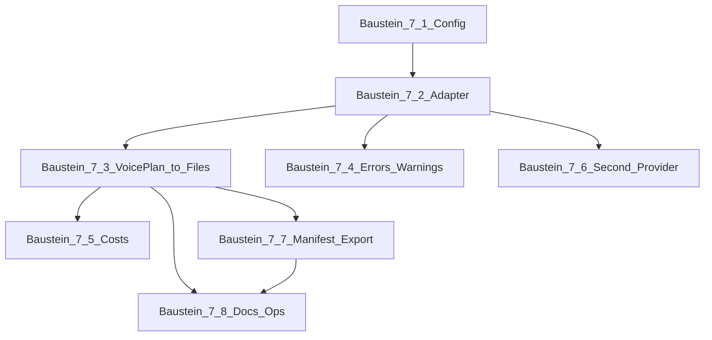

# Bauplan — Makro Phase 7 (Voiceover / TTS)

**Status:** Arbeits- und Abnahmedienst — strukturelle Abarbeitungsreihenfolge  
**Kanone Makrophase:** [PIPELINE_PLAN.md](../../PIPELINE_PLAN.md) → Abschnitt **Phase 7 — Voiceover**  
**Stand:** eingeführt 2026-05-03

---

## 1. Abgrenzungen (strikt einhalten)

| Begriff | Bedeutung |
|---------|-----------|
| **Makro Phase 7** | Voiceover als **Roadmap-Stufe** in der Phasentabelle („Voiceover“, Status `planned` → später `done`). |
| **Baustein 7.x** | **Ausführungsinkremente unterhalb von Phase 7** (dieses Dokument). **Kein** eigener Repo-Makro‑BA wie **BA 9.x**. |
| **BA 9.x** | **Story Engine / Template-Hook-Optimierung** — mit **BA 9.9** in der Produktlinie geschlossen. |
| **Phase 10** | **Publishing-Vorbereitung** — nicht TTS und nicht mit **Baustein 7.x** verwechseln. |

**Vertrag**

- Responses von **`POST /generate-script`** und **`POST /youtube/generate-script`** (**`GenerateScriptResponse`**) bleiben **unverändert** (Genau die **sechs Felder**: `title`, `hook`, `chapters`, `full_script`, `sources`, `warnings`) — neue Voice-Funktionen nur über **andere Routen**/Persistenz, sofern nicht ausdrücklich und separat beschlossen wird, den Hauptvertrag zu erweitern ([AGENTS.md](../../AGENTS.md)).

**Ausgangscode (bereits vorhanden, kein echtes TTS)**

- **`voice_plans`** (Firestore), **`POST /production/jobs/{id}/voice-plan/generate`**, **`GET …/voice-plan`**
- **`provider_configs`** inkl. Slot **`voice_default`**; **`POST /providers/configs/seed-defaults`** (BA 8.6)
- **`production_files`**, **`execution_jobs`** — Strukturen und Heuristiken ohne Provider-Dispatch zu echten TTS-Endpunkten
- Dokumentierte Referenz weiter: [PIPELINE_PLAN.md](../../PIPELINE_PLAN.md) Phase-5-Endpunktliste, [OPERATOR_RUNBOOK.md](../../OPERATOR_RUNBOOK.md), [DEPLOYMENT.md](../../DEPLOYMENT.md)

---

## 2. Qualitäts-Gates (jeder Baustein)

Vor Merge bzw. Abnahme **pro abgeschlossenem Baustein** gelten mindestens:

| Gate | Pflicht |
|------|---------|
| **G1** | `python -m compileall app` — ohne Fehler |
| **G2** | `python -m pytest` — grün (neue/fehlgeschlagene Tests sind **Blocker**) |
| **G3** | Neue oder geänderte HTTP-Routen: **`GET /health`** + Route-Smoke (lokal oder Staging wie in [DEPLOYMENT.md](../../DEPLOYMENT.md)) |
| **G4** | **Keine Secrets** im Repo / in Logs — nur **Namen** von Env/Secret Manager in Doku ([AGENTS.md](../../AGENTS.md)) |
| **G5** | Erwartbare Upstream-/Client-Fehler: **kein blindes HTTP 500**; klare **`warnings`** oder strukturierte Fehlerfelder gemäß Bestehendem API-Stil |

Optionales Gate nach Cloud-Änderungen: Deploy gemäß [docs/runbooks/cloud_run_deploy_runbook.md](../runbooks/cloud_run_deploy_runbook.md) und Kurz‑Smoke gegen Prod‑URL ([DEPLOYMENT.md](../../DEPLOYMENT.md)).

---

## 3. Teststrategie

| Ebene | Zweck |
|-------|--------|
| **Unit** | TTS-Adapter (Request-Bau, Antwort-Parsing), Chunking/Textnormalisierung, Grenzfälle (leere Blöcke, Längenlimits). |
| **Integration API** | FastAPI‑Route‑Tests gegen gemockten Provider oder `httpx`‑Mock — **ohne** echten externen Billing/API‑Call im Default‑CI‑Lauf. |
| **Optional Live-Smoke** | Manuell mit gesetztem Secret und kurzem **`voice_plan`** — nicht als Pflicht in CI, aber im Modul-/Release-Steckbrief vermerken. |

**Namenskonvention neue Tests**

- `tests/test_phase7_<baustein>_<thema>.py`  
  Beispiel: `tests/test_phase7_72_tts_adapter.py`

---

## 4. Baustein-Fahrplan (Reihenfolge)

Abhängigkeiten: strikt **`7.1 → 7.2 → 7.3`**; **`7.4`** parallel/ab **`7.2`**; **`7.5–7.8`** nach tragfähiger **`7.3`**.

### Baustein 7.1 — Scope, Provider-Wahl & Konfig-Schicht

| | |
|--|--|
| **Ziel** | Einheitlicher **Konfig-/Feature-Überblick** für Voice (welche ENV/Secrets, welche **`provider_configs`**-Felder, Default **`voice_default`). |
| **Output** | Kurz-Protokoll oder erweiterter Abschnitt in diesem Dokument unter „Entscheide“; keine Code-Pflicht, wenn bereits ausreichend — dann nur **Feststellung + Tests auf Defaults**. |
| **DoD** | Gates **G1–G5**; Liste der unterstützten Parameter (Sprache, Stimmen-ID-Modell) festgehalten (**ohne Secret-Werte**). |

### Baustein 7.2 — TTS-Provider-Adapter (ohne Persistenz-End-to-End)

Ausgearbeiteter MODULE-Steckbrief (Pflichtvorlage eingehalten): **[docs/modules/phase7_72_voice_provider_minimal_slice.md](../modules/phase7_72_voice_provider_minimal_slice.md)** — **Voice Provider Contract** (`VoiceSynthProvider` o. Ä.) + **OpenAI‑TTS-Adapter** + **`POST …/voice/synthesize-preview`** (minimaler vertikaler Slice, **Metadata-Default**, optional begrenzte `audio_base64` nur mit explizitem Flag).

| | |
|--|--|
| **Ziel** | Internes Modul (z. B. unter `app/voice/` oder `app/watchlist/tts_*.py` — konkrete Wahl im PR) mit **einheitlicher Schnittstelle** (Text/SSML-Light optional später) → Audiodaten oder Stream-Handles. |
| **Nicht-Ziele** | Keine UI; kein YouTube-Upload; kein FFmpeg-Pflicht in diesem Baustein. |
| **DoD** | Unit-Tests mit **Mock** eines HTTP-Responses; erste **echte Provider-Implementierung** (priorisiert: Anbieter, für den bereits **Secret-Pattern im Projekt** existiert — typisch OpenAI‑Ökosystem wird in [PIPELINE_PLAN](../../PIPELINE_PLAN.md)/`.env.example` nur **benannt**) oder abstrakte Stub-Implementierung mit klarem **`NotImplemented`/Fallback** wenn Key fehlt (200 + Warnung, kein 500). Vertikaler Slice konsistent zum Steckbrief (Route + Repo-Read **`voice_plan`**). |

### Baustein 7.3 — Anbindung an `voice_plan` → Artefakte

| | |
|--|--|
| **Ziel** | Aus persistiertem **`voice_plans`** (Blöcke) **deterministische** Synthese-Pipeline: Reihenfolge, Idempotenz-Regeln (**erneuter Aufruf** überschreibt/neu Version?), Fortschritt in **`production_files`** oder gleichwertiger Metadatenstruktur. |
| **API** | Neuer oder erweiterter Endpoint **explizit im PR benennen** (z. B. Synthese-Trigger oder Kopplung an **`execution_*`**-Pfad) — vor Implementierung eine Zeile in [PIPELINE_PLAN.md](../../PIPELINE_PLAN.md) Endpunktliste ergänzen. |
| **Storage** | MVP: **Metadaten** in Firestore + **Binärdaten** nur wo Architektur es hergibt (Cloud Storage später klar trennen); **keine** großen Blobs in Firestore-Dokumenten. |
| **DoD** | Integrationstest mit Firestore‑Mock/fixture wie in bestehenden Production-Tests; **G1–G5**. |

### Baustein 7.4 — Fehler‑, Budget‑ und Warnpfade

| | |
|--|--|
| **Ziel** | Timeouts, Rate-Limits, leere Input-Blöcke: einheitliche **Warn-Codes**/Messages; keine unkontrollierten Stacktraces an Client; wo sinnvoll Anknüpfung an **`pipeline_escalations`** / Audit-Muster (**read-only Eskalations-Hinweise** ohne Pflicht neue Collections). |
| **DoD** | Explizite Testfälle für mindestens: Provider-Fehler, fehlender Key, Firestore‑Readonly-Fehler. |

### Baustein 7.5 — Kosten-/Laufzeit-Schätzung (Voice-Anteil)

| | |
|--|--|
| **Ziel** | **`cost_calculator`** oder Nachfolger um **voice-spezifische** Schätzungen erweitern (Zeichen/Wort/Minuten‑Heuristik abgestimmt mit gewähltem Provider). |
| **DoD** | Tests auf Erwartungswerte; **`production_costs`** bleibt konsistent dokumentiert (EUR‑Heuristik, keine garantierten API-Istkosten). |

### Baustein 7.6 — Zweiter Provider (optional)

| | |
|--|--|
| **Ziel** | Zusätzlicher Adapter hinter gleicher Schnittstelle + Auswahl über **`provider_configs`**. |
| **DoD** | Feature-Flag oder Config-only Umschalten; keine Regression für Single-Provider-Pfad. |

### Baustein 7.7 — Render-Manifest / Export

| | |
|--|--|
| **Ziel** | **`render_manifests`** oder Export-Payload um **voice-Artefakt-Referenzen** erweitern (wie [Connector-Export](../../PIPELINE_PLAN.md)); Downloader/Connector bleiben **ohne automatischen Upload** ohne separates Release-Gate. |
| **DoD** | Regressionstests für bestehende Exportpfade + neues Feld dokumentiert in README wenn nutzerrelevant. |

### Baustein 7.8 — Produktions-/Operator-Doku

| | |
|--|--|
| **Ziel** | [OPERATOR_RUNBOOK.md](../../OPERATOR_RUNBOOK.md), [DEPLOYMENT.md](../../DEPLOYMENT.md) (nur neue **Variablename** Zeilen): Voice aktivieren/deaktivieren, Smoke-Schritte, typische Incident-Szenarien. |
| **DoD** | Referenzierung in [ISSUES_LOG.md](../../ISSUES_LOG.md) nur bei echten Incidents oder Release-Tag; [PIPELINE_PLAN.md](../../PIPELINE_PLAN.md) Status Phase 7 auf **`in progress`** / später **`done`** wenn alle verbindlichen Bausteine für euer definiertes „V1“ erfüllt sind. |

---

## 5. Abhängigkeiten (Mermaid)

---

## 6. Modul-Steckbrief (vor Code zu **7.2**)

Vor dem ersten produktiven Code-Baustein **7.2** Kurzform aus [MODULE_TEMPLATE.md](../../MODULE_TEMPLATE.md) ausfüllen (Scope, Nicht-Ziele, Endpoints, Datenmodell, Risiken) und im PR verlinken — verhindert Scope-Creep.

---

## 7. Nach Abschluss „Phase 7 V1“

- In [PIPELINE_PLAN.md](../../PIPELINE_PLAN.md): Phase-7-Status auf **`done`** (oder **`in progress`** solange optionale 7.6–7.7 offen), **Endpoints**- und **Relevante Dateien**-Zeilen aktualisieren.  
- Keine stillen Abweichungen von **Phase 8/9/10**-Nummerierung; Voice gehört **ausschließlich** zu **Makro Phase 7** + **Baustein 7.x** hier.
