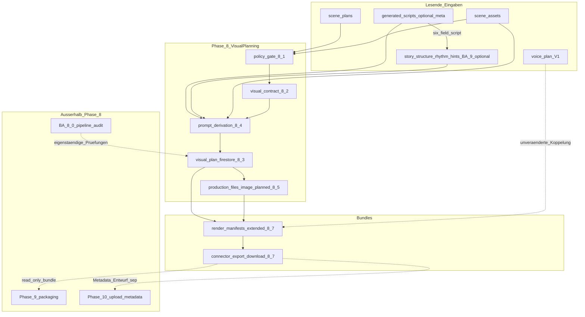

# Bauplan — Makro‑Phase 8 (Visual Production Planning Layer)

**Status:** Kanonischer Arbeits‑ und Scope‑Baum — **Baustein 8.x ≠ BA 9.x ≠ Phase 9 / Phase 10**  
**Kanone Makrophase:** [PIPELINE_PLAN.md](../../PIPELINE_PLAN.md) → Abschnitt **Phase 8 — Bild- / Szenenplan**  
**Governance Repo:** [AGENTS.md](../../AGENTS.md); Modul‑Disziplin: [MODULE_TEMPLATE.md](../../MODULE_TEMPLATE.md)  
**Erster VERTICAL‑SLICE‑Steckbrief:** [docs/modules/phase8_81_visual_contract_minimal_slice.md](../modules/phase8_81_visual_contract_minimal_slice.md)  
**Kontext V1‑Voice:** [phase7_voice_bauplan.md](phase7_voice_bauplan.md), [phase7_73_voice_synthesize_commit.md](../modules/phase7_73_voice_synthesize_commit.md)

---

## 1. Abgrenzungen (strikt einhalten)

| Begriff | Bedeutung |
|---------|------------|
| **Makro‑Phase 8** | **Visual Production Planning** — Verträge, Policy, strukturierte **Bild-/Szenen‑Pläne** und gezielte Spiegelung in **`production_files`** / **Render‑Manifest** / Connector‑Export — **ohne** Phase‑10‑Publishing und **ohne** Video‑Rendering (Phase 9). |
| **Baustein 8.x** | **Ausführungsinkremente unterhalb von Makro‑Phase 8** (dieses Dokument). **Kein** eigener Produkt‑„BA“‑Block; **nicht** verwechseln mit **BA 9.x** Story Engine oder **Phase 10**. |
| **BA 8.0** | **Pipeline‑Audit** (`pipeline_audits`), Heuristik in [app/watchlist/pipeline_audit_scan.py](../../app/watchlist/pipeline_audit_scan.py). **Eigenes Governance‑Thema — nicht identisch mit Phase 8.** |
| **Phase 9** | **Video‑Packaging** (MP4, Schnitt‑Pipeline). Phase 8 liefert **nur Planungs-/Export‑Bundles** read‑only weiter. |
| **Phase 10** | **Veröffentlichungsvorbereitung** (OAuth, Upload‑Helfer, Metadaten). **Keine automatische Hochlade‑Kante** aus Phase 8; Exporte sind **manuelle/editionelle** Zwischeninputs. |
| **BA 9.x** | **Story Engine** — Phase 8 **liest optional** persistierte Meta (`story_structure`, `rhythm_hints`, Template‑Felder auf `generated_scripts`, **`story_pack`** im Connector‑Export); **„GenerateScriptResponse“‑Vertrag** bleibt unverändert. |

### Vertrag (unverändert)

Neue Arbeit **unterhalb** dieser Phase darf **`GenerateScriptResponse`** (**sechs Pflichtfelder** auf **`/generate-script`** / **`/youtube/generate-script`**) nur ändern, wenn **Governance‑OK** dokumentiert wurde ([AGENTS.md](../../AGENTS.md)). Standard: **Alle** Phase‑8‑Artefakte über **Production‑Pfad**, **Firestore** und bestehende **Watchlist**/Production‑Modelle — **nicht** den Script‑Generate‑Payload.

---

## 2. Ausgangslage (Repo, read‑only Referenzen)

- **Szenenbasis:** **`scene_plans`**, **`scene_assets`** (`image_prompt`, `video_prompt`, …).
- **Manifest:** **`render_manifests`** ([RenderManifest](../../app/watchlist/models.py)) mit **`timeline`**, bereits **`TimelineItem.image_prompt`**; Nach Phase 7: **`voice_production_file_refs`**, **`export_version`** — Phase 8 ergänzt **parallele**, optionale **`visual_*`‑Felder**.
- **`production_files`:** bereits `file_type="image"` in [ProductionFileRecord](../../app/watchlist/models.py); **keine** großen Blob‑Payloads in Firestore‑Docs (wie Voice).
- Phase 10 und Phase 9: **planned** — Phase 8 liefert **keine Upload‑Orchestrierung**.

---

## 3. Produktkern: „Visual Planning Layer“

**Ziel:** Eine überprüfbare, policy‑bewusste Schicht: *Welche **visuelle** Aussage gilt pro Szene, auf welchen **konformen** Grundlagen (Placeholder bis Stock/API), wie ist der **strukturierte** Prompt konsolidiert — und welche **`warnings`/Risiken** sind transparent?*

**Explizites Nicht‑Ziel des ersten VERTICAL‑SLICES:** echte Bild‑/Stock‑API‑Aufrufe, Binär‑Uploads oder kostenpflichtige Provider‑Dispatchs ([phase8_81_visual_contract_minimal_slice](../modules/phase8_81_visual_contract_minimal_slice.md)).

---

## 4. Bausteine **8.1–8.8**

| # | Baustein | Zweck |
|---|----------|--------|
| **8.1** | **Scope & Policy‑Rahmen** | Lizenz-/Quellenklassen (z. B. Platzhalter `synthetic_placeholder` / `stock_placeholder` / später `generated`/`stock_*`), Attribution‑Konventionen, Verbot unbelegter „lizenzfrei“‑Behauptungen, Disclaimer **keine Rechtsberatung**, Logging ohne Secrets ([AGENTS.md](../../AGENTS.md)). |
| **8.2** | **Visual Planning Contract v1** | Stabiles JSON/Pydantic‑Schema **ohne** Binärfelder (siehe Abschnitt 6): Intent, strukturierte Tags, `source_class`, `risk_flags`; **niemals** Mutation des Script‑Six‑Field‑Contracts. |
| **8.3** | **Visual Asset Plan (persistiert)** | Firestore‑Collection **`visual_plans`** (Doc‑ID = `production_job_id`, analog **`voice_plans`**); **`POST …/visual-plan/generate`**, **`GET …/visual-plan`** idempotent. |
| **8.4** | **Prompt Pack (deterministisch)** | Reine Ableitung aus **`scene_assets`**, optional BA‑9‑Sidechannels (**`story_structure`**, **`rhythm_hints`**); gleiche Inputs ⇒ gleicher Output (+ Tests). Keine Anbieterwahl im Minimal‑Slice. |
| **8.5** | **`production_files`‑Spiegel (`image`)** | **`planned`** nur; `storage_path`‑Konvention abgestimmt mit `plan_production_files_service` / Szene n (**keine Blobs im Doc**) — später `ready` erst mit echter Artefakt‑Pipeline (**separates Inkrement**). |
| **8.6** | **Audit‑Hooks (dünn)** | Optionale neue Audit‑Drafts gleichen Stils wie Voice‑Gaps („`visual_plan` erwartbar, Dokument fehlt“ / „geplante Image‑Zeilen ohne Plan“); **Audit bleibt BA 8.0‑Artefakt**. |
| **8.7** | **Manifest & Export** | [RenderManifest](../../app/watchlist/models.py): z. B. **`visual_production_file_refs`** und/oder schlanke Referenz; **`ConnectorExportPayload`** in **`app/watchlist/models.py`** — Feld **`visual_artefakte`** o. Ä.; [export_download](../../app/watchlist/export_download.py) konsistent (**read‑only**). **`export_version`‑Bump** bei Schema‑Änderung dokumentiert. |
| **8.8** | **Ops & Gates** | Ergänzungen [OPERATOR_RUNBOOK](../../OPERATOR_RUNBOOK.md); Endpunktliste [PIPELINE_PLAN](../../PIPELINE_PLAN.md); Smoke mit **`dry_run`** wo angeboten — **Deploy nicht Pflicht‑Gate** dieser Phase. |

---

## 5. Empfohlene Reihenfolge

**8.1 → 8.2 → 8.4 (deterministisch) → 8.3 (persist) → 8.5 → 8.7 → 8.6 → 8.8.**

- Policy und Contract vor Speicher‑Write.
- Persistenz (**8.3**) erst, wenn Ableitung (**8.4**) teststabil ist.
- Export/Manifest‑Breite (**8.7**) vor oder parallel zu dünnen Audit‑Regeln (**8.6**), sobald Daten existieren — **aber** eigener PR‑Schnitt erwünscht, um regressionsärmer zu bleiben.

---

## 6. Datenmodell‑Vorschlag

**Empfehlung:** Neue Collection **`visual_plans`**, keine Überladung von **`scene_assets`** (bleiben Prompt‑Entwürfe „Quelle für Ableitung“).

### 6.1 `VisualPlan` (Top‑Level)

| Feld | Zweck |
|------|--------|
| `id` | = `production_job_id` oder explizites ID‑Feld (konkret im MODULE Slice) |
| `production_job_id` | Zuordnung |
| `generated_script_id` | optional, Denormalisierung für Lesepfade |
| `plan_version` | Monoton / Schema‑Version Partial |
| `status` | `draft` \| `ready` \| `failed` |
| `policy_profile` | String/Version auf 8.1‑Profil (kein juristisches Vollwerk) |
| `blocks` | `List[VisualSceneBlock]` |
| `warnings` | Transparenz, `[visual_*]`‑Präfixe empfohlen |

### 6.2 `VisualSceneBlock`

| Feldgruppe | Inhalt |
|------------|--------|
| **Zuordnung** | `scene_number` (zu `scene_assets`/`timeline`) |
| **Contract (8.2)** | `intent`, `subjects_safe` (nur bereits genannte/leere), `style_tags`, `risk_flags` |
| **Quelle/Orchestrierung (Placeholder)** | `source_class` (`synthetic_placeholder`, `stock_placeholder`, …) |
| **8.4 Ausgabe** | `prompt_pack` (deterministische Strings für Bild‑Hinweise, nicht zwingend = finales Produkt‑Prompt ohne Review) |
| **Policy** | `licensing_notes` (Text ohne Rechtsclaims), **`redaction_warnings`** |

### 6.3 `production_files`

Bestehendes [ProductionFileRecord](../../app/watchlist/models.py): `file_type="image"`, **`status`** im MVP‑Slice **`planned`**; `storage_path` analog Voice‑Konvention (**Pro Job + Szene `n`**).

### 6.4 Render‑Manifest

- **Option A:** `visual_plan: Optional[VisualPlan]` eingebettet (einfacher Export, größere Docs).
- **Option B (empfohlen bei Wachstum):** **`visual_production_file_refs`** analog **`voice_production_file_refs`** + optionale **`visual_plan_id`** / Summary‑Felder ohne Vollkopie.

Konkrete Entscheidung im ersten Implementierungs‑PR und im MODULE‑Steckbrief festhalten.

---

## 7. Mermaid — Abhängigkeiten und Datenfluss

**Legende gestrichelter Kanten:** read‑only / spätere Makrophasen / **Audit separat**.

---

## 8. Tests je Slice

| Bereich | Erwartung |
|---------|-----------|
| **8.1–8.2** | Schema‑Validation, Forbidden‑`source_class`, Serialisierung **ohne** Secret‑Leak |
| **8.4** | Determinismus: gleiche `scene_assets` (+ optionale gleiche BA‑9‑Meta) ⇒ identischer **`prompt_pack`** / Hash oder Snapshot‑Test |
| **8.3** | Mock‑Repo: `generate` **idempotent** (zweiter Aufruf warnt wie bestehendes Manifest‑Muster konsultierbar); Firestore‑**503** JSON‑Pfad wie Production‑Routen |
| **8.5** | Konsistente Bild‑Pfad‑Szene Zuordnung & Doc‑IDs |
| **8.7** | Regression bestehender Manifest/Exports; neue Felder **optional** oder leere Defaults |
| **8.6** | Kleine **`scan_production_job_for_issues`**‑Unit mit Mock‑`list_production_files_for_job` / `get_visual_plan` |
| Projekt‑Gates ([AGENTS.md](../../AGENTS.md)) | **`python -m compileall app`**, **`pytest`**, neue Routen **`GET /health`** + Route‑Smoke |

**Namensvorschlag:** `tests/test_phase8_<baustein>_<thema>.py`

---

## 9. Safety‑ / Policy‑Gates („keine Generatoren zuerst“)

- Erster VERTICAL‑SLICE ohne externe Bild‑API — nur **deterministische** Text-/Strukturpakete und **`warnings`**.
- **`dry_run` / Policy‑only** können im ersten PR nur dokumentiert werden; Umsetzung optional.
- **Keine automatische „rechtssichere Stock“‑Zertifizierung** — Platzhalter bis Anbindungen existieren.
- **Keine neuen konkreten Fakten oder Personendarstellungen**, die nicht aus erlaubten Quell‑Strings der Pipeline stammen (redaktionelle Sorgfalt).
- Logs: keine API‑Keys, keine privaten Pre‑Signed‑URLs ausgeben ([AGENTS.md](../../AGENTS.md)).

---

## 10. Manifest‑Integration

- **`TimelineItem.image_prompt`** bleibt nutzbar; Phase 8 liefert **strukturierte Zusatzinformation** (`visual_*`‑Refs oder kurze eingebettete Summary‑Strukturen) — nicht zwingender Ersatz ohne Abstimmung.
- **`export_version`** — bei Änderungen am **`RenderManifest`**‑Schema semver‑Bump dokumentieren und in [PIPELINE_PLAN](../../PIPELINE_PLAN.md) Endpunktvermerk wenn nötig.
- **`ConnectorExportPayload`** — symmetrisch zu **`voice_artefakte`**: Feld wie **`visual_artefakte`** (read‑only `dict`s aus Plan/Production‑Files).

---

## 11. Minimal Vertical Slice (erste Code‑Welle)

**Siehe Pflicht‑MODULE:** [phase8_81_visual_contract_minimal_slice.md](../modules/phase8_81_visual_contract_minimal_slice.md)

Kurzfassung:

1. PACKAGE **`app/visual_plan/`** (oder `app/visual/`) — **Contract + Builder**, noch ohne HTTP wenn PR‑Split gewünscht.
2. **HTTP:** `POST /production/jobs/{production_job_id}/visual-plan/generate`, `GET /production/jobs/{production_job_id}/visual-plan` (Spiegel **Voice‑Pattern**).
3. **Firestore** — Collection **`visual_plans`** + Repo‑Methoden.
4. **`production_files`‑Image‑`planned`** optional **zeitversetzt** (**8.5** eigenes PR wenn Größenlimit).
5. **Manifest:** neue Felder backward‑compat (leere Listen / keine Breaking‑Änderungen an bestehendem Export‑Minimalpfad ohne Feature‑Flag dokumentieren wenn nötig).

**Nach Slice‑Gate:** separate PRs für **8.6** Audit und vollständige **8.7** Connector/Manifest‑Weitung.

---

## 12. Nächster organisatorischer Schritt

Nach Scope‑Freeze: erster **`docs/modules/phase8_*`** Steckbrief abnehmen ([MODULE_TEMPLATE](../../MODULE_TEMPLATE.md)), Branch/PR schneiden, **PIPELINE_PLAN** Phase 8‑Zeile („Endpoints“, „Relevante Dateien“) bei **Merger ersten Endpoints** nachziehen — **nicht verpflichtend in derselben Session** wie reine Bauplan‑Pflege dieser Datei.

---

*Letzte inhaltliche Erweiterung (Voll‑Bauplan): kanonisches Rollout‑Dokument aus Plan „Phase 8 Canonical Bauplan"; Stub ersetzt.*
